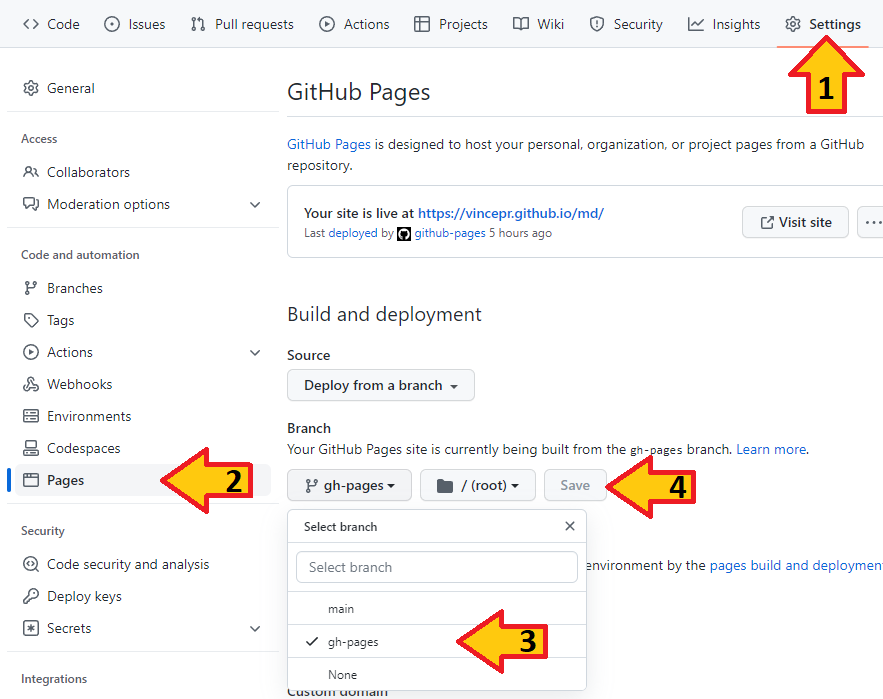

# Auto Deploying Docosaurus on Github-Pages

- 

## setup
1. install a new version of npm (ubuntu apt version is out dated. So get it from nodejs.org directly or update it)
	- in theory you could uninstall npm after doing step 2 once. If you never plan to run it on your localhost. The actual github-pages server will handle the npm-deployment.
2. init the docusaurs-presets
```
npm init docusaurus
```

3. change into your created directory & run it locally
```
cd projectName
npm start
```

4. create your git repo in the projectName folder, stage everything and commit the initial commit.
```
git init
git add -A
git commit -m "initial commit"
git remote add origin git@github.com:yourName/projectName.git
git push -u -f origin main

```

5. customize docusaurus.config.js notice to replace vincepr with your own github name.
```
const config ={
	title: 'vincepr-markdown-docs',
  	tagline: 'Just storing whatever is recent',
  	url: 'https://vincepr.github.io',								// this links to your own github repo don't skipp this
  	baseUrl: '/md/',											// use your own projectName here "/projectName/" . if using yourName.github.io as prjectname you could use the default "/"
  	onBrokenLinks: 'throw',
  	onBrokenMarkdownLinks: 'warn',
  	favicon: 'img/favicon.ico',

  	// GitHub pages deployment config.
  	organizationName: 'vincepr', 									// Usually your GitHub org/user name.		
  	projectName: 'md', 										// Usually your repo name.
  	trailingSlash: false,										// add this line to overwrite default github behaviour
...	

```

6. automate github.io deployment:
- create folders ./.github/workflows and create the following 2 files inside:
- deploy.yml
```
name: Deploy to GitHub Pages

on:
  push:
    branches:
      - main
    # Review gh actions docs if you want to further define triggers, paths, etc
    # https://docs.github.com/en/actions/using-workflows/workflow-syntax-for-github-actions#on

jobs:
  deploy:
    name: Deploy to GitHub Pages
    runs-on: ubuntu-latest
    steps:
      - uses: actions/checkout@v2
      - uses: actions/setup-node@v3
        with:
          node-version: 18
          cache: npm

      - name: Install dependencies
        run: npm ci
      - name: Build website
        run: npm run build

      # Popular action to deploy to GitHub Pages:
      # Docs: https://github.com/peaceiris/actions-gh-pages#%EF%B8%8F-docusaurus
      - name: Deploy to GitHub Pages
        uses: peaceiris/actions-gh-pages@v3
        with:
          github_token: ${{ secrets.GITHUB_TOKEN }}
          # Build output to publish to the `gh-pages` branch:
          publish_dir: ./build
          # The following lines assign commit authorship to the official
          # GH-Actions bot for deploys to `gh-pages` branch:
          # https://github.com/actions/checkout/issues/13#issuecomment-724415212
          # The GH actions bot is used by default if you didn't specify the two fields.
          # You can swap them out with your own user credentials.
          user_name: github-actions[bot]
          user_email: 41898282+github-actions[bot]@users.noreply.github.com
```
- test-deploy.yml

```
name: Test deployment

on:
  pull_request:
    branches:
      - main
    # Review gh actions docs if you want to further define triggers, paths, etc
    # https://docs.github.com/en/actions/using-workflows/workflow-syntax-for-github-actions#on

jobs:
  test-deploy:
    name: Test deployment
    runs-on: ubuntu-latest
    steps:
      - uses: actions/checkout@v2
      - uses: actions/setup-node@v3
        with:
          node-version: 18
          cache: npm

      - name: Install dependencies
        run: npm ci
      - name: Test build website
        run: npm run build
```
7. now whenever we create a new commit and push it to the main-branch it will automatically be tested and if successful deploy on a new **gh-pages** branch. So lets push a new commit:
```
git add -A
git commit -m "getting github-pages-branch ready"
git push
```

8. finally navigate to your newly created github repo. then click Settings-> Pages activate your github-Pages there then select the gh-pages branch that should by now be automatically created with the automatation from step 7. and save your settings.

9. after waiting a few minutes your new github.io page should update. (this can take multiple minutes)




## make the Docs the Main Page:
1. remove/rename: src/pages/index.js -> old_index.js
2. edit docusaurus.config.js -> add routeBasePath
```
presets: [
    [
      'classic',
      /** @type {import('@docusaurus/preset-classic').Options} */
      ({
        docs: {
          routeBasePath: "/",
		/* other docs plugin options */
		// ...
```

3. add slug:  / to your docs/intro.md to make it the new starting point of your homepage:
```
---
slug: /
---

```