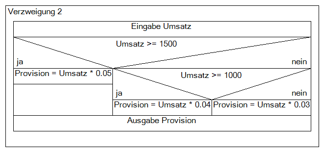

Write a function called ***provisionsRechner***, that takes in a float and adheres to the Diagramm below.

import InteractiveTest from './InteractiveTest.jsx'
let importPath = '/md/jsAufgaben/ae6Test.js';

<InteractiveTest importPath={importPath}/>
