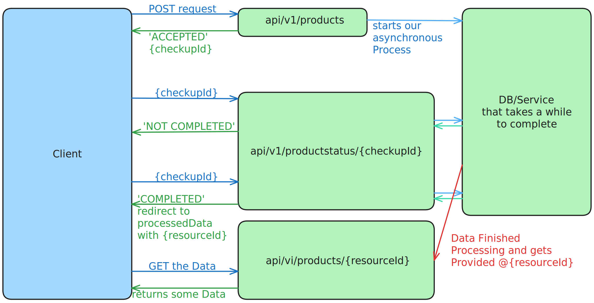

# Asynchronous API example in csharp
Minimal Api. Revolves around the Client posting a large number or Data to our Service.

This should take so long, as that we want to decouple the your post received and the your post has completely ran trough messages.

So in that sense being Asynchronous in it's response.

6

## setup
```
dotnet add package Microsoft.EntitiyFrameworkCore.Design
dotnet add package Microsoft.EntitiyFrameworkCore.Sqlite
```
Rough steps

1. Create our Model
2. Create our DBContext and inject it into our app
3. create EF migration: dotnet ef migrations add initialMigration
4. apply the migrations: dotnet ef database update

## Model and Dtos and DatabaseContext
- `Models/ListingRequests.cs`
```csharp
/// Holds a Lost of Products our Client is trying to post to our Service
public class ListingRequest{
    public int Id { get; set; }
    public string? RequestBody { get; set; }
    public string? EstimatedCompletionTime { get; set; }
    public string? RequestStatus { get; set; }
    public string RequestId { get; set; } = Guid.NewGuid().ToString();
}
```
- `Dtos/ListingRequests.cs`
```csharp
public class DtoListingStatus{
    public string? RequestStatus { get; set; }
    public string? EstimatedcompletionTime { get; set; }
    public string? ResourceUrl { get; set; }
}
```
- `Data/AppDbContext.cs`
```csharp
using AsyncApiExample.Models;
using Microsoft.EntityFrameworkCore;
public class AppDbContext : DbContext{
    public AppDbContext(DbContextOptions<AppDbContext> options) 
        : base(options){}
    public DbSet<ListingRequest> ListingRequests => Set<ListingRequest>();
}
```
## The Code

- `Program.cs`
```csharp
var builder = WebApplication.CreateBuilder(args);
// to not loose db ctx for our dirty async takesSomeTimeAsync() we need to use a singleton here
builder.Services.AddDbContext<AppDbContext>(opt => {
    opt.UseSqlite("Data Source=RequestDB.db");
}, ServiceLifetime.Singleton);
var app = builder.Build();
app.UseHttpsRedirection();

// our Insert Enpoint that starts the process that takes a 'long time' to finish
app.MapPost("api/v1/products", async (AppDbContext ctx, ListingRequest listingRequest) => {
    if (listingRequest == null) return Results.BadRequest();
    listingRequest.RequestStatus = "ACCEPTED";
    listingRequest.EstimatedCompletionTime = DateTime.Now.AddSeconds(20).ToString(CultureInfo.CurrentCulture);

    await ctx.ListingRequests.AddAsync(listingRequest);
    await ctx.SaveChangesAsync();
    takesSomeTimeAsync(ctx, listingRequest.Id);

    // for a non Synchronous Method we would use Results.Created
    // .Accepted(uri) takes an uri pointing to where the status of our requests
    // can be monitored it.
    return Results.Accepted($"api/v1/productstatus/{listingRequest.RequestId}", listingRequest);
});

// our Status Endpoint - gives feedback on if process finished, and how long it might take
app.MapGet("api/v1/productstatus/{requestId}", (AppDbContext ctx, string requestId) => {
    // we check for any info in our db
    var listeningRequest = ctx.ListingRequests.FirstOrDefault(e => e.RequestId == requestId);
    if (listeningRequest is null) return Results.NotFound();

    // we build our Dto-response
    DtoListingStatus response = new DtoListingStatus {
        RequestStatus = listeningRequest.RequestStatus,
        ResourceUrl = String.Empty
    };
    
    // process has finished so we return path to results client wants
    if (response.RequestStatus.ToUpper() == "COMPLETED") {
        // the guid could come from the db or wherever we generate the resources
        var uid = Guid.NewGuid().ToString();
        // response.ResourceUrl = $"api/vi/products/{uid}";
        // return Results.Ok(response);
        return Results.Redirect($"http://localhost:5042/api/vi/products/{uid}");
    }
    
    // in case it hasn't finished we calculate and return an estimated time
    response.EstimatedcompletionTime = DateTime.Now.AddSeconds(5).ToString(CultureInfo.CurrentCulture);
    return Results.Ok(response);

});

// Endpoint that supplies Resources at the end
app.MapGet("api/vi/products/{resourceId}", (string resourceId) => {
    return Results.Ok($"This is where we would pass back our results for {resourceId}");
});

// (in its own thread) this will after 5 seconds change the Status to COMPLETED
async static void takesSomeTimeAsync(AppDbContext ctx, int id){
    int timeoutMs = 5000;
    await Task.Delay(timeoutMs);
    
    var entry = ctx.ListingRequests.FirstOrDefault(e => e.Id == id);
    if (entry is not null) {
        entry.RequestStatus = "COMPLETED";
        ctx.SaveChanges();
        Console.WriteLine("finished task");
    }
}
app.Run();
```