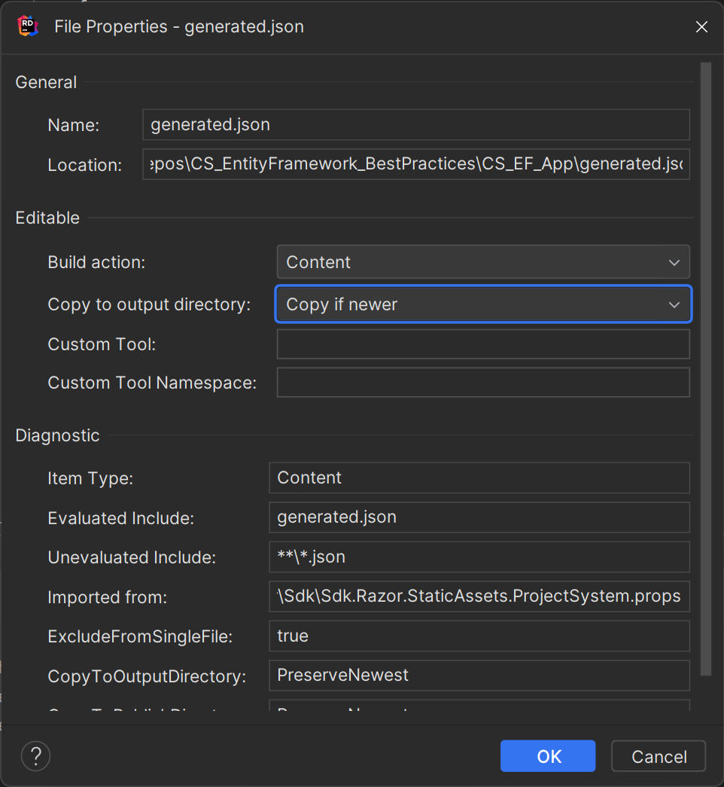

# EntityFramework - best practices
- my Project on https://github.com/vincepr/CS_EntityFramework_BestPractices


working trough https://www.youtube.com/watch?v=qkJ9keBmQWo and taking notes along the way.

## Setup
1. install the EntityFramework Dependencies
```
dotnet add package Microsoft.EntityFrameworkCore.Design
dotnet add package Microsoft.EntityFrameworkCore.SqlServer
```

1. Create a ClassLibrary DataAccessLib
	- create our Models that live in the Db
	- create our DbContext for whatever Database we start with (sqlite in this case)
	- if we use a real db hook up the connection-string etc...

```csharp
public class PeopleContextSqlite : DbContext{
    public PeopleContextSqlite(DbContextOptions<PeopleContextSqlite> options) : base(options) {}
    public DbSet<Person> Persons { get; set; }
    public DbSet<Address> Addresses { get; set; }
    public DbSet<Email> Emails { get; set; }
}
```

1. Import our Custom-DBContext in our Frontend/Api Project
	- we can RightClick-Add-ProjectReference
	- or add it manually to the .csproj file
```
  <ItemGroup>
    <ProjectReference Include="..\DataAccessLib\DataAccessLib.csproj" />
  </ItemGroup>
```
1. Then Reference/Use our Custom-DbContext in our Program.cs
```csharp
builder.Services.AddDbContext<PeopleContextSqlite>(options =>{
    // options.UseSqlServer(Configuration.GetConnectionString("DefaultDev")); // "DefaultDev" defined in our appsettings.json
    options.UseSqlite("Data Source=EFlocalDB.db");  // just a local sqlite file that will get created for us for development
});
```

1. Tell EntityFramework to generate the Migrations and put them in the Database

	- In this case we need to run it from our DataAccessLib (so we cd into that)
	- Since our Startup Project is in another folder we have to point to it:
```
dotnet ef --startup-project ../CS_EF_App/ migrations add initialMigration
dotnet ef --startup-project ../CS_EF_App/ database update
```

Alternatively we can from our root path (solution folder that holds both projects) work like this:
```
dotnet ef --project ./DataAccessLib --startup-project ./CS_EF_App/ migrations add initialMigration
dotnet ef --project ./DataAccessLib --startup-project ./CS_EF_App/ database update
```

## Notes
**Migration-Scripts** - the steps EF builds out our DB with.

These are split in 2 functions. Up and Down.
`Up(MigrationBuilder migrationBuilder)` - this creates our tables (and adds ontop of existing ones for followup migrations)
`Down(MigrationBuilder migrationBuilder)` - rolls back our database back down to the state of the previous Migration.
Or drops it if that table didnt exist before. So you might **loose data** when rolling back!


### EF is not efficient by default - nvarchar(max) and indexing
limits: varchar(8000) and nvarchar(4000) of how much symbols a row can hold.

In Windows SqlServer nvarchar(max) goes way beyond that by storing those on the drive as 'files' and just storing a pointer in the db

- problem is speed for searching on those rows or indexing into them etc.
- so EF's defaults generated might not always be optimal/sensible depending on use case and underlying database
- In Sql-Servers case nvarchar(max) also allocates memory for each lookup before reading it out. 
  - for a 256 long nvarchar or varchar allocated heap-memory usually will be zero
  - while for a 1024+ .. max will allocate on the heap.
  - the above is just the database itself. So it's performance might degrade quite a bit.

So to summarize EF by default will **not** create ideal table design.

### The Solution - Data Annotations
We can for example for the zip code go to the more efficient varchar and in general make sensible assumptions about length
```csharp
using System.ComponentModel.DataAnnotations;
using System.ComponentModel.DataAnnotations.Schema;

namespace DataAccessLib.Models;
public class Address{
    public int Id { get; set; }
    
    [Required, MaxLength(200)]
    public string StreetAddress { get; set; }
    
    [Required, MaxLength(100)]
    public string City { get; set; }
    
    [Required, MaxLength(50)]
    public string State { get; set; }
   
    // We can put them in same section or stack them:
    [Required]
    [MaxLength]
    [Column(TypeName = "varchar(10)")]  // we can basically write raw sql like this
    public string ZipCode { get; set; }
}
```

### Loading in some Json
We use some service(https://json-generator.com/) to quickly generate some json data:
```
[
  '{{repeat(100)}}',
  {
    FirstName: '{{firstName()}}',
    LastName: '{{surname()}}',
    Age: '{{integer(20, 40)}}',
    Addresses: [
      '{{repeat(1,3)}}',
      {
        StreetAddress: '{{street()}} {{integer(1,250)}}',
        City: '{{city()}}',
        State: '{{state()}}',
        ZipCode: '{{integer(100, 999)}}-{{integer(100, 9999)}}'
      }
    ],
    EmailAddresses: [
      '{{repeat(1,4)}}',
      {
       EmailAddress: '{{email(true)}}'
      }
    ]
  }
]
```

- We make sure the `generated.json` gets put in our output build.


- we can use XEventProfiler for Microsoft SqlServer Management Studio to filter and Profile what actually gets ran against our db.
  - https://www.youtube.com/watch?v=qkJ9keBmQWo&t=4710s about 20min on how to filter.

- in our `Index.cshtml.cs` we add our json data to our db. 
```csharp
namespace CS_EF_App.Pages;

public class IndexModel : PageModel {
    private readonly ILogger<IndexModel> _logger;
    private readonly PeopleContextSqlite _dbCtx;

    public IndexModel(ILogger<IndexModel> logger, PeopleContextSqlite dbCtx) {
        _logger = logger;
        _dbCtx = dbCtx;
    }
    public void OnGet() {
        LoadSampleData();
    }
    private void LoadSampleData() {
        // load and insert our json file if there is no entries in the database
        if (_dbCtx.Persons.Count() == 0) {
            string file = System.IO.File.ReadAllText("generated.json");
            var jsonPersons = JsonSerializer.Deserialize<List<Person>>(file);
            if (jsonPersons is null) return;
            _dbCtx.AddRange(jsonPersons);
            _dbCtx.SaveChanges();
        }
    }
}
```

### Query efficiency
- as we can see it is not always obvious what queries EF will build under the hood, so in cases where performance matters,
some profiling or checking the 'generated sql statements'.
```csharp
private void DeleteAllPersons() {
	var people = _dbCtx.Persons
		.ToList();
	foreach (Person p in people) {
		_dbCtx.Persons.Remove(p);
	}
	_dbCtx.SaveChanges(); 
}
private void GetAllTheData() {
	var people = _dbCtx.Persons
	.Include(a => a.Addresses)
	.Include(e => e.EmailAddresses)
	.ToList();
	// a inefficient way to get all data: Rider even gives a warning about average number of records: 530 for just 100 objects
	// 		SELECT "p"."Id", "p"."Age", "p"."FirstName", "p"."LastName", "a"."Id", "a"."City", "a"."PersonId", "a"."State", "a"."StreetAddress", "a"."ZipCode", "e"."Id", "e"."EmailAddress", "e"."PersonId"
	// 		FROM "Persons" AS "p"
	// 		LEFT JOIN "Addresses" AS "a" ON "p"."Id" = "a"."PersonId"
	//		LEFT JOIN "Emails" AS "e" ON "p"."Id" = "e"."PersonId"
	//		ORDER BY "p"."Id", "a"."Id"
	// 
	// So the data for just ONE Person might look like this:
	//
	// Id   Age FName   LName   Id  City    PersonId    State   Street  Zip Id  Email
	// 1    33  James   Bond    1   Town    1           Alabama SomeStr A1V 234 brookmail@gmx.de     
	// 1    33  James   Bond    1   Town    1           Alabama SomeStr A1V 22  james@bond.mit
	// 1    33  James   Bond    1   Town    1           Alabama SomeStr A1V 113 spy@seecret.eu
	// 1    33  James   Bond    1   Town    1           Alabama SomeStr A1V 234 another@mail.ml
	// 1    33  James   Bond    213 Town    1           Oregon  LakeAV  123 234 brookmail@gmx.de     
	// 1    33  James   Bond    213 Town    1           Oregon  LakeAV  123 22  james@bond.mit
	// 1    33  James   Bond    213 Town    1           Oregon  LakeAV  123 113 spy@seecret.eu
	// 1    33  James   Bond    213 Town    1           Oregon  LakeAV  123 234 another@mail.ml
	// 1    33  James   Bond    111 Town    1           Guam    street  IB1 234 brookmail@gmx.de     
	// 1    33  James   Bond    111 Town    1           Guam    street  IB1 22  james@bond.mit
	// 1    33  James   Bond    111 Town    1           Guam    street  IB1 113 spy@seecret.eu
	// 1    33  James   Bond    111 Town    1           Guam    street  IB1 234 another@mail.ml
	//
	// it would be way less data to first get all persons, then all addresses then all emails and put them together
	// but the default behavior of Entity Framework does it in this inefficient way
	//
	// An this would get multiplicatively worse for more and more relations -> more and more left joins + extra data
}
```


One of the below Queries (that functionally produce the exact same result) results in the Where clause getting passed down in an SQL-query.

The other(`peopleBAD`) one will fetch ALL tables form the database then filter them in csharp. 
This is obviously more traffic on our db, more potentially huge ammounts of ram allocated etc. And just slower overall.

```csharp
private void WhereClause() {
	var peopleGOOD = _dbCtx.Persons
		.Where(p => p.Age >= 18 && p.Age < 30)
		.ToList();
	var peopleBAD = _dbCtx.Persons
		.ToList()
		.Where(p => ApprovedAge(p.Age));
	
	Console.WriteLine( peopleGOOD.Count() ); // just fetched the 44 targeted people
	Console.WriteLine( peopleBAD.Count() );  // this fetched all 100 potentially 1000s of people then filtered them down to 44
}

private bool ApprovedAge(int age) {
	return (age >= 18 && age < 30);
}
```