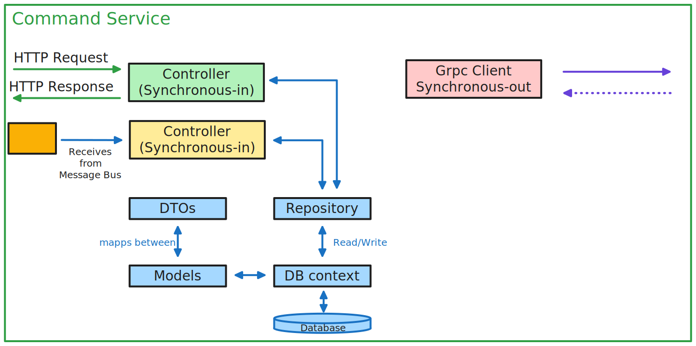

# part1 - Microservices Architecture
my repo: https://github.com/vincepr/CS_Microservices_KubernetesGrpcRabbitMQ

Going along with Les Jackson's `.Net Microsercies - Full Course` https://www.youtube.com/watch?v=DgVjEo3OGBI on Youtube
- it is using Kubernetes, RabbitMQ and GRPC. So there should be quite a few new technologies for me to learn.

## technologies used
- EntityFramework
    - AutoMapper
- Kubernetes
    - Docker
- MS-Sql-Server
- Rabbit MQ
- Grpc

# Solution Architecture
The Platforms provided by the PlatformService are the "Parent Resource". Platforms like docker, dotnet, kubernetes are defined there. 

The CommandService holds an List of commandline Commands for each of those platforms. Therefore it will get the neccesary information about existing platforms from the PlatformService. first synchronous, asynchronous, via an Messagebus and lastly via grpc. 

## Microservices Architecture

**Asynchronous Messaging** (Pub-Sub) for most of our Dataflow from our Platform Service to our Comand Service.
- this allows loose coupling of those services. (the Platform Service doesn't even need to know that/if the Command Service exists)

**Grpc** is later on used to extend that model, and allow dataflow in the other direction. (Grpc is not neccessary here, but more or less used as a teaching example)

## Service Architecture
**Models** - internal data representations

**DB Context** - mediates those models down to one Database-Implementation. (ex. one for Sqlite, MongoDb, WindowsSqlServer etc...)

**DTOs** - Data-Transfer-Objects = External Representations of our Model data. (ex. only sending Data down to our Frontend the Consumer is allowed to see. Not the hashed Pw or internal Ids from our DB)

**Repository** (-Patern) - Abstracts away our DB Context implementation

**Controller(Synchronous-in)** - API Rest controller listening to external http Requests and then sending back the Response (using a Dto)

