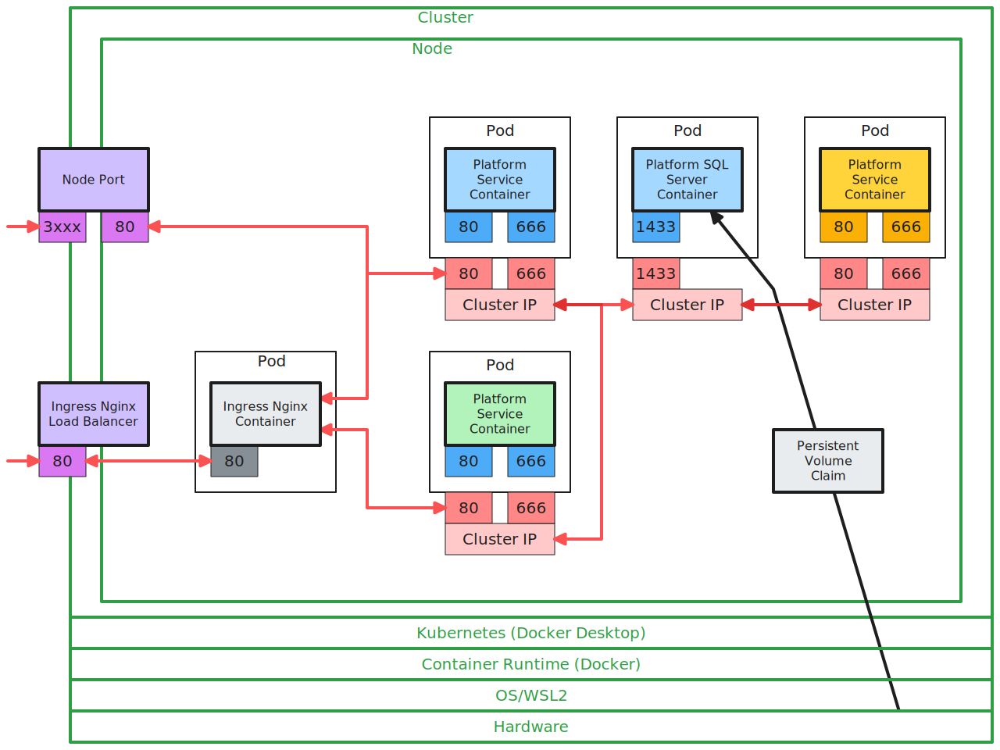
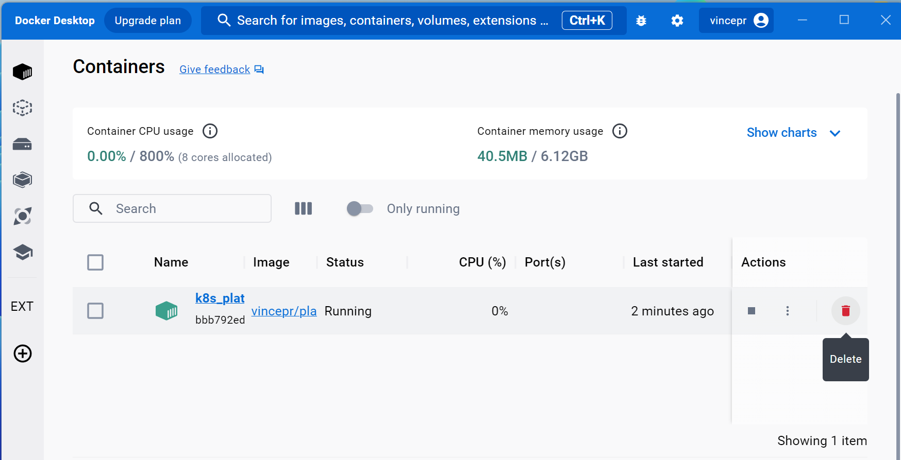

# part3 - Kubernetes - aka K8S
## what we want out of kubernetes
Kubernetes is our Container-Orchestrator, making sure everything is running as it should

- containers get spun up in the right order
- make sure containers continue to run (ex after a crash)
- scales in the right way

## Notes on Architecture



**Cluster** - a group of servers/VM's that we run on. In this case we just have our desktop as our one Cluster we run everyhing on.

**Node** - Splits up our Cluster into more parts. Ex. in Azure/Google-Cloud we might end up with different nodes we run our stuff on. In this project we just use one Node.

**Pod** - Is used to host and run Containers. A pod can in theory run multiple containers. We will use just one Pod per service. (we only have 2 of those anyways)

### Kubernetes Services
Services that Kubernetes provides for us:

**Node Port** - used only for development purpose. Quickly maps a internal port and makes it accessible for us on our dev desktop machine.

**Cluster Ip(-Service)** - Attatches to a Pod and again Maps Ports from inside the container to ones inside our Node/Cluster. Only used for container to container communication.

**Ingress Nginx Controller** - a API Gateway. (the proper way to make our Endpoints accessible, replacing our dev only NodePort). This connects directly with the Pods (not trough the Cluster IPs)

**Ingress Nginx Load Balancer** - Connects our API Gateway to the outside

**Persistent Volume Claim** - since everything (but the SQL DB) is stateless we must use a persistent volume. This will make our DB persist trough Reboots etc...

## creating our first deploymend
- `platforms-depl.yaml`
```yaml
apiVersion: apps/v1
kind: Deployment
metadata:
  name: platforms-depl
spec:
  # replicas are basically horizontal scaling (ex multiple api containers that run at the same time etc...)
  replicas: 1
  # selector and template are defining the template were creating
  selector:
    matchLabels:
      app: platformservice
  template:
    metadata:
      labels:
        app: platformservice
    spec:
      containers:
        ## we use our previously created docker containers here
        - name: platformservice
          image: vincepr/platformservice:latest
```

- we start DockerDesktop and make sure our Kubernetes is running
```
kubectl version
cd K8s

kubectl apply -f platforms-depl.yaml
kubectl get deployments
# NAME             READY   UP-TO-DATE   AVAILABLE   AGE
# platforms-depl   1/1     1            1           32s

kubectl get pods
# NAME                              READY   STATUS    RESTARTS   AGE
# platforms-depl-85677fb59d-nx2zq   1/1     Running   0          77s
```
- if we check our running containers in VscodeExtension, `docker ps` or in DockerDesktop now there should up our (by Kubernetes managed running container: `vincepr/platformservice@sha236......`)


## Kubernetes has a desired End State

When we now stop or delete our container. Kubernetes will do it's best to get back to the desired state. In this case coming back to `replicas: 1`. So it will instantly start a new container back up.

To shut it down for good:
```
kubectl get deployments
kubectl delete deployment platforms-depl
```

## Creating the Node Port
- `platforms-np-srv.yaml`
```yaml
# our NodePort (for devironment only) to quickly connect into our Cluster/Node
apiVersion: v1
kind: Service
metadata:
  # the name of it when we work at the command line:
  name: platformnpservice-srv
spec:
  type: NodePort
  # the NodePort needs to know what Pod it is targeting to
  selector:
    app: platformservice
  ports:
    - name: platformservice
      protocol: TCP
      port: 80
      targetPort: 80
```
- then we start it 
```
kubectl apply -f ./K8S/platforms-np-srv.yaml

kubectl get services
# NAME                    TYPE        CLUSTER-IP     EXTERNAL-IP   PORT(S)        AGE
# kubernetes              ClusterIP   10.96.0.1      <none>        443/TCP        24h
# platformnpservice-srv   NodePort    10.103.51.73   <none>        80:30085/TCP   36s
```
- now we can Postman http://localhost:30085/api/platforms and it will reach into the container, that is maintained by kubernetes
