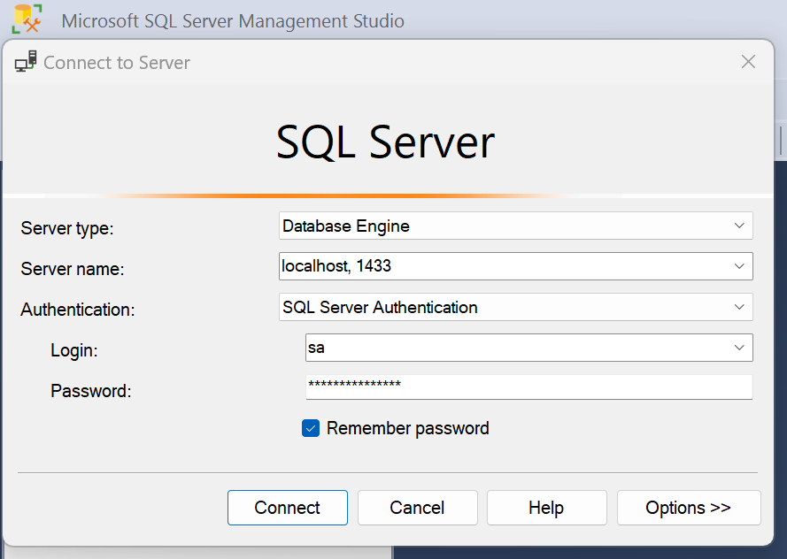
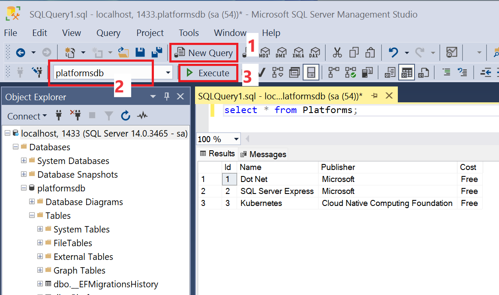

# part6 - Sql inside Kubernetes
 - creating Sql Server inside Kubernetes

## Terminology
1. Persistent Volume Claim - we stake in our yaml file that we need some persistent storage
2. Persistent Volume - this gets created under the hood. Ex Docker volume
3. Storage Class - our local filesystem

Since were using just a local machine, we only need to set up the first step. In AWS etc. every part would need to be configured.

## create the persistent volume claim

`local-volumeclaim.yaml`
```yaml
# the persistent volume claim. Basically to stake out real memory for the SQl-DB
apiVersion: v1
kind: PersistentVolumeClaim
metadata:
  name: mssql-claim
spec:
  accessModes:
    - ReadWriteMany
  resources:
    requests:
      storage: 200Mi
```

- next create our claim: (`hosepath` is the default filesystem that shows up `kubectl get storageclass`)
```
kubectl apply -f K8S/local-volumeclaim.yaml

kubectl get pvc
# NAME          STATUS   VOLUME                                     CAPACITY   ACCESS MODES   STORAGECLASS   AGE
# mssql-claim   Bound    pvc-263b1ab8-3f24-498f-b998-8aeea72f022b   200Mi      RWX            hostpath       57s
```

## use kubernetes secrets to store the sensitive data (here sql-password)
```
kubectl create secret generic mssql --from-literal=SA_PASSWORD="pa55sword!"
```

## create the ms-sql-server deploy

- `mssql-plat-depl.yaml`
```yaml
apiVersion: apps/v1
kind: Deployment
metadata:
  name: mssql-depl
spec:
  replicas: 1
  selector:
    matchLabels:
      app: mssql
  template:
    metadata:
      labels:
        app: mssql
    spec:
      containers:
        - name: mssql
          image: mcr.microsoft.com/mssql/server:2017-latest
          ports:
            - containerPort: 1443
          env:
            - name: MSSQL_PID
              value: "Express"
            - name: ACCEPT_EULA
              value: "Y"
            - name: SA_PASSWORD
              valueFrom:
                secretKeyRef:
                  name: mssql ## this name came from the `kubectl create secret generic mssql --from-literal=SA_PASSWORD="password123!"`
                  key: SA_PASSWORD
          volumeMounts:
            ## the path where in our dockercontainer the data is located at:
            - mountPath: /var/opt/mssql/data
              name: mssqldb
      volumes:
        - name: mssqldb
          persistentVolumeClaim:
            ## this references the one we created in our: `local-volumeclaim.yaml` 
            claimName: mssql-claim
---
# the DB needs to be accessible for it's Service so we create a ClusterIP for it
apiVersion: v1
kind: Service
metadata:
  name: mssql-clusterip-srv
spec:
  type: ClusterIP
  selector:
    app: mssql
  ports:
    - name: mssql
      protocol: TCP
      port: 1433
      targetPort: 1433
---
# the DB also needs to be accessible from outside the Kubernetes (at least for development)
# so we create a LoadbalancerService for it
apiVersion: v1
kind: Service
metadata:
  name: mssql-loadbalancer
spec:
  type: LoadBalancer
  selector:
    app: mssql
  ports:
  - protocol: TCP
    port: 1433
    targetPort: 1433
```

- then we fire it up:
    - we can see how it shows up in colum: `EXTERNAL-IP=localhost` so we should be able to reach there at port 1433
```
kubectl apply -f K8S/mssql-plat-depl.yaml

kubectl get services
# NAME                      TYPE           CLUSTER-IP      EXTERNAL-IP   PORT(S)          AGE
# commands-clusterip-srv    ClusterIP      10.105.102.58   <none>        80/TCP           10h
# kubernetes                ClusterIP      10.96.0.1       <none>        443/TCP          5d1h
# mssql-clusterip-srv       ClusterIP      10.105.73.193   <none>        1433/TCP         64s
# mssql-loadbalancer        LoadBalancer   10.103.72.144   localhost     1433:31483/TCP   64s
# platformnpservice-srv     NodePort       10.103.51.73    <none>        80:30085/TCP     4d1h
# platforms-clusterip-srv   ClusterIP      10.97.239.139   <none>        80/TCP           10h
```




# part5/2
We want to use the sql-db inside the Kubernetes Cluster. While keeping the in-memory-db in the normal development environment (`dotnet run`)
- `appesettings.Production.json` we add the ConnectionString
```json
{
    "CommandService": "http://commands-clusterip-srv:80/api/c/platforms/",
    "ConnectionStrings" : {
        "PlatformsConn" : "Server=mssql-clusterip-srv,1433;Initial Catalog=platformsdb;User ID=sa;Password=pa55sword!;"
    }
}
```
- we switch from using the in memory db all the time in `Program.cs`
```csharp
// we inject our Database context
builder.Services.AddDbContext<AppDbContext>(opts => {
    opts.UseInMemoryDatabase("InMem");
});
```
- to switchting db implementation depending on prod/dev:
```csharp
// we inject our Database context
builder.Services.AddDbContext<AppDbContext>(opts => {
    if (builder.Environment.IsProduction()) {
        Console.WriteLine("--> CASE PRODUCTION - using SqlServerDb");
        opts.UseSqlServer(builder.Configuration.GetConnectionString("PlatformsConn"));
    } else {
        Console.WriteLine("--> CASE DEV - using InMemoryDB");
        opts.UseInMemoryDatabase("InMem");
    }
});
```

- the in memory db doesnt need/want any Migrations. But when running against the real DB we want to apply those. In our `Data/PrepDb.cs` we add:
```csharp
// we want to migrate our migrations when against the real DB:
if(isProduction) {
    Console.WriteLine("--> Attempting to apply migrations.. ");
    try {
        ctx.Database.Migrate();
    } catch(Exception e) {
        Console.WriteLine($"--> Failed to run migrations! {e.Message}");
    }
}
```

### Generate the Migrations:
- THE FOLLOWING WILL NOT WORK:
```
!! dotnet --project PlatformService ef migrations add initialMigration

>>
Unable to resolve service for type 'Microsoft.EntityFrameworkCore.Migrations.IMigrator'. This is often because no database provider has been configured for this DbContext. A provider can be configured by overriding the 'DbContext.OnConfiguring' method or by using 'AddDbContext' on the application service provider. If 'AddDbContext' is used, then also ensure that your DbContext type accepts a DbContextOptions<TContext> object in its constructor and passes it to the base constructor for DbContext.    
```
- this happens because EntityFrameworks needs a NON-InMemoryDB provider to build its Migrations for.

### Solution A
- So we want to trick EF to think were using SQL server at. We could temporary comment out like this:

```csharp
// if (builder.Environment.IsProduction()) {
    Console.WriteLine("--> CASE PRODUCTION - using SqlServerDb");
    opts.UseSqlServer(builder.Configuration.GetConnectionString("PlatformsConn"));
// } else {
//     Console.WriteLine("--> CASE DEV - using InMemoryDB");
//     opts.UseInMemoryDatabase("InMem");
// }
```
- and then revert back once we ran the `dotnet --project PlatformService ef migrations add initialMigration`
### Solution B
- The for me cleaner looking way. Passing the environment to dotnet in the terminal:
  - so it will build migrations assuming env.Development is set.
```
dotnet ef --project PlatformService migrations add initialMigration -- --environment Production
```

### building, pushing to dockerhub, applying and restarting the kubernetesService

```
docker build -t vincepr/platformservice ./PlatformService
```

```
2023-10-15 12:49:07 --> CASE PRODUCTION - using SqlServerDb
2023-10-15 12:49:07 --> Attempting to apply migrations.. 
2023-10-15 12:49:08 info: Microsoft.EntityFrameworkCore.Database.Command[20101]
2023-10-15 12:49:08       Executed DbCommand (616ms) [Parameters=[], CommandType='Text', CommandTimeout='60']
2023-10-15 12:49:08       CREATE DATABASE [platformsdb];
// ..
23-10-15 12:49:09       Executed DbCommand (7ms) [Parameters=[], CommandType='Text', CommandTimeout='30']
2023-10-15 12:49:09       CREATE TABLE [Platforms] (
2023-10-15 12:49:09           [Id] int NOT NULL IDENTITY,
2023-10-15 12:49:09           [Name] nvarchar(max) NOT NULL,
2023-10-15 12:49:09           [Publisher] nvarchar(max) NOT NULL,
2023-10-15 12:49:09           [Cost] nvarchar(max) NOT NULL,
2023-10-15 12:49:09           CONSTRAINT [PK_Platforms] PRIMARY KEY ([Id])
2023-10-15 12:49:09       );

// ...

2023-10-15 12:49:09 --> Seeding Data with some made up Data
// ...
2023-10-15 12:49:09       INSERT ([Cost], [Name], [Publisher])
2023-10-15 12:49:09       VALUES (i.[Cost], i.[Name], i.[Publisher])
2023-10-15 12:49:09       OUTPUT INSERTED.[Id], i._Position;
```
- we can now check into our persistent db and the 3 seed-Platforms should show up:

