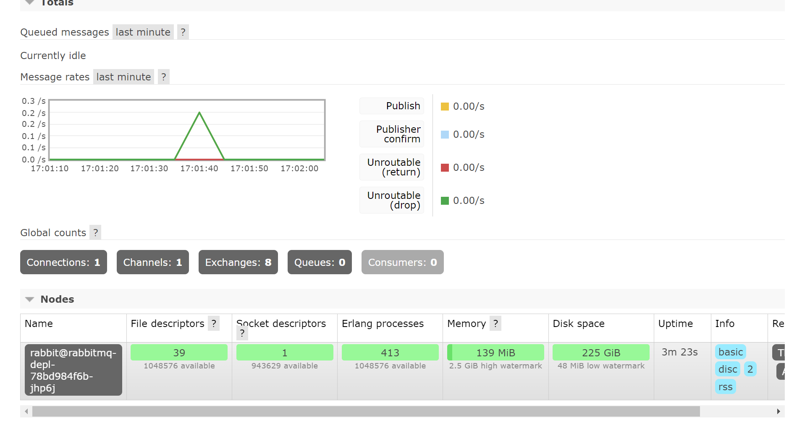

# part 8 - Message Bus with RabbitMQ
Goal is to implement the Message-Bus and add the PlatformService as a Publisher and the CommandService as a Subscriber.

## notes about RabbitMQ
- Message Broker: accepts, forwards messages
- Messages are stored on Queues. (in real production those would be persisted if RabbitMQ crashes etc...)
- uses AMQP - Advanced Message Queuing Protocl (among others)
- 4 types of exchanges
    - direct exchange - delivers messages to queues based on a routing key. ideal for direct/unicasting messaging
    - fanout exchange (used here) - delivers messages to all queues bound to the exchange. ideal for broadcast messages.
    - topic exchance - routes messages to 1 or more queues based on routingkey/patterns. ideal for multicasting messages
    - header exchange

## starting up RabbitMQ in Kubernetes
- `K8S/rabbitmq-depl.yaml`
```yaml
apiVersion: apps/v1
kind: Deployment
metadata:
  name: rabbitmq-depl
spec:
  replicas: 1
  selector:
    matchLabels:
      app: rabbitmq
  template:
    metadata:
      labels:
        app: rabbitmq
    spec:
      containers:
        - name: rabbitmq
          image: rabbitmq:3-management
          ports:
            ## first port is just to access the "management" webinterface
            - containerPort: 15672
              name: rbmq-mgmt-port
            ## this is the used port for the Bus itself
            - containerPort: 5672
              name: rbmq-msg-port
---
# the Bus needs to be accessible from the Services inside Kubernetes, so we create a ClusterIP for it
apiVersion: v1
kind: Service
metadata:
  name: rabbitmq-clusterip-srv
spec:
  type: ClusterIP
  selector:
    app: rabbitmq
  ports:
    - name: rbmq-mgmt-port
      protocol: TCP
      port: 15672
      targetPort: 15672
    - name: rbmq-msg-port
      protocol: TCP
      port: 5672
      targetPort: 5672 
---
# the Bus also needs to be accessible from outside the Kubernetes (at least for development)
# so we create a LoadbalancerService for it
apiVersion: v1
kind: Service
metadata:
  name: rabbitmq-loadbalancer
spec:
  type: LoadBalancer
  selector:
    app: rabbitmq
  ports:
    - name: rbmq-mgmt-port
      protocol: TCP
      port: 15672
      targetPort: 15672
    - name: rbmq-msg-port
      protocol: TCP
      port: 5672
      targetPort: 5672 
```
- then we deploy our messagebus
```
kubectl apply -f K8S/rabbitmq-depl.yaml
```
- now we can reach out messagebus webinterface with `localhost:15672` username: guest password: guest

## Code in PlatformService - The Publisher
```
dotnet add package RabbitMQ.Client
```
- we add to `appsettings.Development.json` 
```json
"RabbitMQHost": "localhost",
"RabbitMQPort": "5672"
```
- we add to `appsettings.Production.json`
```json
"RabbitMQHost": "rabbitmq-clusterip-srv",
"RabbitMQPort": "5672"
```

- we create `Dtos/PlatformPublishedDto` This is the Event that gets pushed onto the MessageBus
```csharp
public class PlatformPublishdDto {
    public required int Id { get; set; }
    public required string Name { get; set; }  
    public required string Event { get; set; }
}
```

### Implementing the Message Bus Client

- we create an interface for the following RabbitMQ Message Bus implementation. `AsyncDataServices/IMessageBusClient.cs`
```csharp
public interface IMessageBusClient {
    void PublishNewPlatform(PlatformPublishdDto newCreatedPlatform);
}
```

- we inject our Bus in `Program.cs`. Here as a Singleton as we assume it always stays the "same" connection.
```csharp
builder.Services.AddSingleton<IMessageBusClient, MessageBusClient>();
```
`AsyncDataServices/IMessageBusClient.cs`
```csharp
public class MessageBusClient : IMessageBusClient
{
    private readonly IConfiguration _config;
    private readonly RabbitMQ.Client.IConnection _connection;
    private readonly RabbitMQ.Client.IModel _channel;

    public MessageBusClient(IConfiguration configuration) {
        _config = configuration;
        // RabbitMQ 1. wants the factory with config data 
        var factory = new RabbitMQ.Client.ConnectionFactory() {
            HostName = _config["RabbitMQHost"],
            Port = int.Parse(_config["RabbitMQPort"]!),
        };

        try {
            // RabbitMQ 2. wants us to create the connection itself
            _connection = factory.CreateConnection();

            // RabbitMQ 3. wants us to create our channel
            _channel = _connection.CreateModel();

            // RabbitMQ 4. wants us to create the Exchange( in this case the fanout-type)
            _channel.ExchangeDeclare(exchange: "trigger", type: ExchangeType.Fanout);

            _connection.ConnectionShutdown += RabbitMQ_ConnectionShutdown;

            Console.WriteLine("--> Connected to MessageBus");

        } catch (Exception e) {
            Console.WriteLine($"--> Could not connect to the Messagebus! {e.Message}");
        }
    }

    public void PublishNewPlatform(PlatformPublishdDto newCreatedPlatformDto) {
        var message = JsonSerializer.Serialize(newCreatedPlatformDto);

        if (_connection.IsOpen) {
            Console.WriteLine("--> RabbitMQ Connection Open, sending message.");
            SendMessage(message);
        } else {
            Console.WriteLine("--> RabbitMQ Connection CLOSED, NOT sending!");
        }
    }

    private void SendMessage(string message) {
        var body = Encoding.UTF8.GetBytes(message);
        _channel.BasicPublish(
            exchange: "trigger", 
            routingKey: "", 
            basicProperties: null, 
            body: body);
        
        Console.WriteLine($"--> We have sent {message}");
    }
    
    // properly close ressources when this class leaves scope/dies
    public void Dispose() {
        Console.WriteLine("--> MessageBus Disposed");
        if (_channel.IsOpen) {
            _channel.Close();
            _connection.Close();
        }
    }

    // triggers every time the connection to the Bus gets shut down
    private void RabbitMQ_ConnectionShutdown(object? sender, ShutdownEventArgs args) {
        Console.WriteLine($"--> RabbitMQ Connection Shut Down. args={args}");
    }
}
```

### We Use that Bus to send in our Controller
- for a first test we just spin up both Services while having Kubernetes active (for the RabbitMQ Bus).
- When we send a postrequest to `http://localhost:5062/api/platforms/` we see in our logs for PlatformService:
```
--> Connected to MessageBus
info: Microsoft.EntityFrameworkCore.Update[30100]
      Saved 1 entities to in-memory store.
// ...
--> Sync POST to CommandService was OK.
--> RabbitMQ Connection Open, sending message.
--> We have sent {"Id":4,"Name":"Docker","Event":"New_Platform_Published"}
```
- And a peek into the RabbitMQ manager web interface shows the recent message:


## Code in CommandsService - The Subscriber
### Setup
- add the package
```
dotnet add package RabbitMQ.Client
```
- add RabbitMQ-configSettings to `appsettings.Development.json` and add `appsettings.Production.json` like previous Service

- we add two new Dtos: `Dtos/GenericEventDto.cs` `Dtos/PlatformPublishedDto.cs`
```csharp
public class GenericEventDto
{
    public required string Event { get; set; }
}
public class PlatformPublishedDto 
{
    public required int Id { get; set; }
    public required string Name { get; set; }  
    public required string Event { get; set; }
}
```

- we add to our Mappings:
```csharp
CreateMap<PlatformPublishedDto, Platform>()
    .ForMember(dest => dest.ExternalId, opt => opt.MapFrom(src => src.Id));
    // Basically we want to take PlatformPublishedDto.Id and map it to our Platform.ExternalID
```

- we add to our `Data/ICommandRepo.cs`
```csharp
/// <summary>
/// Checks if we already added this ExternalPlatform to our data. If so were synced up. Makes sure we dont duplicate data. 
/// </summary>
bool ExternalPlatformExist(int ExternalPlatformId);
```
- we add to our `Data/CommandRepo.cs`
```csharp
public bool ExternalPlatformExist(int ExternalPlatformId)
{
    return _ctx.Platforms.Any(p => p.ExternalId == ExternalPlatformId);
}
```
**Note about Dependency Injection:**

The Implementation listening on our Bus will be added as a Singleton. - so for the lifetime of the app.
- That Singleton-Service will create "instances" of the EventProcessor (available via dependency-injection)
  - so the EventProcessor MUST have a lifetime the same or greater than it's "parent" - so it MUST be a Singleton aswell.
  - A Consequence of this is, that we can not inject our repository here in the constructor of EventProcessor(). Because it will only get created once.
    - so we need to pass in the reference to repo another way. 

- we add `EventProcessing/IEventProcessor.cs`. Basically whenever we get an Event, we use this To Map over our Reactions. Ex we Deserialize it, add it to localPlatformsData if neccessary etc... Ignore it if its a wrong kind of Event...
```csharp
public interface IEventProcessor
{
    void ProcessEvent(string message);
}
```

- and we inject it as singleton in our main:
```csharp
builder.Services.AddSingleton<IEventProcessor, EventProcessor>();
```

- finally we write the implementation `EventProcessing/EventProcessor.cs`
```csharp
public class EventProcessor : IEventProcessor
{
    private readonly IServiceScopeFactory _scopeFactory;
    private readonly IMapper _mapper;

    public EventProcessor(
        IServiceScopeFactory scopeFactory,
        IMapper mapper
    )
    {
        _scopeFactory = scopeFactory;
        _mapper = mapper;
    }
    public void ProcessEvent(string message)
    {
        var eventType = DetermineEvent(message);
        switch (eventType)
        {
            case EventType.PlatformPublished:
                AddPlatform(message);
                break;
            default:
                break;
        }
    }

    private EventType DetermineEvent(string notificationMessage)
    {
        Console.WriteLine("--> Determining event");
        var eventType = JsonSerializer.Deserialize<GenericEventDto>(notificationMessage);

        if (eventType is null)
        {
            Console.WriteLine("--> Serializing event-type wrent wrong. Is Null");
            return EventType.Undetermined;
        }

        switch (eventType.Event)
        {
            case "New_Platform_Published":
                Console.WriteLine("--> New_Platform_Published event-type detected.");
                return EventType.PlatformPublished;
            default:
                Console.WriteLine("--> Could not determine event-type.");
                return EventType.Undetermined;
        }
    }

    // TODO use AddPlatform
    private void AddPlatform(string platformPublishedMessage)
    {
        // use the scopeFactory to get access to our repository
        // this is neccessary because of the different lifetimes of our repo vs our Singleton-EventProcessing
        using (var scope = _scopeFactory.CreateScope())
        {
            var repo = scope.ServiceProvider.GetRequiredService<ICommandRepo>();
            var platformPublishedDto = JsonSerializer.Deserialize<PlatformPublishedDto>(platformPublishedMessage);

            try
            {
                var plat = _mapper.Map<Platform>(platformPublishedDto);
                if (!repo.ExternalPlatformExist(plat.ExternalId))
                {
                    repo.CreatePlatform(plat);
                    repo.SaveChanges();
                    Console.WriteLine($" --> Added Platform=[{plat.Name}] to local-Server");
                }
                else
                {
                    Console.WriteLine(" --> Platform already exists in local db...");
                }
            }
            catch (Exception e)
            {
                Console.WriteLine($"--> Could not add Platform do DB; {e.Message}");
            }
        }
    }
}
enum EventType
{
    PlatformPublished,  // <= "New_Platform_Published" as Event string
    Undetermined        // <= any other Event
}
```

- `AsyncDataServices/MessageBusSubscribers.cs`
```csharp
// A Background Service. A long running Task. That probably will run over the whole duration of the App. If nothing goes wrong
public class MessageBusSubscriber : BackgroundService
{
    private readonly IConfiguration _config;
    private readonly IEventProcessor _eventProcessor;
    private IConnection? _connection;
    private IModel? _channel;
    private string? _queueName;

    public MessageBusSubscriber(IConfiguration config, IEventProcessor eventProcessor)
    {
        _config = config;
        _eventProcessor = eventProcessor;
        InitializeMQ();
    }

    private void InitializeMQ()
    {
        var factory = new ConnectionFactory()
        {
            HostName = _config["RabbitMQHost"],
            Port = int.Parse(_config["RabbitMQPort"]!),
        };
        _connection = factory.CreateConnection();
        _channel = _connection.CreateModel();
        _channel.ExchangeDeclare(exchange: "trigger", type: ExchangeType.Fanout);
        _queueName = _channel.QueueDeclare().QueueName;
        _channel.QueueBind(queue: _queueName,
            exchange: "trigger",
            routingKey: "");

        Console.WriteLine("--> Listening on the Message Bus.");

        _connection.ConnectionShutdown += RabbitMQ_ConnectionShutdown;
    }

    private void RabbitMQ_ConnectionShutdown(object? sender, ShutdownEventArgs e)
    {
        Console.WriteLine("--> connection Shutdown");
    }

    public override void Dispose()
    {
        if (_channel is not null && _channel.IsOpen)
        {
            _channel.Close();
            _connection?.Close();
        }
        base.Dispose();
    }
    protected override Task ExecuteAsync(CancellationToken stoppingToken)
    {
        stoppingToken.ThrowIfCancellationRequested();

        var consumer = new EventingBasicConsumer(_channel);
        consumer.Received += (Modulehandle, ea) => 
        {
            Console.WriteLine("--> Event Received,");
            var body = ea.Body;
            var notificationMessage = Encoding.UTF8.GetString(body.ToArray());
            _eventProcessor.ProcessEvent(notificationMessage);
        };
        _channel.BasicConsume(queue: _queueName, autoAck: true, consumer: consumer);
        return Task.CompletedTask;
    }
}
```

- we inject it to our main:
```csharp
builder.Services.AddHostedService<MessageBusSubscriber>();
```

- now we should be able to test the whole pipeline locally. 
    - start both servers up
- create a new Platform -> see the data hit our Subscriber:
- Create commands for the new platform and get those back.
```
>> LOG FROM CommandsService
--> Inbound POST # Command Service
--> Event Received,
--> Determining event
--> New_Platform_Published event-type detected.
info: Microsoft.EntityFrameworkCore.Update[30100]
      Saved 1 entities to in-memory store.
 --> Added Platform=[Docker] to local-Server
```

## We Publish the above steps to Kubernetes
```
// (using my Makefile)
make dev


// (manually)
docker build -t vincepr/platformservice ./PlatformService
docker push vincepr/platformservice 
kubectl rollout restart deployment platforms-depl

docker build -t vincepr/commandservice ./CommandsService
docker push vincepr/commandservice
kubectl rollout restart deployment commands-depl
```

- now everything should be working up there.