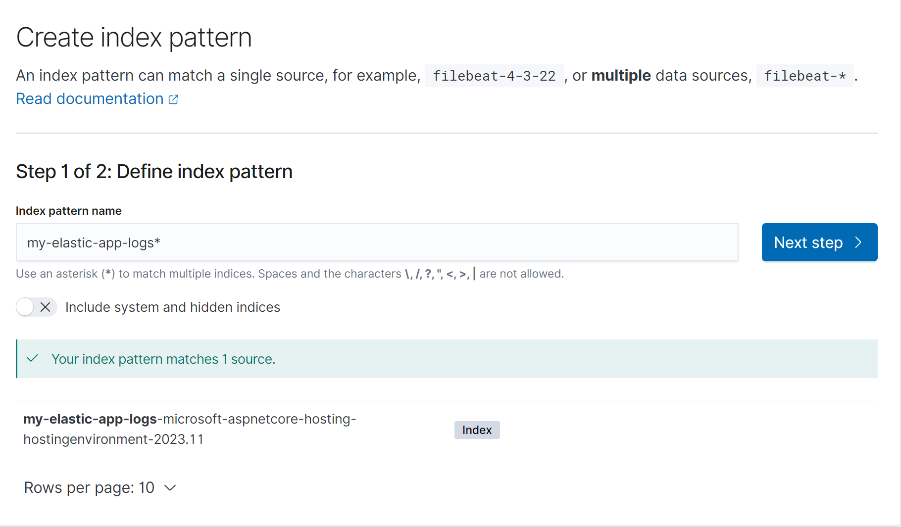
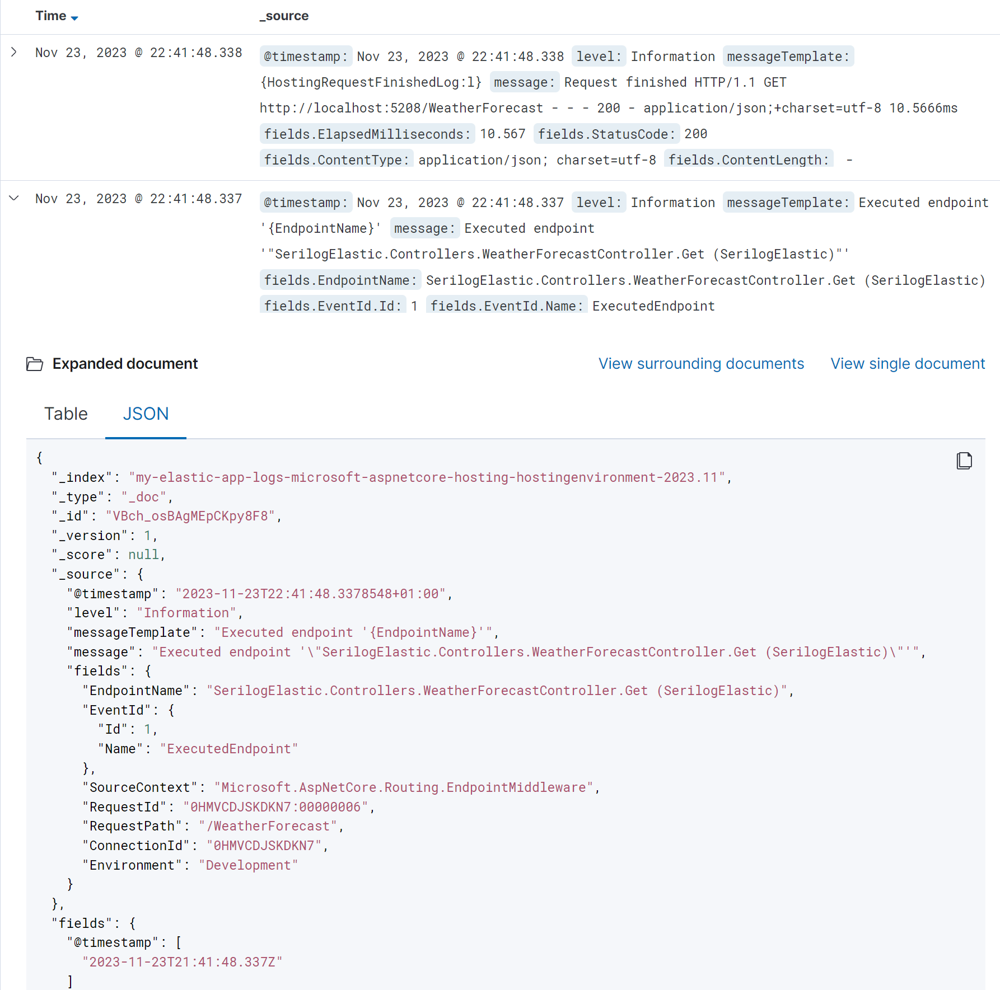

# Serilog and Elasticsearch / Kibana

## spinning up kibana/elasticsearch in docker
- create `docker-compose.yaml`
```yaml
version: '2.2'
services:
  es01:
    image: docker.elastic.co/elasticsearch/elasticsearch:7.9.0
    container_name: es01
    environment:
      - node.name=es01
      - cluster.name=es-docker-cluster
      - cluster.initial_master_nodes=es01
      #      - discovery.type=single-node
      - bootstrap.memory_lock=true
      - "ES_JAVA_OPTS=-Xms512m -Xmx512m"
    ulimits:
      memlock:
        soft: -1
        hard: -1
    volumes:
      - data01:/usr/share/elasticsearch/data
    ports:
      - 9200:9200
    networks:
      - elastic
  kib01:
    image: docker.elastic.co/kibana/kibana:7.9.0
    container_name: kib01
    ports:
      - 5601:5601
    environment:
      ELASTICSEARCH_URL: http://es01::9200
      ELASTICSEARCH_HOSTS: http://es01:9200
    networks:
      - elastic
#    depends_on:
#      - es01   

volumes:
  data01:
    driver: local

networks:
  elastic:
    driver: bridge
```
- and spin it up with docker-compose up
- on windows (with docker-desktop) temporarily move vm map count up:
  - alt could be to use discovery.type=single-node 
```
wsl -d docker-desktop
sysctl -w vm.max_map_count=262144
```
- now we should see on http://localhost:9200/ a json with info about the elastic
  now we should see on http://localhost:5601/ the kibana application

## Getting Net project ready
- add Serilog.AspNetCore
- add Serilog.Sinks.Elasticsearch
- add Serilog.Enrichers.Environment
- in the `appsettings.json` replace the Logging entries:
```json
{
  "Logging": {
    "LogLevel": {
      "Default": "Information",
      "Microsoft.AspNetCore": "Warning"
    }
  },
  "AllowedHosts": "*"
}
```
```json
{
  "Serilog": {
    "MinimumLevel": {
      "Default": "Information",
      "Override": {
        "Microsoft": "Information",
        "System": "Warning"
      }
    }
  },
  "AllowedHosts": "*"
}
```

## Programm.cs
```csharp
using Serilog;
using Serilog.Sinks.Elasticsearch;

var builder = WebApplication.CreateBuilder(args);
// setup the logger
Log.Logger = new LoggerConfiguration()
    .Enrich.FromLogContext()
    .WriteTo.Console()
    .WriteTo.File("logs.txt")
    .WriteTo.Elasticsearch(new ElasticsearchSinkOptions(new Uri("http://localhost:9200"))
    {
        IndexFormat =
            $"my-elastic-app-logs-{builder.Environment.ToString()!.ToLower().Replace(".", "-")}-{DateTime.UtcNow:yyyy:MM}",
        AutoRegisterTemplate = true,
        NumberOfShards = 2,
        NumberOfReplicas = 1,
    })
    .Enrich.WithProperty("Environment", builder.Environment.EnvironmentName)
    .ReadFrom.Configuration(builder.Configuration)     // use "Serilog" settings from our appsettings
    .CreateLogger();

builder.Host.UseSerilog();                          // <- !!
builder.Services.AddControllers();
builder.Services.AddEndpointsApiExplorer();
builder.Services.AddSwaggerGen();
var app = builder.Build();
if (app.Environment.IsDevelopment())
{
    app.UseSwagger();
    app.UseSwaggerUI();
}
app.UseHttpsRedirection();
app.UseAuthorization();
app.MapControllers();
app.Run();

```

## The Controller
```csharp
[HttpGet(Name = "GetWeatherForecast")]
public ActionResult<IEnumerable<WeatherForecast>> Get()
{
    try
    {
        if (new Random().Next(0, 5) < 2) 
            throw new Exception("Something broke randomly");
    }
    catch (Exception ex)
    {
        _logger.LogError(ex, "An Error happened.");
        return new StatusCodeResult(500);
    }
    
    return Ok(Enumerable.Range(1, 5).Select(index => new WeatherForecast
        {
            Date = DateOnly.FromDateTime(DateTime.Now.AddDays(index)),
            TemperatureC = Random.Shared.Next(-20, 55),
            Summary = Summaries[Random.Shared.Next(Summaries.Length)]
        })
        .ToArray());
}
```
- now (while docker is running) just hit the controller a bunch for some data

## kibana
- first we need to create an Index that we can filter our data by:

- we can select `@timestamp` if we want to per default sort the data chronologically

- if we now click discover we should see our data already:

