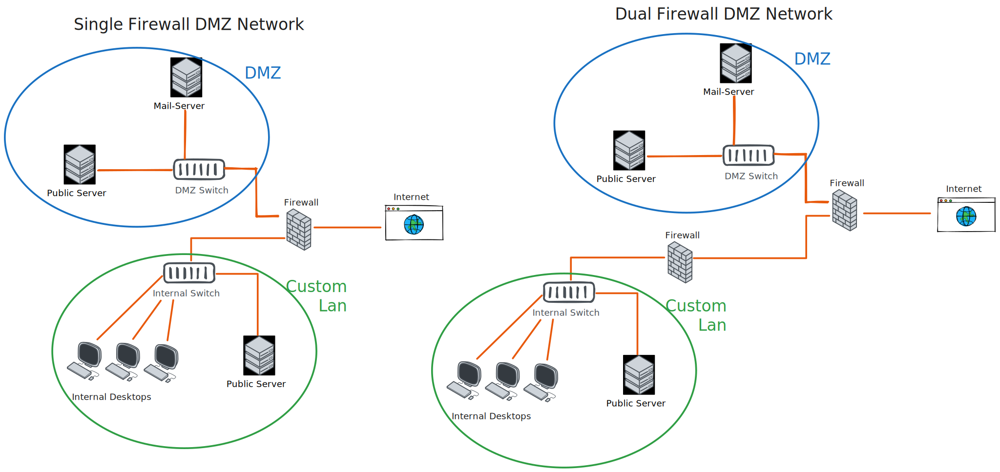

# Building blocks Networksecurity

## Firewall

### Basics - (hardware) Firewall
- System aus Software und Hardwarekomponenten
- Ip basierte Netze koppeln
- Zugriff überwachen und Einschränken
- Der gesamte Netzwerkverkehr nach und von außen geht durch die Firewall

#### Wann macht eine hardware Firewall Sinn
z.B. Intranet, Sensible Daten (mehr Sicherheit als Softwarefirewall). Oder bei großem Volumen, z.B. Provider einer API oder eines großen Onlinestores.
- **Vorteile**: erhöte Sicherheit, größeres Volumen möglich, mehr/bessere erweitere Funktionalitäten, bessere Admin-Verwaltung.
- **Nachteile**: Anschaffungskosten, benötigtes Fachwissen zum einrichten.

### Angrifsfäche einer Firewall
- DDOS. Begrenzte Kapazität/Durchfluss-Rate der Firewall kann überwältigt werden.
- Konfigurationsfehler
- Umgehung von Firewall-regeln.

### Firewallarten
- **Packetfilternde Firewalls** - verifies IPs, Ports and Protocols.
- **Circuit Level Gateway** - verifies TCP handshakes and session fulfilment rules. Consumes low resources.
- **Stateful Inspection FW** - packetfilternd und circuit-level.
- **Next gen FW** - adds features like SSL and SSH inspection, deep-packet inspection, anti malware features.
- **Application level FW** - advanced features against things like SQL-injections, cross-site-scripting, cookie-tempering.
- **Unifed Thread management** - combining multiple security features (anti-virus, anti-spam, content filtering, web-filtering) in a single device.

## DMZ
- Eigenständiges Netzwerk, das als Pufferzone zwischem dem Internet und Intranet fungiert.
- Oft (aber nicht zwingend) mit eigener Firewall
- safety hardened (more so than needed for internal networks)
- einfach einzurichten und zu verwalten

### who is in a dmz network usually
- Email servers
- FTP servers
- Web servers
- Reverse-Proxy (to add another layer before the Web servers or secure content behind some auth)

## Exposed Host
- dmz für arme
- open both directions
- uses public ip (or via dyndns etc.)

## Proxy (forward-Proxy)
Vermittler in einem Netzwerk. Jede Verbindung geht nicht direkt ins Internet, sondern an den Proxy, der dann weiterleitet.

### Vorteile
- Einsparen von Bandbreite.
- Bessere Kontrolle (z.B. Welche Webseiten aufgerufen werden)
    - Whitelist/Blacklist einfach implementierbar
    - Identitäten hinter dem Proxy verborgen
- Erhöhung des Datenschutzes/Sicherheit
- Caching kann Geschwindigkeit erhöhen
- Kontrolle über Bandbreite, Lastenverteilung steuerbar
    - Kann für Loadbalancing eingesetzt werden

### Reverse-Proxy
sits in front of back-end applications and forwards client(ex. browsers) requests to those.
- help increase scalability, performance, resilience and security. by for example caching static content, acting as load balancers, redirecting not logged in reuqests to login page etc...
- Popular examples that include reverse proxys: nginx, apache, caddy.

## IDS - Intrusion Detection System
Sammelt daten und Analysiert diese automatisiert aus um dann nach gewissen Regel automatisiert zu benachrichtigen. (auch als moderne KI systeme möglich)
- passives tool
- Soll eine Ergänzung zur Firewall sein
- Es soll Muster/Anomlien erkennen (Viele Login-Requests fehlgeschlagen, Viele Timeouts etc.)
    - automatisierte Meldungen an Admin
- Host-basiert / Netzwerk-basiert / Hybride-systeme

## IPS
Wie IDS, reagiert jedoch auch und meldet nicht ausschließlich.
- aktives tool
- automatische Abwehrmaßnahmen ergreifen
- z.B. 
    - Verbindung unterbrechen
    - Pakete verwerfen
    - Verbindungen von Zeil und Quelle
    - grundsätzliches Blocken
    - Admin informieren
