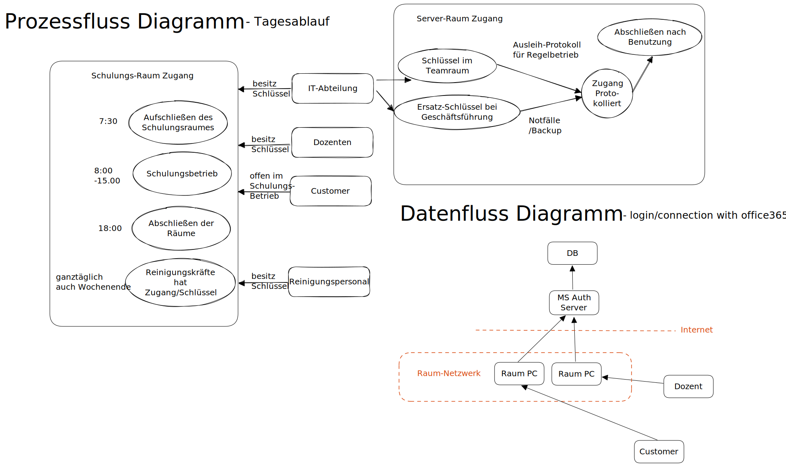
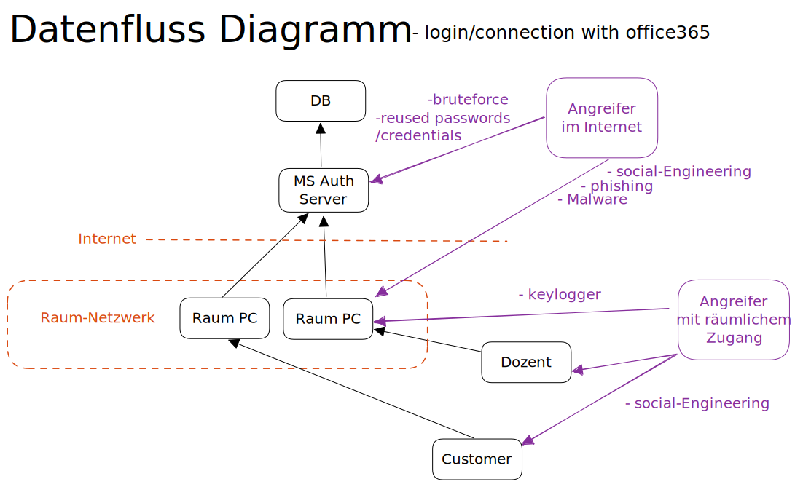

# Bedrohungsanalyse - Threat Moddeling
1. Einleitung - was ist Threat Modelling
2. Analyse des Anwendungsfalles
3. Datenfluss-Diagramm?
4. Ermittlung und Einstufung von Bedrohungen
5. Security Controls - Maßnahmen zur Bedrohungsabwehr
6. Zusammenfassung

## 1. Einleitung - was ist Threat Modelling
Im Kontext der IT-Sicherheit ist einer der Bausteine das Thema **Threat Analysis**. In kurz: ein systematisches Schema zur Bedrohungsanalyse. Um z.B. im Rahmen eines Kundenauftrages ein klar definiertes Ergebnis zu erarbeiten.
- Anhand von Tabellen und Definitonen können die Begriffe und Entitäten des zu untersuchenden IT-Systems in eine Struktur gebracht werden, die es letztendlich erlaubt, Bedrohungen zu erkennen und zu managen.

Die folgenden 3 Phasen sind in diesem Prozess Vorgesehen:
- Zerlegen des Systems in Komponenten und Ablaufpläne 
- Bedrohungen erkennen und einstufen
- Bestimmungen von Gegenmaßnahmen und Entschärfungen/ Risikominderung

## 2. Analyse des Anwendungsfalles - Ziele festlegen
### allgemeine Ziele:
In der Regel sind Ziele Confidentiality, Integrity und Ability (auch im Angriffsfall). Dies trifft auch für unser Beispiel zu.
- Confidentiality - Vertraulichkeit. Es soll keine unautorisierte Informationsgewinnung möglich sein.
    - Untergeordnete Schutzziele sind z.B. 
        - Unverkettbarkeit
        - Unbeobachtbarkeit
        - Nicht-Verfolgbarkeit
	- Bsp. zur Realisierung z.B. Verschlüsselung
- Integrity - Integrität:
    - Datenintegrität: Korrektheit der Daten
    - Systemintegrität: korrekte Funktionsweise des Systems
    - Mögliche Manipulationen sind z.B. das Verändern von Daten, Löschen von Daten und Einfügen von Daten.
    - Sollte keine starke Integrität vorliegen (keine mögliche Datenmanipulation möglich) sollte mindestens eine schwache Integrität gewährleistet werden: (Datenmanipulation sollte in keinem FAll unbemerkt möglich sein)
    - Bsp. zur Realisierung von Integrität sind z.B. Message Authentication Codes oder Tamper-Resistant Security Module.
- Availability - Verfügbarkeit: Systeme sollen jederzeit (wenn benötigt) betriebsbereit sein.
    - im Sicherheitskontext spielt das Schutzziel Verfügbarkeit eine wichtige Rolle. Inwieweit können z.B. denial of Service Angriffe unsere Systeme blockieren, stören oder lahmlegen.

### Weitere Ziele
unter anderem sind auch folgende Ziele von Bedeutung:
- Authentizität
- Nichtabstreitbarkeit
- Zurechenbarkeit
- Privatsphäre
- Einhalten von Datenschutzverordnung und anderen gesetzlichen Rahmenbedingungen

## 3. Datenfluss-Diagramm
- Zum Anwendungsfall werden erste Datenfluss und Prozessfluss Diagramme erstellt um eine erste Übersicht zu bekommen

## 4. Ermittlung und Einstufung von Bedrohungen
Grundsätzliche Herangehensweise bei Thread-modeling:
- asset-centric: Alle Bausteine werden individual auf Schwachstellen analysiert
- attacker-centric: Für bestimmte Angreifer-Profile überlegen welche Schnittstellen wie interessant und angreifbar sind
- software-centric: Aus System-Design Blickwinkel analysieren wie Daten durch das System/App fließen und wie diese Schnittstellen konfiguriert sind.

Im Folgenden wird eine (attacker-centric) Herangehensweise gewählt. Für einige denkbare und wahrscheinliche Angriffs-Potentiale sollen im Folgenden die Bedrohungen definiert und auf ihr Risikopotential eingestuft werden.

### Anhand der Diagramme Bedrohungen herausarbeiten

### Bedrohung Einstufen

#### Angreifer bekommt zugang zu Zustomer-Account(s)
|Risiko-Faktor|Einschätzung|Faktor|
|---|---|---|
|Damage|Bedrohung auf Nutzerdaten dieses Nutzers beschränkt|5|
|Reproducibility|Komplett reproduzierbar|10|
|Exploitability|Durch shared Medien (ex Onedrive)|7|
|Affected Users|Ein Nutzer ist ursprünglich betroffen|2|
|Discoverability|Kann je nach Methode nur schwer Bemerkt werden|8|
| |DREAD-Score: | 6.4 |

Angriffsvektoren:
- brutefoce auf MS-Accounts
- data leaked Credentials+Passwords reused for MS-Accounts
- keylogger auf Lokalen Maschienen
- phishing, social engineering, malware angriffe auf einzelne User

#### Zugang zu Schulungsräumen
|Risiko-Faktor|Einschätzung|Faktor|
|---|---|---|
|Damage|In der Regel auf Unterrichtszeiten begrenzt|3|
|Reproducibility|komplett reproduzierbar|10|
|Exploitability|im Regelbetrieb wenig freie Zeit für Angriffe|4|
|Affected Users|alle User im betroffenen Raum|7|
|Discoverability|je nach Art der Zugangsbeschaffung sehr leicht bemerkbar|4|
| |DREAD-Score: | 5.6 |

Angriffsvektoren:
- pseudo Öffentlichkeit der Schulungsräume / des geteilten Büros
- Innerhalb der öffnungszeiten leicht zugänglich
- Auserhalb normaler Werktage sind destruktive-Zugangsmethoden relevant (Einbruch ...)

#### Zugang zu Serverräumen
|Risiko-Faktor|Einschätzung|Faktor|
|---|---|---|
|Damage|Sehr Hoch|10|
|Reproducibility|nur mit großem Wissen/Zufall möglich|2|
|Exploitability|Nahezu unbegrenztes Potential|10|
|Affected Users|Nicht nur auf Standort beschränkt|10|
|Discoverability|Je nach Zugriffsmethode|5|
| |DREAD-Score: | 9.2 |

Angriffsvektoren:
- zerstörungsfreie Methoden wie Lockpicking, Diebstahl, Nachlässigkeit im Umgang mit Schlüssel
- zerstörende Methoden wie aufbrechen der Türen

## 5. Security Controls - Maßnahmen zur Bedrohungsabwehr
Liste zu treffender Gegenmaßnahmen:

### - Bios Passwort aller öffentlich zugänglichen PCs setzen
Somit wird es für einen Angreifer deutlich schwerer ohne Zugangsdaten Zugriff auf die Rechner oder Daten auf ihnen zu bekommen
- als Erweiterung könnten auch USB Anschlüsse im Bios deaktiviert werden

### - Daten auf den Festplatten verschlüsseln
Selbst mit Zugriff auf die Rechner selbst, sind so Die Eigentlichen Daten der Nutzer(Customer/Dozenten) deutlich sicherer.

### - Schulungsräume außerhalb der Schulzeiten verschließen
Nur so kann durch den pseudo-öffentlichen shared office-space der Zugang für potentielle Angreifer erschwert werden

### - Schulung von Dozenten und Customern
Nur so können Angriffsvektoren wie social-engineering, phishing und übliche Malware angriffe die auf Unwissenheit der Endnutzer abspielen minimiert werden.

### - Vergabe von username, der von Robotron generiert wurde
Usernamen von robotron vergeben: Nachname+BuchstabeVorname@myrobotron (z.B. SmithE@myrobotron.de). Somit können Überschneidungen mit (eventuell geleakten) 3rd Party Accountzugangsdaten vermieden werden.

### - Passwort Mindestanforderungen
Festlegen von Mindestlänge, Verwendung von Sonderzeichen und Zahlen.

### - Ein klares Protokoll zum Umgang mit Schlüssel für den Serverraum definieren
Raum sollte jederzeit abgeschlossen sein und alle Zugangsmethoden nicht öffentlich zugänglich sein
- Es muss des weiteren Sichergestellt werden, das Putzpersonal/Hausmeister soweit möglich keinen Zugang zu diesem haben.

## 6. Zusammenfassung
Abschlussgedanken:
- Methoden zum Testen der Maßnahmen sind hierbei noch nicht berücksichtigt und sollten Teil eines erweiterten Sicherheits-Konzepts sein.
- Gegen zerstörende Zugriffsmethoden, z.B. Aufbrechen der Serverräume, sind Maßnahmen, wie z.B. Panzertüren, mit unverhältnismäßig großen Kosten gepaart und wurden deswegen verworfen.
- Ebenso die Kompetenz Risiken zerstörungsfreier Zugriffsmethoden wie Lockpicking, Diebstahl einzuschätzen. Hierfür müssten noch gesonderte Gutachten in Auftrag gegeben werden.
