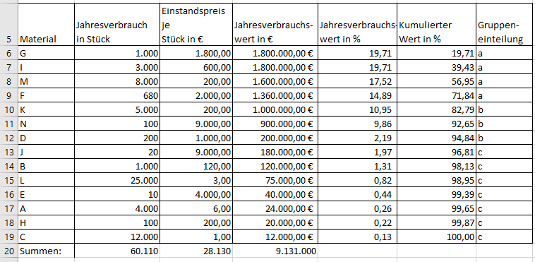

# Beschaffung

## Ziele der Beschaffung
- Versorgungsziel: kurze Lieferzeiten, hohe Termintreue, zuverlässige Lieferungen, flexible Lieferung
- Kostenreduzierung: niedrige Bezugskosten, niedrige Lagerkosten, niedrige Fehlmengenkosten
- Qualitätsverbesserung: bereits gute Qualität einkaufen, stets gleichbleibenden Qualität
- Ökologische Ziele: reduktion der Emissionen, ressourcenschonender Umgang, Abfallvermeidung, Umweltschonende Materiallogistik

Daraus ergeben sich Zielkonflikte wie:
- hohe Lieferbereitschaft - niedrige Lagerkosten
- günstige Einstandspreise - niedrige Materialbestände
- günstige Einstandspreise - hoohe Umweltverträglichkeit

## ABC-Analyse
Festlegung der Schranken ist ermessenssache, üblich A-Güter die ersten 75-80% kommulierte Werte. C-Güter kummulierter Wertanteil von weniger als 5%.

