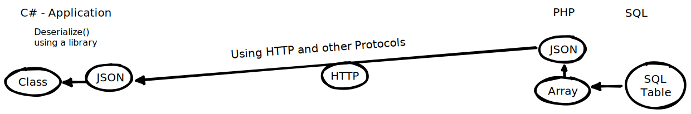

# Projekt ereignisgesteuerte App in C#
[project svg](./ProjectLieferdienst.excalidraw.svg)
## Setup the DB
- using maria db MySql and Xampp
```
# login as root
mysql -u root

# Datenabank erstellen
CREATE DATABASE lieferdienst;
USE lieferdienst;

CREATE TABLE essen(
    eid INT AUTO_INCREMENT PRIMARY KEY,
    bezeichnung VARCHAR(50),
    preis DECIMAL(5,2)
);
# ENGINE=InnoDB DEFAULT CHARSET=utf8;
ALTER TABLE essen CHARACTER SET = utf8;

# filling some mock-data into the DB:
INSERT INTO essen (bezeichnung, preis) VALUES ("Pizza Fungi", 8.89);
INSERT INTO essen (bezeichnung, preis) VALUES ("Pizza Tonno", 9.99);
INSERT INTO essen (bezeichnung, preis) VALUES ("Boulette", 3.20);
INSERT INTO essen (bezeichnung, preis) VALUES ("Gemüsepfanne", 6.45);
INSERT INTO essen (bezeichnung, preis) VALUES ("Creme Catalan", 5.59);


# non root user with access to the table:
CREATE USER ronny@localhost IDENTIFIED BY "1234";
GRANT SELECT ON lieferdienst.essen TO ronny@localhost;

```


## Create a PHP script 
- for indirect access to the DB
- possible improvement: handle credentials in the php.ini
- `C:\xampp\htdocs\ProjectLieferdienst\essen.php`

```php
<?php
    // Connection to the DB-Server
    $db = new mysqli("localhost", "ronny", "1234", "lieferdienst");

    // define the SQL reuqest
    $request = "SELECT eid, bezeichnung, preis FROM essen";

    // send request to DB-Server -> get pointer pointing at start of table
    $table = $db->query($request);

    // fetch_assoc() - fetches a result row as an associative array.
    $line = $table->fetch_assoc();
    $data = array(); 

    // keep reading lines
    while ($line == true){
        //print "$line[eid] <br/> $line[bezeichnung] <br/> $line[preis] <br/> <br/>";
        array_push($data, $line);
        $line = $table->fetch_assoc();
    }
    $text = json_encode($data);
    //print_r($data);
    print $text;

    // close connection when done:
    $db->close();
?>
```

## Testing our Data pipeline

```cs
namespace HTTP_to_JSON
{
    internal class Program
    {
        static void Main(string[] args)
        {
            Console.WriteLine("running");
            // run the async Task and wait till it finishes (otherwise no output since it finishes after main):
            Method().Wait();        
        }

        // Task are the async "Threads" of C#
        static async Task Method()
        {
            // make a HTTP request
            HttpClient client = new HttpClient();
            var response = await client.GetAsync("http://localhost/ProjectLieferdienst/essen.php");
            if (response.IsSuccessStatusCode)
            {
                string json = await response.Content.ReadAsStringAsync();
                List<Food> foods = new List<Food>();
                foods = JsonConvert.DeserializeObject<List<Food>>(json);
                foreach (Food food in foods)
                    Console.WriteLine(food);
            }
        }
    }

    // the wrapper for our Data coming as JSON form the DB/PHP pipeline
    public class Food
    {
        public int      eid         { get; set; }
        public string   bezeichnung { get; set; }
        public double   preis       { get; set; }
        public override string ToString()
        {
            string bez = bezeichnung.ToString();
            if (bez.Length > 7) return $"{eid} \t| {bezeichnung}\t| {preis}";
            return $"{eid} \t| {bezeichnung} \t\t| {preis}";
        }
    }
}
```

## Application Layer
- were using a wpf C# Application
- xaml format (a bit like html)
- Goal is to separate the User Interface from other Logic/Dataflow
