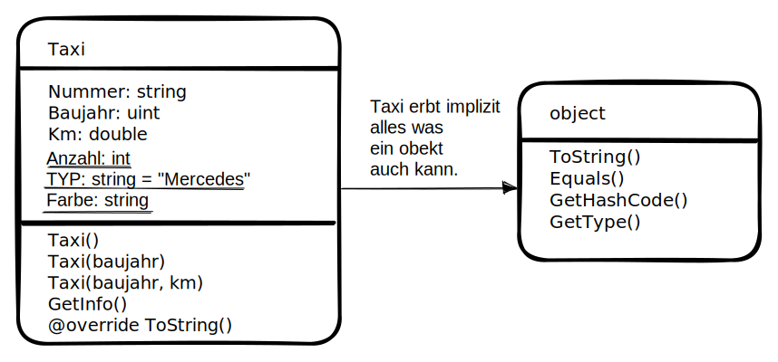

# Grundlagen in C`#`

- https://learn.microsoft.com/de-de/dotnet/api/

## Abgrenzung prozedurale Programmierung
- Unter anderem: Variablen für Speicherung von Daten.
- Kontrollstrukturen für die Erstellung eines Programmablaufs: if, while, for...
- Bibliotheken, Unterprogramme, Prozeduren fassen Variablen und Kontrollstrukturen zusammen.

## Objektorientierte Programmierung
Variablen und Prozeduren (hier genannt Methoden) werden in Klassen zusammengefasst.
    - Variablen, Eigenschaften bilden die Datensätze ab
    - Methoden sind die Klassenspezifischen Funktionen/Prozeduren

## Default entrypoint for a (terminal) C# Program:
```cs
namespace tag01_erstes_projekt
{
    internal class Program
    {
        static void Main(string[] args)
        {
            Console.WriteLine("Running from Main()");
            while (true)
            {
                Console.Write(">");
                String input = Console.ReadLine();
                bool isNumber = Int32.TryParse(input, out int value);
                if (isNumber){
                    Console.WriteLine("Quadriertes Ergebniss: " + value*value + " !");
                }
            }
        }
    }
}
```
## Naming Conventions
|||
|---|---|
|Class| StudenClass|
|Method|GetMarks|
|Local variable|firstName|
|Private variable|avgMarks|
|Constants|Percentile|

## Basics
### Comments
```Cs
// Single-line comment

/* Multi-line 
   comment */

// TODO: Adds comment to a task list in Visual Studio

/// Single-line comment used for documentation

/** Multi-line comment 
    used for documentation **/
```
### Formatierte Ausgabe (von Zahlen)
```cs
Console.WriteLine(zahl.ToString("00000"));      // 00123
Console.WriteLine(zahl.ToString("#.##"));       // 12.34
Console.WriteLine(zahl.ToString("#0.##E+0"));   // 12.35 E+2
Console.WriteLine(zahl.ToString("#.##%"));      // 2.5%  <- 0.025 
// Escapebezeichnung (um z.B. # anzuzeigen):
Console.WriteLine(zahl.ToString("\\#00.#E+0\\#")) // #12.35 E+2#
```


### Datentypen
|Datentyp|Speicherplatz in Byte|Wertebrereich|
|---|---|---|
|bool|1|TRUE, FALSE|
|byte|1|0-255|
|int|2|32Bit|
|long|4|64Bit|
|ushort|2|8Bit-0-65535|
|uint|4|32Bit|
|ulong|8|64Bit|
|decimal|16|Dezimalzahl ca. -7.9228E+28 ca. 7.928E+28|
|float|4|Gleitkommazahl ca.-3.4E+28 ca.3.4E+38|
|double|8|Gleitkommazahl ca. -1.99E+308 ca.1.79E+308|
|char|2-4|utf16|
|string|...|Zeichenkette|
- get size, get type
- `sizeof()` returns size of the data type
- `typeof()` returns type of object (ex. string, integer, bool ...)

### Strings
```cs
Length      // returns length of string
Compare()   // compares two strings
Contains()  // true if contains a substring
Equals()    // checks if two strings have same character data
Format()    // Formats a string via the {0} notation by using other primitives.
Trim()      //remove whitespace from end & start
```
- Other notable Operations:
    - Clone, CompareTo, EndsWith, GetHashCode, GetTypeCode, IndexOf, ToLower, ToUpper, Insert, IsNormalized, LastIndexOf, Remove, Replace, Split, StartsWith, Substring, ToCharArray
#### Character Constants
- the following symbosy need to be escaped with a `\` inside of strings to be used:
|escape sequence| Meaning|
|---|---|
|`\\`|`\`|
|`\'`|`'`|
|`\"`|`"`|
|`\?`|`?`|
|`\n`|Newline|
|`\t`|Tab|
|`\a`|Alert or Bell|
|`\b`|Backspace|
|`\f`|From feed|
|`\r`|Carriage return|
|`\v`|Vertical Tab|
|`\xhh`|Hexadecimal number of one or more digits|

### Type conversions
-implicit type conversions: Werden automatisch wo Typsicher von C# vorgenommen (von i32->i63 usw)
- explicit type conversions: Müssen explizit geschrieben werden, da hier nicht garantiert werden kann, dass daten verloren gehen.
- Type conversion, Type checking
    - `AsInt()` String into integer. 
    - `IsInt()` Check if input is a String.
    - `AsDateTime()`
    - `IsDatetime()`
    - `ToString()`
- ToConversions:
    - `ToChar()`, `ToByte()`, `ToDecimal()` ...
- example of where it could go wrong
```cs
// nach Eingabe eines Radius soll das Programm das Volumen ausgeben
        public static void Beispiel1()
        {
            double radius = 0, volumen = 0;

            Console.Write("Radius eingeben: ");
            String input = Console.ReadLine();
            bool isNumber = double.TryParse(input, out radius);
            while (!isNumber)
            {
                Console.Write("ERROR ungültige Eingabe, Radius erneut eingeben:");
                input = Console.ReadLine();
                isNumber = double.TryParse(input, out radius);
            }

            // volumen =  4 / 3 * Math.PI* Math.Pow(radius,2);  // WILL USE I32 for 4/3 -> 4/3=1
            // volumen = Math.PI *4/3 would also work since the compiler will go from left to right, inferring the type.
            volumen =  4.0 / 3.0 * Math.PI* Math.Pow(radius,2);

            Console.WriteLine("Volumen: " + volumen.ToString("#.###"));
        }
```
## Objects
### Modifiers
|name|description+
|---|---|
|public|accessible by any other code|
|private|only accessible from within the same class or struct|
|protected|only accessible from within the same class or struct or derived class|
|internal|accessible by any code in the same assembly, but not from another assembly|
|protected internal|accessible by any code in the same assembly, or by any derived class in another assembly|
|abstract|class can only be used as base of other classes|
|async|asynchronous method|
|const|the field can not be modified|
|event|declares an event|
|extern|indicates that the method is implemented externally|
|new|explicitly hides a member inherited from a base class|
|override|provides a new implementation of a virtual member inherited from a base class|
|partial|define a partial class, strut or method|
|read-only|field can only be assigned in declaration or in constructor (when creating an instance)|
|sealed|This class can not be inherited|
|static|no instances/objects for this class need to be crated. It already exists by itself (singleton ish etc.)|
|unsafe|declares unsafe context|
|virtual|Declares a method or an accessor whose implementation can be changed by an overriding member in a derived class|
|volatile|Indicates that a field can be modified in the program by something such as the operating system, the hardware, or a concurrently executing thread|

```cs
namespace tag01_erstes_projekt
{
    internal class Programm{
        static void Main(){
            Artikel a1 = new Artikel();
            a1.Bezeichung = "Hose";
            a1.Preis = 23.45;
            a1.Menge = 10;

            Artikel a2 = new Artikel { Bezeichung="Jacke", Preis = 19.99, Menge = 3};
        }
    }
    internal class Artikel
    {
        public string Bezeichung;
        public double Preis;
        public int Menge;
    }
}

```


## Exception Handling
```cs
try{} catch (Exception e){throw;}
```

## Handling Files
||||
|---|---|---|
|File.Exists(path)|Check  the existence of the file in the path|
|File.ReadAllLines(path)|Read all the lines from the file in the path|
|File.ReadAllText(path)|Read all the text from the file and return a string|
|File.Copy(path1, destPath))|Copy content from one file to antoher|
|File.Delte|Delete an existing file from the path|


## Reference Type
- point to memory location (heap) instead of direct value (stack).
- examples: object, dynamic, string.
```cs
// when a value type is converted to object type this is called boxing (vs unboxing):
object obj;
obj = 100;  // this is boxing

// you can stoire any type of value in the dynamic data type variable:
// type checking for those happens at runtime:
dynamic variable_name = 20;
```
### Pointer Type
```cs
char* some_pointer;
int* another_pointer;
```

## Functional methods
```cs
// map() is Select
Enumerable.Range(1, 10).Select(x => x + 2);

// reduce() is Aggregate
Enumerable.Range(1, 10).Aggregate(0, (acc, x) => acc + x);

// filter() is Where
Enumerable.Range(1, 10).Where(x => x % 2 == 0);
```

## Operators
|Operator|Description|
|---|---|
|`&&`|Logical AND|
|`||`|Logical OR|
|`!`|Logical NOT|
|`&`|Binary AND|
|`|`|Binary OR|
|`^`|Binary XOR|
|`~`|Binary Bitflipping|
|`<<`|Binary Left Shift|
|`>>`|Binary Right Shift|
|`&`|Returns the memory adress of an variable|
|`*`|`*a`Creates a pointer name a to a variable|
|`?:`|`c ? x:y`if condition c is true ? then x otherwise y|
|`is`|`if (Ford is Car)` checks if Ford is an obj of class Car|
|`as`|Cast without raising an exception if it fails|

## Class vs Struct
- Strukturen als **Werttypen** 
    - werden im Stack gespeichert
    - lassen sich z.B. nicht direkt mit `==` vergleichen
```cs
internal struct MitarbeiterStruct{
    // Felder (Member) eines Objekts:
    private  string _name;
    double _gehalt;     // implicit private by default
    // Konstruktor um Werte Initial festzulegen:
    public MitarbeiterStruct(string name, double gehalt){
        _name = name;
        _gehalt = gehalt;
    }
    // Properties - Accessoren:
    public string Name { 
        get { return _name; }
    }
    public double Gehalt{
        get { return _gehalt; }
        set { _gehalt = value; }
    }
}
internal class Program{
    static void Main(string[] args){
        MitarbeiterStruct ma1 = new MitarbeiterStruct("Meier", 2000);
        // ma1.Name= "Meier";   // keine set Berechtigung
        Console.WriteLine("Name:" + ma1.Name);
        ma1.Gehalt = 2456;
        Console.WriteLine("Gehalt: " + ma1.Gehalt);
        
        // Structs lassen sich nit mit == vergleichen
        // (ma1 == ma2) ist NICHT zulässig
        Console.WriteLine("they are equal:" + ma1.Equals(ma2));
    }
}
```
- Klassen sind **Referenztypen**
    - werden im Heap gespeichert.
    - Referenzen lassen sich mit `==` auf identität vergleichen.
    - lassen sich Null setzen.
```cs
internal class MitarbeiterClass{
    // ausführlich (feld + accessoren)
    private string _name;
    public string Name{
        get { return _name; }
    }
    // alternativ hier als kurzform möglich:
    public double Gehalt { get; set; }
    // Konstruktor-overloading:
    public MitarbeiterClass() {
        _name = "unbekannt";
        Gehalt = 0.1;
    }
    // Mit :this() haben wir zugriff auf den ersten Constructor
    public MitarbeiterClass(string name):this()
    {
        _name = name;
    }
    public MitarbeiterClass(string name, double gehalt){
        _name = name;
        Gehalt = gehalt;
    }
}
internal class Program{
    static void Main(string[] args){
        /* Class */
        MitarbeiterClass ma3 = new MitarbeiterClass();
        MitarbeiterClass ma4 = new MitarbeiterClass("John");
        MitarbeiterClass ma5 = new MitarbeiterClass("Meier", 2000);
        Console.WriteLine("Name: " + ma3.Name + " | Gehalt: " + ma3.Gehalt);
        Console.WriteLine("Name: " + ma4.Name + " | Gehalt: " + ma4.Gehalt);
        Console.WriteLine("Name: " + ma5.Name +" | Gehalt: "+ma5.Gehalt);

        // Bei Klassen lassen sich die Objektreferenzen vergleichen
        Console.WriteLine("Die Speicheradressen sind natürlich unterschiedlich:" + (ma3==ma4));

        // Objekte lassen sich null setzten:
        ma3 = null;
        Console.WriteLine("trying to acess "+ma3.Name)
            // -> NullReferenceExecption
    }
}
```
### Beispiele zu Klassen

```cs
internal class Taxi
{
    // Alle Taxen haben den gleichen Typ, kann nicht geändert werden.
    public const string TYP = "Mercedes";
    // Alle Taxen haben die gleiche Farbe, kann geändert werden.
    public static string Farbe = "beige";
    // Objekteigenschaften - individuell:
    public string Nummer { get; set; }
    public uint Baujahr { get; set; }
    public double Km { get; set; }

    // Implementierung einer Auto-Inkrement Funktion:
    private static uint count = 0;
    public static uint Count { get { return count; } }  // getter-anzahl, wieviele Taxen wurden Instanziert.
    public Taxi(){
        count++;
        Nummer = "T-" + count ;
    }

    // constructor-chaining:
    public Taxi(uint baujahr) : this(){
        Baujahr = baujahr ;
    }
    public Taxi(uint baujahr, double km):this(baujahr){
        Km = km;
    }
    public String GetInfo(){
        return "Nummer: " + Nummer + " | Baujahr: " + Baujahr + " | Km: " + Km + " | TYP:" + TYP + " Farbe:" + Farbe; 
    }

    // Override the ToString and Equals Method as needed
    override
    public  String ToString(){
        return GetInfo();
    }

    // because of our Autoincrement we have to ignore Taxi.Nummer while doing .Equals() so we override it
    public override Boolean Equals(object other)
    {
        if (other is Taxi){
            return this.Baujahr == ((Taxi)other).Baujahr && this.Km == ((Taxi)other).Km;
        }
        return base.Equals(other);          // Way to access the Original .Equals() as failback.
    }
}

static void Main(string[] args)
{
    // Zugriff auf Klasseneigenschaften über Objektname.
    Console.WriteLine(Taxi.Farbe);
    Taxi.Farbe = "Grün";
    Console.WriteLine(Taxi.Farbe);
    Console.WriteLine(Taxi.TYP); 

    // Objekte instanzieren:
    Taxi t1 = new Taxi();
    Taxi t2 = new Taxi(2022);
    Taxi t3 = new Taxi(2013, 123456.99);
    Taxi t4 = new Taxi(2013, 123456.99);

    // Zugriff auf Objekteigenschaften immer Über instanziertes-Objekt.
    Console.WriteLine(t1.Nummer + "<nr|km>" + t1.Km);

    Console.WriteLine(t1.GetInfo());
    Console.WriteLine(t2.GetInfo());
    Console.WriteLine(t3.GetInfo());

    Console.WriteLine("Es gibt: "+Taxi.Count +" Taxen");

    // Standard Methoden von objekt und overwritten ToString()
    Console.WriteLine("GetType() " + t1.GetType());
    Console.WriteLine("GetHashCode() " + t2.GetHashCode());
    Console.WriteLine("ToString() " + t3.ToString());       // ToString() manuell aufrufen
    Console.WriteLine("ToString() " + t4);                  // ToString() wird automatisch/implizit aufrufen
    
    Console.WriteLine("t3==t4" + (t3 == t4) + " because different Pointers!");
    Console.WriteLine("t3.Equals(t4)" + t3.Equals(t4)  +" because of our autoincrement we have to override .Equals()");
}
```

## Casting
- for nullable objects like classes we can:
```cs
Animal d = new Dog();
Cat cast = d as Cat;

if (cast != null){
    Console.WriteLine(cast.SOUND)
}
```
- for not nullable objects like structs we have to:
```c#
Animal d = new Dog();
try{
    Cat cast = (Cat)d
} catch(Exception e){
    Console.WriteLine("Casting Error:" + e);
}
```