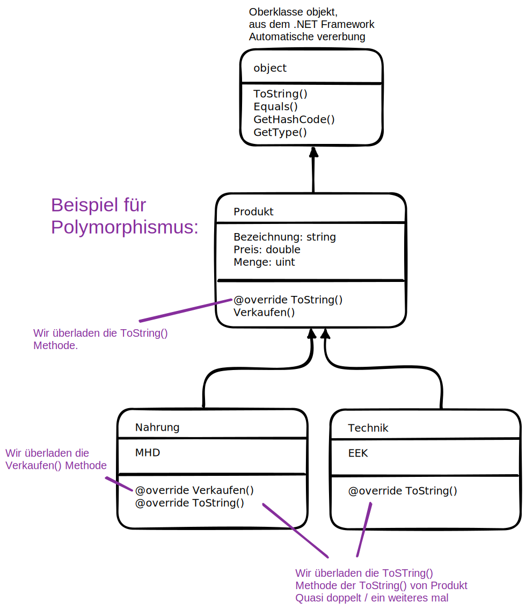

# Beispiel Vererbung 

```cs
internal class Produkt {
    public string Bezeichnung { get; set; }
    public double Preis{ get; set; }
    public uint Menge { get; set; }
    public double Warenwert => Preis * Menge;
    public Produkt(string bezeichnung, double preis, uint menge) {
        Bezeichnung = bezeichnung;
        Preis = preis;
        Menge = menge;
    }
    public override String ToString() => 
        Bezeichnung + " " + Preis + "Euro x " + Menge + "Stueck => " + Warenwert +"Euro";
    public virtual bool Verkaufen(uint anzahl) {
        if (Menge >= anzahl) {
            Menge -= anzahl;
            return true;
        }
        return false;
    }
}

internal class Technik : Produkt {
    public string EEK { get; set; }
    // die Unterklasse Technik ruft den Konstruktor der Oberklasse mit base() auf
    public Technik(string bezeichnung, double preis, uint menge, string eek) : base(bezeichnung, preis, menge) {
        EEK = eek;
    }
    public override string ToString() => base.ToString() + " EEK:" + EEK;
}

internal class Nahrung : Produkt {
    public DateTime MHD { get; set; }   // Verbleibendes Mindest-Haltbarkeits-Datum in Tagen
    public Nahrung(string bezeichnung, double preis, uint menge, DateTime mhd) : base(bezeichnung, preis, menge) {
        MHD = mhd;
    }
    public override bool Verkaufen(uint anzahl) {
        TimeSpan days_left = MHD - DateTime.Today;
        if (days_left.Days <= 3) return false;
        return base.Verkaufen(anzahl);
    }
    public override string ToString() => base.ToString() + " MHD:" + MHD.ToShortDateString();
}

internal class Program
{
    static void Main(string[] args)
    {
        TestingProducts();

        Produkt[] tabelle = new Produkt[4];
        tabelle[0] = new Nahrung("Schinken", 3.99, 7, new DateTime(2023, 5, 10));
        tabelle[1] = new Technik("Kühlschrank", 199.99, 10, "AAA");
        tabelle[2] = new Nahrung("Jogurt", 1.99, 15, DateTime.Parse("13.5.23"));
        tabelle[3] = new Technik("Lampe", 24.99, 22, "B");

        foreach (Produkt p in tabelle){
            Console.WriteLine(p);
            Console.WriteLine("p.GetType() => \t" + p.GetType());
            if (p is Nahrung){
                Nahrung cast = p as Nahrung;
                Console.WriteLine("MHD reachable with cast: " + cast.MHD);
            }
            if (p is Technik)
            {
                Technik cast = p as Technik;
                Console.WriteLine("EEK reachable with cast: " + cast.EEK);
            }
            Console.WriteLine();
        }
    }

    static void TestingProducts() {
        Console.WriteLine("\n***************----***************");
        Console.WriteLine("***************----***************");
        Produkt p1 = new Produkt("Default", 3.29, 50);
        Console.WriteLine("\n" + p1);
        Console.WriteLine("Verkauf erfolgreich: " + p1.Verkaufen(50));
        Console.WriteLine(p1 + "\n\n");

        Technik t1 = new Technik("Kühlschrank", 199.99, 10, "AAA");
        Console.WriteLine(t1);
        Console.WriteLine("Verkauf erfolgreich: " + t1.Verkaufen(2));
        Console.WriteLine(t1 + "\n\n");

        Nahrung n1 = new Nahrung("Schinken", 3.99, 7, new DateTime(2023, 5, 10));
        Console.WriteLine(n1);
        Console.WriteLine("Verkauf erfolgreich: " + n1.Verkaufen(2));
        Console.WriteLine(n1 + "\n\n");

        Nahrung n2 = new Nahrung("Jogurt", 1.99, 15, DateTime.Parse("13.5.23"));
        Console.WriteLine(n2);
        Console.WriteLine("Verkauf erfolgreich: " + n2.Verkaufen(2));
        Console.WriteLine(n2 + "\n\n");

        // Typ eines Objekts ist der verwendete Konstruktor:
        Console.WriteLine("n2 is Nahrung: " + (n2 is Nahrung));    // -> true
        Console.WriteLine("n2 is Technik: " + (n2 is Technik));    // -> false
        Console.WriteLine("n2 is Produkt: " + (n2 is Produkt));    // -> true

        // typeof operator
        Console.WriteLine("typeof: " + (n2.GetType() == typeof(Nahrung))); // -> true

        // Durch casten gehen keine in formationen verloren.
        var cast1 = (Produkt)n2;
        Console.WriteLine(cast1);
        var cast2 = (Nahrung)cast1;
        Console.WriteLine(cast2);

        PrintTypes();
        // wenn casting fehlschlägt  => null !

        Console.WriteLine("\n***************----***************");
        Console.WriteLine("***************----***************\n\n");

    }

    static void PrintTypes() {
        Produkt p = new Nahrung("Schinken", 3.99, 7, new DateTime(2023, 5, 10));
        Console.WriteLine(p.GetType() == typeof(Nahrung)); // false 
        Console.WriteLine(p is Produkt);                   // true 
        Console.WriteLine(p.GetType() == typeof(Nahrung));    // true
        Console.WriteLine(p is Nahrung);                      // true 
    }

}
```
