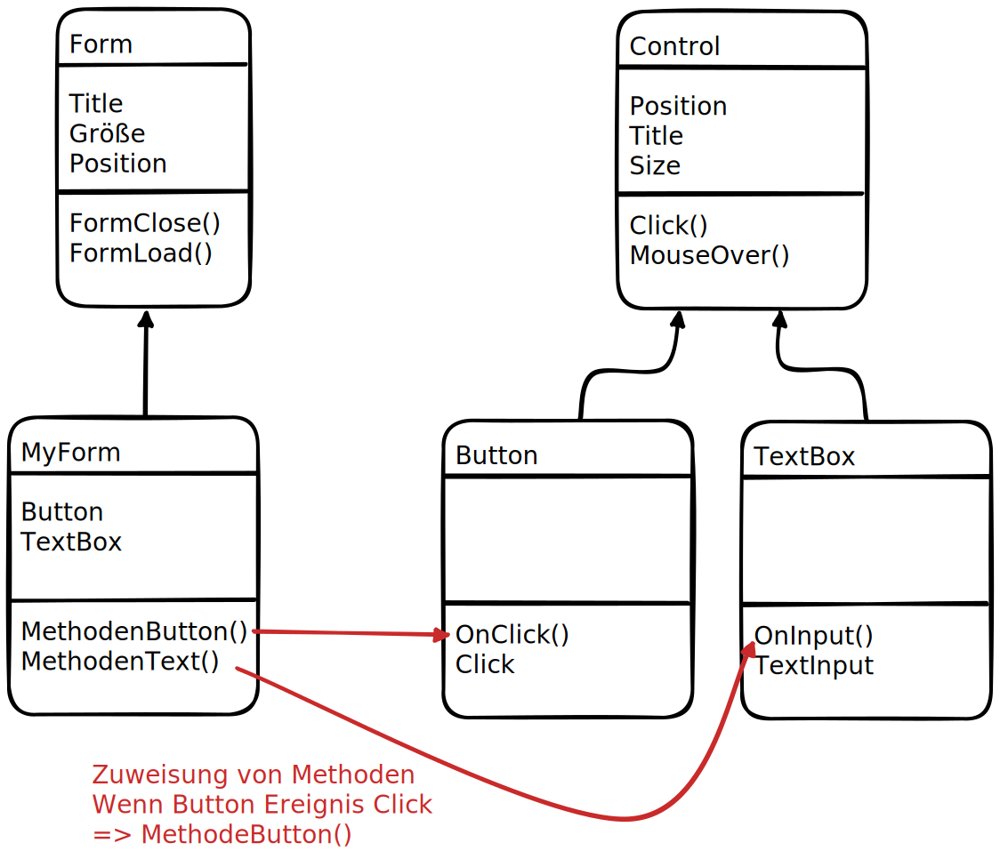

# Event-driven Design with WinForms

## Typen in Csharp
- Event
- Delegate

### Control events
[Full list of Events and Properties](https://learn.microsoft.com/en-us/dotnet/api/system.windows.forms.control#events)

An event is an action that you can respond to, or `handle` in your code. `KeyDownHandler`.

- Mouse events (MouseClick, MouseEnter, -Hover, -Leave...)
- Keyboard events (KeyDown, KeyPress, KeyUp)
- Property changed events
    - BackgroundColorChanged, BackgroundImageChanged, BindingContextChanged, DockChanged, EnabledChanged, FontChanged, SizeChanged, VisibleChanged...
- Other events

### Delegates and their role
Delegates roughly equate to function pointers. But they are object-oriented, type-safe and secure.

This event model uses delegates to bind events to the methods that are used to handle them. This enables other classes to register for event notification specifying custom `handler methods`.

Delegates can be bound to a single method or multiple methods (aka multicasting). When an event is recoded by the app, the control raises the event by invoking the delegate for that event. The delegate in turn calls the bound method(s). Or in case of a multicast delegate each bound method in the invocation list in turn. The binding mechanism used with delegates is dynamic at run time.

