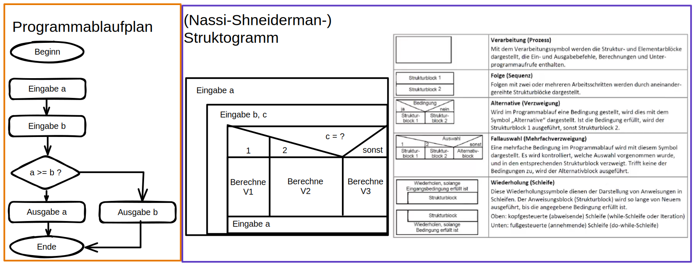
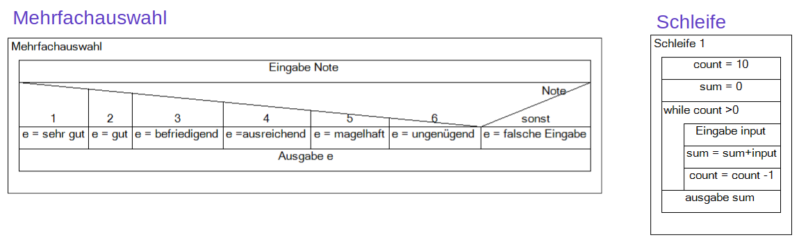
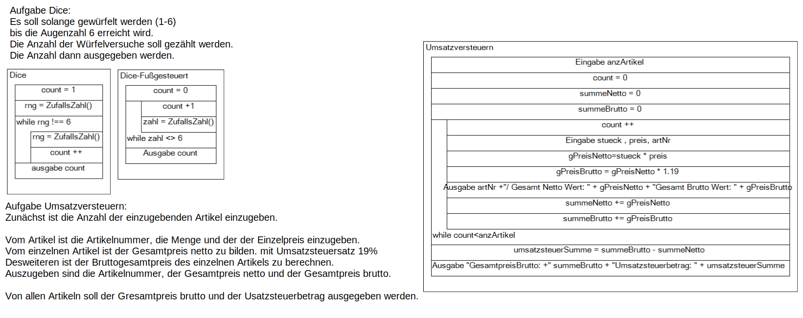
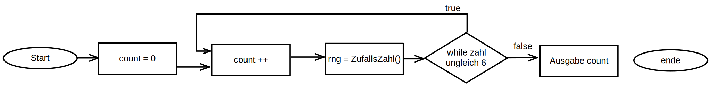

# Grundlagen der Programmierung

## Qualitätsmerkmale

### Anforderungen an

- Korrektheit, Robustheit, Zuverlässigkeit
- Benutzerfreundlichkeit
- Effizienz (Wirksamkeit und Wirtschaftlichkeit)
- Wartbarkeit
- Dokumentation
- Einheitlicher Guter Programmierstiel

### Softwaredokumentation aus dem Quellcode heraus

- Quellcode soll selbsterklärend sein
- Bezeichner von variablen und Funktionen für alle intuitiv verständlich sein
- Kommentare in unmittelbarer Nähe zu den Anweisungen
- Einhalten von Konventionen - (CamelCase vs _ ...)
- DRY-Prinzip (Don't repeat yourself) - Redundanz vermeiden
- KISS-Prinzip (Keep it simple/stupid) - keine unnötigen komplexer oder lange Strukturen

### Inhalte der Softwaredokumentation

- wie ein Programm funktioniert - Programmierer-dokumentation
- über die Zeit gepflegt wird - Entwicklungsdokumentation
- wie ein Programm - Datendokumentation
- wie ein Programm getestet wurde - Testdokumentation
- Wie ein Programm zu benutzen ist - Benutzerdokumentation
- was zum Betrieb erforderlich ist - Installationsdokumentation
- Auf welchen Grundlagen die Software entwickelt wurde - Methodendokumentation

## Arten von Software

- Betriebssysteme
- Standardsoftware
- Individualsoftware

## Klassifizierung von Programmiersprachen
### Nach ihrer historischen Entwicklung
- erste Generation: Maschinensprache (0 und 1s)
- zweite Generation: Assembler-Sprachen
- dritte Generation: Prozedurale Sprachen
- vierte Generation: 4GL - generation language (z.B. graphische Editoren, Formular->sql)
- fünfte Generation: Künstliche Intelligenz

## Entwurfstechniken
- Programmablaufplan - auch Ablaufdiagramm, Flussdiagramm oder Blockdiagramm genannt. DIN 66001 enthält Darstellungsmittel
- Struktogramm nach DIN 66261 - Auch Nassi-Shneiderman-Struktogramm genannt.

### Datenflussdiagramm - ein Programmablaufplan
- Eine grafische Übersicht, welche die Programme und Daten, die zu einer Gesamtaufgabe gehören, miteinander verbindet.

# Aufgabe S50

