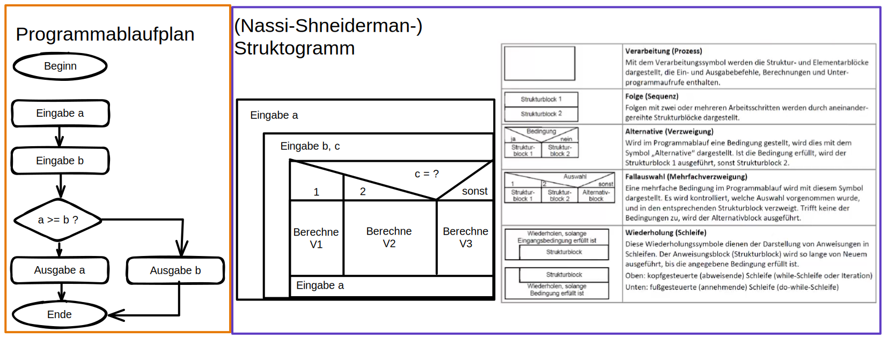
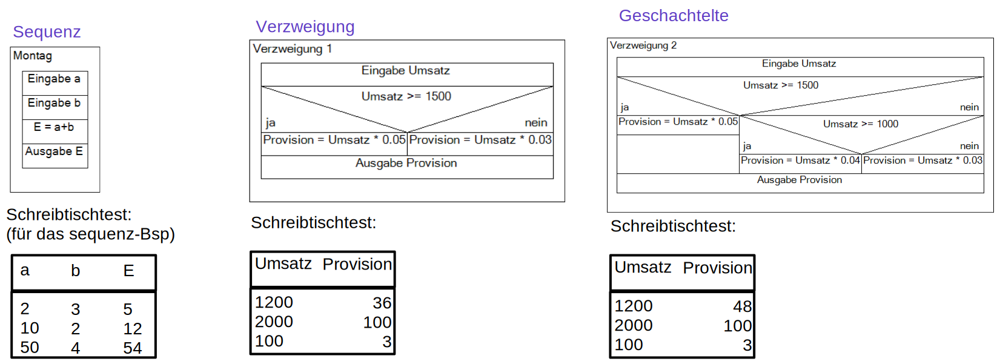
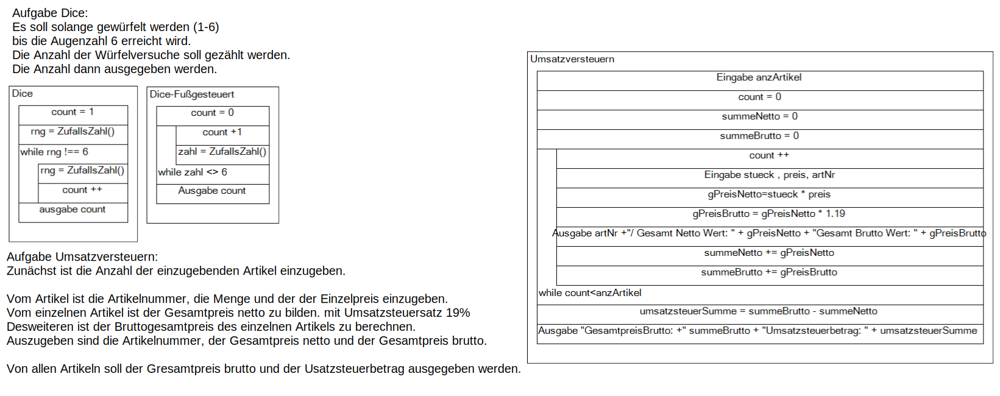
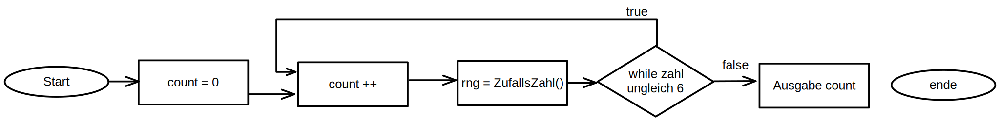
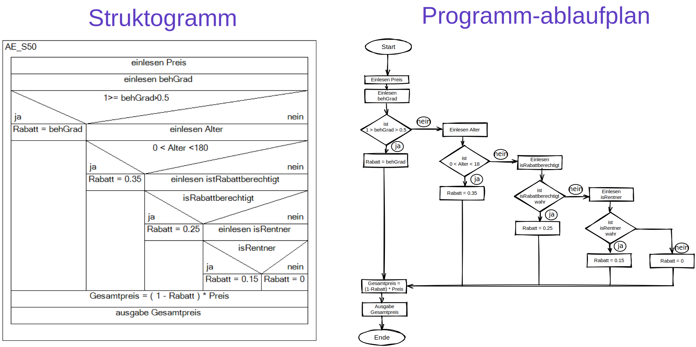
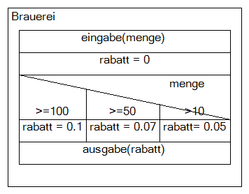

# Grundlagen der Programmierung

## Qualitätsmerkmale

### Anforderungen an

- Korrektheit, Robustheit, Zuverlässigkeit
- Benutzerfreundlichkeit
- Effizienz (Wirksamkeit und Wirtschaftlichkeit)
- Wartbarkeit
- Dokumentation
- Einheitlicher Guter Programmierstiel

### Softwaredokumentation aus dem Quellcode heraus

- Quellcode soll selbsterklärend sein
- Bezeichner von variablen und Funktionen für alle intuitiv verständlich sein
- Kommentare in unmittelbarer Nähe zu den Anweisungen
- Einhalten von Konventionen - (CamelCase vs _ ...)
- DRY-Prinzip (Don't repeat yourself) - Redundanz vermeiden
- KISS-Prinzip (Keep it simple/stupid) - keine unnötigen komplexer oder lange Strukturen

### Inhalte der Softwaredokumentation

- wie ein Programm funktioniert - Programmierer-dokumentation
- über die Zeit gepflegt wird - Entwicklungsdokumentation
- wie ein Programm - Datendokumentation
- wie ein Programm getestet wurde - Testdokumentation
- Wie ein Programm zu benutzen ist - Benutzerdokumentation
- was zum Betrieb erforderlich ist - Installationsdokumentation
- Auf welchen Grundlagen die Software entwickelt wurde - Methodendokumentation

## Arten von Software

- Betriebssysteme
- Standardsoftware
- Individualsoftware

## Klassifizierung von Programmiersprachen
### Nach ihrer historischen Entwicklung
- erste Generation: Maschinensprache (0 und 1s)
- zweite Generation: Assembler-Sprachen
- dritte Generation: Prozedurale Sprachen
- vierte Generation: 4GL - generation language (z.B. graphische Editoren, Formular->sql)
- fünfte Generation: Künstliche Intelligenz

## Entwurfstechniken
- Programmablaufplan - auch Ablaufdiagramm, Flussdiagramm oder Blockdiagramm genannt. DIN 66001 enthält Darstellungsmittel
- Struktogramm nach DIN 66261 - Auch Nassi-Shneiderman-Struktogramm genannt.

### Datenflussdiagramm - ein Programmablaufplan
- Eine grafische Übersicht, welche die Programme und Daten, die zu einer Gesamtaufgabe gehören, miteinander verbindet.











# Aufgabe S50



# Bsp Pseudocode
```
begin prototyp
	ausgabe(versionsname)
	sumOriginal = 0;
	sumRabbatiert = 0;
	
	do
		ausgabe("Bitte Rechnungsbetrag eingeben: ");
		
		do 
			eingabe(curr);
		while NOT(curr >=0)
		end do

		case true is
			curr > 15000 : erg = cur*0.965; 	ausgabe("Rabattierter Betrag" erg);
			curr >= 5000 : erg = curr*0.9775; 	ausgabe("Rabattierter Betrag" erg));
			curr >= 1000 : erg = curr;		ausgabe("Kein Rabatt vorgesehen!");
			curr > 0     : erg = curr*1.0125;	ausgabe("Erhöhter Betrag" erg);
			otherwise    : erg = 0;
		end case

		sumOriginal += curr;
		sumRabbatiert += erg;
		
	while curr NOT 0
	end do
	
	sumRabatte = sumOriginal - sumRabbatiert;
	ausgabe("Summe der Rabatte abzgl. Azufschläge" sumRabatte );

end prototyp


beginn Stammkunde
	eingabe(umsatz)
	eingabe(isStammkunde)
	rabatt = 0

	if isStammkunde is true then
		if is umsatz > 1000 then
			rabatt = 0.05
		else:
			rabatt = 0.03
		endif
	else:
		if is umsatz > 2000 then
			rabatt = 0.04
		else:
			rabatt = 0.02
		endif
	endif
	erg  = (1 + rabatt)
	ausgabe(erg)
end Stammkunde
```

# Aufgabe 2
Eine Brauerei gewährt Kunden bei Abnahme von mindestens 10 Kösten 5% Rabatt, bei Abnahme von 50 Kästen 7% und bei mindestens 100 Kästen 10%.        
Die Variable Menge enthält die Anzahl der Kästen, die Variable Rabatt den Prozentsatz.      
- Erstellen Sie ein Struktogramm und den Pseudocode.



```
begin Brauerei
    eingabe(menge)
    rabatt = 0
    case menge is
        >=100   : rabatt = 0.1
        >=50    : rabatt = 0.07
        > 10    : rabatt = 0.05
    end case
    ausgabe(rabatt)
end Brauerei
```

# Aufgabe 3 - Entscheidungstabellen
 Entwickeln sie eine Entscheidungstabelle für die Versandbedingungen eines Versandhauses. Dieses berechnet bis zu einem Einkaufspreis von 150€ Versandkosten in Höhe 8€. ab einem Einkaufspreis von 300€ wird zusätzlich ein Gratisgeschenk verschickt.

```
                                        Entscheidungsregeln		
                                        R1	R2	R3
Bedingungsteil WENN				
	            Einkaufspreis <=150	    j	n	n
	            Einkaufspreis > 150	    -	j	n
	            Einkaufspreis >=300	    -	j	j
Aktionsteil DANN				
                Versandkosten= 8€	    x	-	-
                Gratisgeschenk	        -	-	x
				
				
R1	Bis zu einem Einkaufspreis von 150 werden Versandkosten in Höhe 8 €			
R2	ab 150€ Einkaufspreis keine Versandkosten			
R3	Ab einem Einkaufspreis von 300  wird ein Gratisgeschenk verschickt			
```