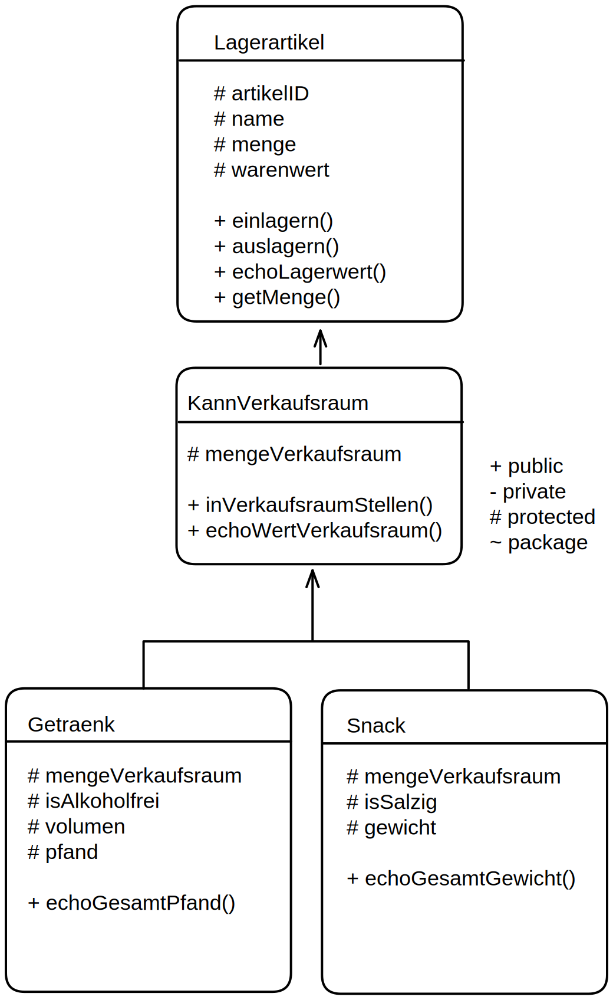

# PHP - LAGER-Aufgabe

## UML

## code - ursprüngliches Modell: 
Anhand des uml-Diagramms erstellen der Klassen:

```php
class Lagerartikel{
    protected $artikelID;
    protected $name;
    protected $menge;
    protected $warenwert;

    public function __construct(string $name){
        $this->artikelID = rand(1,999999);
        $this->name = $name;
        $this->menge = 0;
        $this->warenwert = rand(1,10);
    }
    public function einlagern(int $anzahl){
        $this->menge += $anzahl;
    }
    public function auslagern(int $anzahl){
        if ($anzahl <= $this->menge)   {$this->menge -= $anzahl;}
    }
    public function echoLagerwert(){
        echo $this->name."-Warenwert : ".$this->menge * $this->warenwert ." € <br>";
    }
    public function getMenge(){
        return $this->menge;
    }
}

class KannVerkaufsraum extends Lagerartikel{
    protected $mengeVerkaufsraum = 0;

    public function inVerkaufsraumStellen(int $anzahl){
        if($anzahl <= $this->menge)
        self::auslagern($anzahl);
        $this->mengeVerkaufsraum += $anzahl;
    }
    public function echoWertVerkaufsraum(){
        echo $this->name."-VerkaufsraumsWert : ".$this->mengeVerkaufsraum * $this->warenwert ." € <br>";
    }
}

class Getraenk extends KannVerkaufsraum{
    protected $isAlkoholfrei;
    protected $volumen="1 Liter";
    protected $pfand=0.15;

    public function __construct(string $name, bool $isAlkoholfrei){
        parent::__construct($name);
        $this->isAlkoholfrei = $isAlkoholfrei;
    }
    public function echoGesamtPfand(){
        echo "PfandWert im Lager: ".$this->pfand*$this->menge."<br>";
        echo "PfandWert im Verkaufsraum: ".$this->pfand*$this->mengeVerkaufsraum."<br>";
    }
}

class Snack extends KannVerkaufsraum{
    protected $isSalzig;
    protected $gewicht;

    public function __construct(string $name, float $gewicht, bool $isSalzig){
        parent::__construct($name);
        $this->gewicht = $gewicht;
        $this->isSalzig = $isSalzig;
    }
    public function echoGesamtGewicht(){
        echo "Gesamtgewicht im Lager: ".$this->gewicht*$this->menge/1000 ." kg <br>";
        echo "Gesamtgewicht im Verkaufsraum: ".$this->gewicht*$this->mengeVerkaufsraum/1000 ." kg <br>";
        return $this->gewicht*$this->menge;
    }
}

// erstellen unseres Lagers
$lager = [];
$lager[] = new Snack("Snickers",57,false);
$lager[] = new Snack("Chips",200,true);
$lager[] = new Getraenk("cola", true);
$lager[] = new Getraenk("bier", false);
$lager[] = new Getraenk("wein", false);

// befüllen unseres Lagers:
foreach($lager as $art){
    $art->einlagern(100);                       // 100 artikel ins Lager stellen
    $halbeMenge = round( $art->getMenge() / 4 );
    $art->inVerkaufsraumStellen($halbeMenge);   //ein Viertel, also 25 in Verkaufsraum stellen
}

// ausgeben unserer Werte:
foreach($lager as $art){
    $art->echoLagerwert();                      //echo des Lager-Wert
    $art->echoWertVerkaufsraum();               //echo des Werts im Verkaufsraum

    if($art instanceof Snack){
        $art->echoGesamtGewicht();              //echo der 2 Gewichts-Summen (Lager/Verkaufsraum) wenn Snack

    }else if ($art instanceof Getraenk){
        $art->echoGesamtPfand();              //echo der 2 Pfand-Summen (Lager/Verkaufsraum) wenn Snack
    }

    echo"----------------<br>";
}
```

### Ausgabe

```
Snickers-Warenwert : 525 €
Snickers-VerkaufsraumsWert : 175 €
Gesamtgewicht im Lager: 4.275 kg
Gesamtgewicht im Verkaufsraum: 1.425 kg
----------------
Chips-Warenwert : 75 €
Chips-VerkaufsraumsWert : 25 €
Gesamtgewicht im Lager: 15 kg
Gesamtgewicht im Verkaufsraum: 5 kg
----------------
cola-Warenwert : 750 €
cola-VerkaufsraumsWert : 250 €
PfandWert im Lager: 11.25
PfandWert im Verkaufsraum: 3.75
----------------
bier-Warenwert : 300 €
bier-VerkaufsraumsWert : 100 €
PfandWert im Lager: 11.25
PfandWert im Verkaufsraum: 3.75
----------------
wein-Warenwert : 600 €
wein-VerkaufsraumsWert : 200 €
PfandWert im Lager: 11.25
PfandWert im Verkaufsraum: 3.75
----------------
```

## code - Modell erweitern
Um ein "Kassensystem" zu implementieren, das gedanklich für Zahlung, Vertifizierung, Rechnung drucken etc zuständig ist schreiben wir in ein neues .php File:
```php
class Verkaufsterminal{
    protected static $instance = null;

    private function  __construct(){
        
        // db-connection etc would/could go here
    }

    //object is created only if there is no instance of it, otherwise return the instance
    public static function getInsance(){
        if(self::$instance === null){
            self::$instance = new Verkaufsterminal();
        }
        return self::$instance;
    }

    // objekt wurde verkauft und an der Kasse bezahlt
    public static function verkaufe(KannVerkaufsraum $artikel, int $anzahl){
        echo $artikel->getName_KlassenName()." wurde an der Kasse bezahlt und verkauft -> lösche $anzahl mal aus dem Verkaufsraum<br>";
        $artikel->wurdeVerkauft($anzahl);
    }
}

interface KannVerkauftWerden{
    public function wurdeVerkauft(int $anzahl);
}
```

- Dann importieren wir diesen File und erweitern unser Modell:

```php
include('verkauf.php');
abstract class Lagerartikel{
    protected $artikelID;
    protected $name;
    protected $menge;
    protected $warenwert;

    public function __construct(string $name){
        $this->artikelID = rand(1,999999);
        $this->name = $name;
        $this->menge = 0;
        $this->warenwert = rand(1,10);
        if ($this->getPriceFromDB($name)) $this->warenwert =$this->getPriceFromDB($name);
    }
    public function einlagern(int $anzahl){
        $this->menge += $anzahl;
    }
    public function auslagern(int $anzahl){
        if ($anzahl <= $this->menge)   { $this->menge -= $anzahl; }
    }
    public function echoLagerwert(){
        echo $this->name."-Warenwert : ".$this->menge * $this->warenwert ." € <br>";
    }
    public function getMenge(){
        return $this->menge;
    }
    public function getName_KlassenName(){
        //specifing type with instanceof:
        $type = "Lagerartikel";
        if     ( $this instanceof Snack)    {$type ="Snack";}
        else if( $this instanceof Snack)    {$type ="Getraenk";}
        //or just getting it with get_class():
        $type = get_class($this);
        return "->".$this->name." <- Klassenname: ".$type;
    }
    private function getPriceFromDB($name){
        $fakeDB ["Snickers"]=1.00;
        $fakeDB ["Chips"]=2.00;
        $fakeDB ["cola"]=1.50;
        $fakeDB ["bier"]=0.80;
        if (!array_key_exists($name, $fakeDB)) return false;
        return $fakeDB[$name];
    }
}

abstract class KannVerkaufsraum 
    extends Lagerartikel 
    implements KannVerkauftWerden
{
    protected $mengeVerkaufsraum = 0;

    public function inVerkaufsraumStellen(int $anzahl){
        if($anzahl <= $this->menge)
        self::auslagern($anzahl);
        $this->mengeVerkaufsraum += $anzahl;
    }
    public function echoWertVerkaufsraum(){
        echo $this->name."-VerkaufsraumsWert : ".$this->mengeVerkaufsraum * $this->warenwert ." € <br>";
    }
    public function wurdeVerkauft(int $anzahl){
        if ($anzahl <= $this->mengeVerkaufsraum) { $this->mengeVerkaufsraum -= $anzahl; }
    }
}

class Getraenk extends KannVerkaufsraum{
    protected $isAlkoholfrei;
    protected $volumen="1 Liter";
    protected $pfand=0.15;

    public function __construct(string $name, bool $isAlkoholfrei){
        parent::__construct($name);
        $this->isAlkoholfrei = $isAlkoholfrei;
    }
    public function echoGesamtPfand(){
        echo "PfandWert im Lager: ".$this->pfand*$this->menge."<br>";
        echo "PfandWert im Verkaufsraum: ".$this->pfand*$this->mengeVerkaufsraum."<br>";
    }
}

class Snack extends KannVerkaufsraum{
    protected $isSalzig;
    protected $gewicht;

    public function __construct(string $name, float $gewicht, bool $isSalzig){
        parent::__construct($name);
        $this->gewicht = $gewicht;
        $this->isSalzig = $isSalzig;
    }
    public function echoGesamtGewicht(){
        echo "Gesamtgewicht im Lager: ".$this->gewicht*$this->menge/1000 ." kg <br>";
        echo "Gesamtgewicht im Verkaufsraum: ".$this->gewicht*$this->mengeVerkaufsraum/1000 ." kg <br>";
        return $this->gewicht*$this->menge;
    }
}

// erstellen unseres Lagers
$lager = [];
$lager[] = new Snack    ("Snickers",57,false);
$lager[] = new Snack    ("Chips",200,true);
$lager[] = new Getraenk ("cola", true);
$lager[] = new Getraenk ("bier", false);
$lager[] = new Getraenk ("mate", true);                 // mate nicht in fake db -> random wert.


// befüllen unseres Lagers:
foreach($lager as $art){
    $art->einlagern(100);                               // 100 artikel ins Lager stellen
    $halbeMenge = round( $art->getMenge() / 4 );
    $art->inVerkaufsraumStellen($halbeMenge);           //ein Viertel, also 25 in Verkaufsraum stellen
}

function helperEchoLagerbestand($lager){
    // ausgeben unserer Werte:
    foreach($lager as $art){
        echo "<h4>".$art->getName_KlassenName()."</h4>";//echo des Klassennamens
        $art->echoLagerwert();                          //echo des Lager-Wert
        $art->echoWertVerkaufsraum();                   //echo des Werts im Verkaufsraum

        if($art instanceof Snack){
            $art->echoGesamtGewicht();                  //echo der 2 Gewichts-Summen (Lager/Verkaufsraum) wenn Snack

        }else if ($art instanceof Getraenk){
            $art->echoGesamtPfand();                    //echo der 2 Pfand-Summen (Lager/Verkaufsraum) wenn Snack
        }
    }
}

echo "<h2>----- Ursprünglicher Warenbestand: ------</h2>";
helperEchoLagerbestand($lager);

// erstellen des Verkaufsterminal-Singletons:
echo "<h2>----- Verkaufen einiger Waren: ------</h2>";
$kasse = Verkaufsterminal::getInsance();
$kasse->verkaufe($lager[0],10);
$kasse->verkaufe($lager[1],25);

helperEchoLagerbestand($lager);
```

### Ausgabe

```
----- Ursprünglicher Warenbestand: ------
->Snickers <- Klassenname: Snack
Snickers-Warenwert : 525 €
Snickers-VerkaufsraumsWert : 175 €
Gesamtgewicht im Lager: 4.275 kg
Gesamtgewicht im Verkaufsraum: 1.425 kg

->Chips <- Klassenname: Snack
Chips-Warenwert : 225 €
Chips-VerkaufsraumsWert : 75 €
Gesamtgewicht im Lager: 15 kg
Gesamtgewicht im Verkaufsraum: 5 kg

->cola <- Klassenname: Getraenk
cola-Warenwert : 525 €
cola-VerkaufsraumsWert : 175 €
PfandWert im Lager: 11.25
PfandWert im Verkaufsraum: 3.75

->bier <- Klassenname: Getraenk
bier-Warenwert : 75 €
bier-VerkaufsraumsWert : 25 €
PfandWert im Lager: 11.25
PfandWert im Verkaufsraum: 3.75

----- Verkaufen einiger Waren: ------
->Snickers <- Klassenname: Snack wurde an der Kasse bezahlt und verkauft -> lösche 10 mal aus dem Verkaufsraum
->Chips <- Klassenname: Snack wurde an der Kasse bezahlt und verkauft -> lösche 25 mal aus dem Verkaufsraum

->Snickers <- Klassenname: Snack
Snickers-Warenwert : 525 €
Snickers-VerkaufsraumsWert : 105 €
Gesamtgewicht im Lager: 4.275 kg
Gesamtgewicht im Verkaufsraum: 0.855 kg

->Chips <- Klassenname: Snack
Chips-Warenwert : 225 €
Chips-VerkaufsraumsWert : 0 €
Gesamtgewicht im Lager: 15 kg
Gesamtgewicht im Verkaufsraum: 0 kg

->cola <- Klassenname: Getraenk
cola-Warenwert : 525 €
cola-VerkaufsraumsWert : 175 €
PfandWert im Lager: 11.25
PfandWert im Verkaufsraum: 3.75
->bier <- Klassenname: Getraenk

bier-Warenwert : 75 €
bier-VerkaufsraumsWert : 25 €
PfandWert im Lager: 11.25
PfandWert im Verkaufsraum: 3.75
```