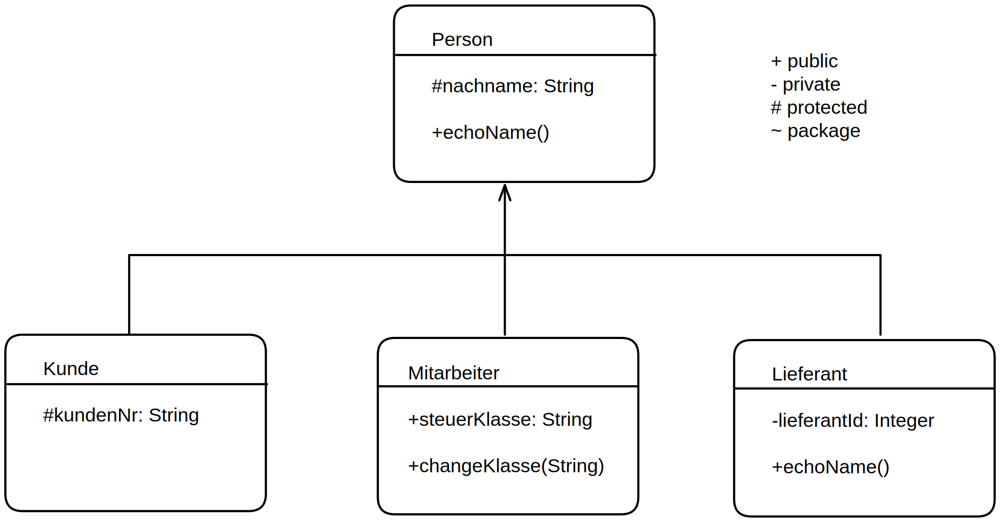

# PHP
Notizen zu PHP. Sehr 

## implementing with html, css
```html
<!DOCTYPE html>
<html>
  <head>
    <style>
    /* Styles Go Here, or import css file normally*/
    </style>
  </head>
  <body>
    <h4>Some Table grabbing data from a SQL db</h4>
    <table>
        <tr>
            <td><?php
                while($row = mysql_fetch_row($result)){
                    echo 'Data...'; ?></td>
                }
        </tr>
    </table>
  </body>
</html>
```

## Code snippets

### Basics
1. Variables
```php
// Variablen
$v1 = "Welcome";
$v2 = 'Smith';
$v3 = 012;
echo $v1." Mr $v2 your id is: ".$v3."\n"
// careful with booleans:
echo true;      // returns 1
echo false;     // returns NOTHING!
// number systems:
$num = 0123;  // is considered an octal number (that equals 83 decimal)
$num = 0x123; // is considered a hexadecimal number (that equals 291 decimal)
$num = 0b111; // is considered a binary number (that equals 7 decimal)
```
- note take care of leading zeros before converting or some octal-number shenanigans will happen!
- careful with using booleans in error msg etc, since false -> "" without casting to string first
2. functions
```php
function isMonth($inMonths){
        $months = ["Januar", "Februar", "März", "April", "Mai", "Juni", "Juli", "August", "September", "Oktober", "November", "Dezember"];
        
        $i = 0;
        while($i < count($months) ){
            if ($inMonths === $months[$i]) - "true";
            $i++;
        }
        
        return "false";
    }
```
```php
function summeGeraden(){
        [$sumEven, $sumOdd] = [0,0];
        for ($i=0; $i<10; $i++){
            $rng = rand(2,49);
            if ($rng % 2) $sumOdd += $rng;
            else $sumEven += $rng;
        }
        echo "summe gerade: ".$sumEven." summe ungerade: ".$sumOdd;
    }
```
3. Arrays
```php
// like in js
$prices = [["Cola", 1000],["Wasser",450],["Bier",800]];
$samePricesArray [] = ["Cola", 1000]
$samePricesArray [] = ["Wasser",450]
$samePricesArray [] = ["Bier",800]

// but we can also use them like a  Map/Dictonary:
$users['vorname'] = "Hans";
$users['nachname'] = "Wurst";
$users['adresse'] = "Stuttgarterweg 15";
$users['nachname'] = "Herbinger";
$adr[0]['vorname'] = "Dieter";
$adr[0]['nachname'] = "Dietberg";
$adr[1]['vorname'] = "Jorg";
$adr[1]['nachname'] = "Joergenson";

foreach($adr as $row){
    var_dump($row)
}
```
- Sorting Arrays:
```php
//simple sorts:
sort()          //sort ascending
rsort()         //sort descending
asort()         //sort ascending but keep original indexes
arsort()        // sort descending but keep original indexes

// Multisort example (ex data from a sql db)
$data=[];
$data[] = array('Datum' => 99, 'ort' => "Amberg");
$data[] = array('Datum' => 86, 'Ort' => "Bielefeld");
$data[] = array('Datum' => 75, 'Ort' => "Cambridge");
$data[] = array('Datum' => 68, 'Ort' => "Duesburg");
$data[] = array('Datum' => 56, 'Ort' => "Enn");
$data[] = array('Datum' => 47, 'Ort' => "Frankfurt");

$datum  = array_column($data, 'Datum');
$ort = array_column($data, 'Ort');
// Sort the data with Datum descending, ort ascending
// Add $data as the last parameter, to sort by the common key
array_multisort($datum, SORT_ASC, $data);
```

### Classes
```php
class User{
    //property declaration
    public $name = "default name";

    //method declaration
    public function displayName(){
        echo $this->name;           //no $
    }
}

$instance1 = new User();
$instance1 ->displayName();
```
- calling attribute vs function (with same name)
```php
class Foo
{
    public $bar = "!property!";
    
    public function bar() {
        return "!method!";
    }
}

$obj = new Foo();
echo $obj->bar."<br>". $obj->bar()."<br>";
```
- inheritance
```php
class AdminUser extends User
{
    // Redefine the parent method
    function displayName()
    {
        echo "IS Admin: \n";
        parent::displayName();
    }
}

$extended = new ExtendClass();
$extended->displayName();
```

```php
class Base{
    public function foo(int $a) {
        echo "Valid\n";
    }
}

class ExtBase1 extends Base{
    function foo(int $a = 5)
    {
        parent::foo($a);
    }
}

class ExtBase2 extends Base{
    function foo(int $a, $b = 5)
    {
        parent::foo($a);
    }
}

$extended1 = new ExtBase1();
$extended1->foo();              //echo Valid
$extended2 = new ExtBase2();
$extended2->foo(1);             //echo Valid
```

- Constructor example with some data encapsulation:
- note how here we use the concept of encapsulation here to only allow setting of typ on creation.
```php
class Konto {
    // attributes
    private float $kontostand;      // holds money in bank
    private string $typ;     // can only be defined on creation

    //constructor
    public function __construct(float $kontostand=0, string $typ="normal"){
        $this -> kontostand = $kontostand;
        $this -> setKontoTyp($typ);
    }

    // functions
    private function setKontoTyp(string $typ){
        $this -> typ= $typ;
    }
    public function getKontoTyp(){
        return $this -> typ;
    }
    public function einzahlen($input){
        return $this -> kontostand += $input;
    }
    public function auszahlen($input){
        return $this -> kontostand -= $input;
    }
}

echo "<pre>";
$defaultKonto = new Konto();
var_dump($defaultKonto);
$paulsKonto = new Konto(1000, "enterprise");
var_dump($paulsKonto);
echo $paulsKonto-> einzahlen(999)."\n";
echo $paulsKonto-> auszahlen(99)."\n";
```
### Kunde - Objekt

```php
class Kunde{
    // --Attribute--
    private $vorname = "";
    private $nachname = "";
    private int $alter = 0;
    private $geschlecht = "";

    //Konstruktor
    public function __construct(string $vor, string $nach, int $al, string $gesch){
        $this -> vorname = $vor;
        $this -> nachname = $nach;
        $this -> alter = $al;
        $this -> geschlecht = $gesch;
    }
    
    // --Methoden--
    // bei Hochzeit ect kann sich Nachname ändern
    public function setNachname(string $neuerName){
        $this->nachname = $neuerName;
    }
    // Jedes Jahr unvermeidbar
    public function hatteGeburtstag(){
        $this->alter +=1;
    }

    // Gibt alle Kundendaten aus 
    public function printInfo(){
        $isVolljaehrig = false;
        if ($this->alter >17){
            $isVolljaehrig = true;
        }
        echo "Kunde ".$this->vorname
            ." ".$this->nachname
            ." ist ".$this->alter." Jahre alt, "
            .$this->geschlecht." und "
            .($isVolljaehrig ? "volljährig" : "minderjährig")
            .". <br>";
    }
}

$alleKunden = [];
$alleKunden[] = new Kunde("Susanne","Schmidt",19,"weiblich");
$alleKunden[] = new Kunde("Aron","Griebler",17,"männlich");
$alleKunden[] = new Kunde("Dieter","Griebler",33,"männlich");
$alleKunden[] = new Kunde("Johanna","Fürst",22,"weiblich");

echo "<h4>Ursprüngliche Kunden</h4>";
foreach ($alleKunden as $kunde){
    $kunde->printInfo();
}

$alleKunden[1]->hatteGeburtstag();

echo "<h4>Kunden nach Geburtstag</h4>";
foreach ($alleKunden as $kunde){
    $kunde->printInfo();
}
```

### pseudo Main()

```php
require_once("Kunde.class.php");
class Programm{
    public function __construct(){
        $this -> main();
    }
    public function __destruct(){
        echo "<br> Programm ist beendet <br>";
    }

    private function main(){
        // run our Programm here
    }
}
new Programm();
```

### Rechnungs Beispiel

```php
class Rechnung{
    private $einzelpreis;
    private $menge;

    public function __construct(float $einzelpreis=0, int $menge=1){
        $this->einzelpreis = round($einzelpreis,2);
        $this->menge = $menge;
    }

    public function __destruct(){
        $this->ausgabe();
    }
    
    private function whatRabatt($gp){
        $rabattProzent  = 0;
        if      ($gp>200) $rabattProzent = 5;
        else if ($gp>100) $rabattProzent = 4;
        return $rabattProzent;
    }

    public function ausgabe(){
        $gp = round($this->einzelpreis*$this->menge,2);
        $rabattProzent = $this->whatRabatt($gp);
        $rabatt = round($gp / 100 * $rabattProzent,2);
        $gpBrutto = round(($gp - $rabatt) * 1.19,2);

        echo "<h4>Rechnung:</h4><table>";
        echo "<tr> <th>Einzelpreis: </th><th>".$this->einzelpreis."</th></tr>";
        echo "<tr> <th>Menge: </th><th>".$this->menge."</th></tr>";
        echo "<tr> <th>Gesamtpreis: </th><th>".$gp-$rabatt."</th></tr>";
        echo "<tr> <th>Rabatt von $rabattProzent% : </th><th>".$rabatt."</th></tr>";
        echo "<tr> <th>Gesamtpreis-Netto: </th><th>".$gp-$rabatt."</th></tr>";
        echo "<tr> <th>Gesamtpreis-Brutto: </th><th>".$gpBrutto."</th></tr>";
        echo "</table>";
    }
}

for ($i=0;$i<50;$i++){
    new Rechnung(rand(10,300), rand(1,20));
}
```

### Static
- erzeugt mit dem Keywort `public static`
- Angesprochen mit dem Gültigkeitsbereichsoperator `::`

```php
class Firma {
    public static $name = "C & A";
    private static $locations = ["Bonn", "Leipzig", "München"];

    public static function locationList(){
        foreach( self::$locations as $location){
            echo "<li>$location </li>";
        }
    }
}

// zugriff auf statische Elemente ohne Instanz zu erzeugen:
echo Firma  :: $name;
Firma::locationList();

//auf statische Elemente kann man in PHP auch über eine Instanz der Klasse zugreifen:
$firma1 = new Firma();
echo $firma1::$name;
$firma1::locationList();
```
### Konstanten
```php
class Kunde{
    // Konstanten:
    public const type = "Human";
    //
}

echo Kunde::type;
```

### Singleton
```php
class SharedDataStorage{
    private static $ich = null;
    private $sharedDataStorage;
    private final function __construct(){}
    public static function getData() : SharedDataStorage{
        if (!isset(self::$ich))
            self::$ich = new SharedDataStorage();
        return self::$ich;
    }
    public function setData($value){
        $this->sharedDataStorage = $value;
    }
}

$data1 = SharedDataStorage::getData();      // erste instanz des singleton wird erzeugt
$data1 -> setData("Erster Wert");       // data wird: "Erster Wert"
$name2 = SharedDataStorage::getData();      // name2 wird: "Erster Wert"
$name2 -> setData(123);                 // data1 und name2 werden beide: 123
$data3 = SharedDataStorage::getData();      // data3 wird 123
$data3 -> setData("alle variablen");    // data1, name2 und data3 werden: "alle variablen"
```

## Vererbung
### protected
- Protected beschränkt den Zugang auf Elternklassen und abgeleitete Klassen (sowie die Klasse, die das Element definiert). Private grenzt die Sichtbarkeit einzig auf die Klasse ein, die das Element definiert.
### Bsp extends


```php
class Person{
    protected $nachname = "";
    public function __construct(string $name){
        $this->nachname = $name;
    }
    public function echoName(){
        echo "Nachname ist: ".$this->nachname."<br>";
    }
}

class Kunde extends Person{
    protected $kundenNr;
    public function __construct(string $name, int  $kundenNr){
        parent :: __construct($name);
        $this->kundenNr = $kundenNr;
    }
}

class Mitarbeiter extends Person{
    public $steuerKlasse = "default";
    public function __construct(string $name, string $steuerKlasse){
        $this->steuerKlasse = $steuerKlasse;
        parent :: __construct($name);
    }
    public function changeKlasse(string $neueKlasse){
        $this->steuerKlasse = $neueKlasse;
    }
}

class Lieferant extends Person{
    private $lieferantId;
    public function __construct(string $name, int $lieferantId ){
        parent :: __construct($name);
        $this->lieferantId = $lieferantId;
    }
    public function echoName(){
        echo "Lieferanten-";
        parent::echoName();
    }
}

$k1 = new Lieferant("Logistig gmbH", 212);
$k1-> echoName();
// -> Lieferanten-Nachname ist: Logistig gmbH

$alleMitarbeiter = [];
$alleMitarbeiter[] = new Mitarbeiter("Kunigunde Schöffer", "Klasse 1");
$alleMitarbeiter[] = new Mitarbeiter("Bert Grahm", "Klasse 0");
$alleMitarbeiter[1]->changeKlasse("Klasse 4");

foreach ($alleMitarbeiter as $mitarbeiter){
    echo $mitarbeiter->steuerKlasse." - ";
    $mitarbeiter->echoName();
}
// -> Klasse 1 - Nachname ist: Kunigunde Schöffer
// -> Klasse 4 - Nachname ist: Bert Grahm


echo "<h4> mixed data: </h4>";
$allePersonen = $alleMitarbeiter;
$allePersonen[] = new Kunde("Knut Stephen", 12312);
$allePersonen[] = $k1;

foreach($allePersonen as $person){
    if($person instanceof Mitarbeiter) echo "MITARBEITER: ";
    $person -> echoName();
}

// -> MITARBEITER: Nachname ist: Kunigunde Schöffer
// -> MITARBEITER: Nachname ist: Bert Grahm
// -> Nachname ist: Knut Stephen
// -> Lieferanten-Nachname ist: Logistig gmbH
```

