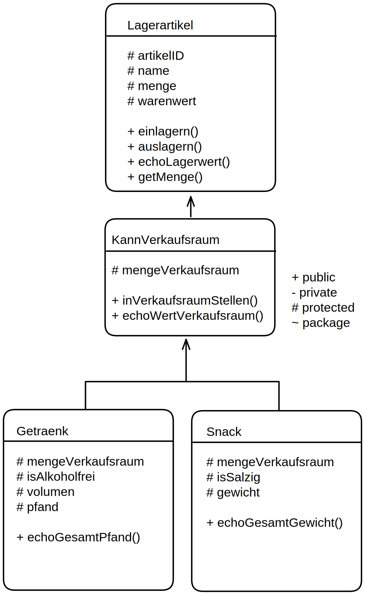

# PHP - LAGER-Aufgabe



````php

class Lagerartikel{
    protected $artikelID;
    protected $name;
    protected $menge;
    protected $warenwert;

    public function __construct(string $name){
        $this->artikelID = rand(1,999999);
        $this->name = $name;
        $this->menge = 0;
        $this->warenwert = rand(1,10);
    }
    public function einlagern(int $anzahl){
        $this->menge += $anzahl;
    }
    public function auslagern(int $anzahl){
        if ($anzahl <= $this->menge)   {$this->menge -= $anzahl;}
    }
    public function echoLagerwert(){
        echo $this->name."-Warenwert : ".$this->menge * $this->warenwert ." € <br>";
    }
    public function getMenge(){
        return $this->menge;
    }
}

class KannVerkaufsraum extends Lagerartikel{
    protected $mengeVerkaufsraum = 0;

    public function inVerkaufsraumStellen(int $anzahl){
        if($anzahl <= $this->menge)
        self::auslagern($anzahl);
        $this->mengeVerkaufsraum += $anzahl;
    }
    public function echoWertVerkaufsraum(){
        echo $this->name."-VerkaufsraumsWert : ".$this->mengeVerkaufsraum * $this->warenwert ." € <br>";
    }
}

class Getraenk extends KannVerkaufsraum{
    protected $isAlkoholfrei;
    protected $volumen="1 Liter";
    protected $pfand=0.15;

    public function __construct(string $name, bool $isAlkoholfrei){
        parent::__construct($name);
        $this->isAlkoholfrei = $isAlkoholfrei;
    }
    public function echoGesamtPfand(){
        echo "PfandWert im Lager: ".$this->pfand*$this->menge."<br>";
        echo "PfandWert im Verkaufsraum: ".$this->pfand*$this->mengeVerkaufsraum."<br>";
    }

}

class Snack extends KannVerkaufsraum{
    protected $isSalzig;
    protected $gewicht;

    public function __construct(string $name, float $gewicht, bool $isSalzig){
        parent::__construct($name);
        $this->gewicht = $gewicht;
        $this->isSalzig = $isSalzig;
    }
    public function echoGesamtGewicht(){
        echo "Gesamtgewicht im Lager: ".$this->gewicht*$this->menge/1000 ." kg <br>";
        echo "Gesamtgewicht im Verkaufsraum: ".$this->gewicht*$this->mengeVerkaufsraum/1000 ." kg <br>";
        return $this->gewicht*$this->menge;
    }
}

// erstellen unseres Lagers
$lager = [];
$lager[] = new Snack("Snickers",57,false);
$lager[] = new Snack("Chips",200,true);
$lager[] = new Getraenk("cola", true);
$lager[] = new Getraenk("bier", false);
$lager[] = new Getraenk("wein", false);

// befüllen unseres Lagers:
foreach($lager as $art){
    $art->einlagern(100);                       // 100 artikel ins Lager stellen
    $halbeMenge = round( $art->getMenge() / 4 );
    $art->inVerkaufsraumStellen($halbeMenge);   //ein Viertel, also 25 in Verkaufsraum stellen
}

// ausgeben unserer Werte:
foreach($lager as $art){
    $art->echoLagerwert();                      //echo des Lager-Wert
    $art->echoWertVerkaufsraum();               //echo des Werts im Verkaufsraum

    if($art instanceof Snack){
        $art->echoGesamtGewicht();              //echo der 2 Gewichts-Summen (Lager/Verkaufsraum) wenn Snack

    }else if ($art instanceof Getraenk){
        $art->echoGesamtPfand();              //echo der 2 Pfand-Summen (Lager/Verkaufsraum) wenn Snack
    }

    echo"----------------<br>";
}
```