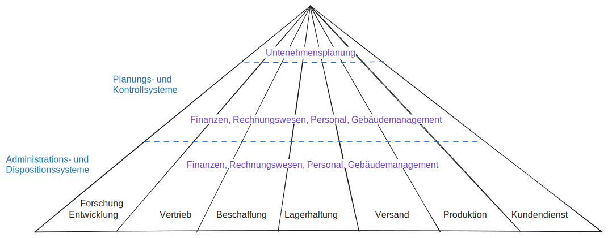
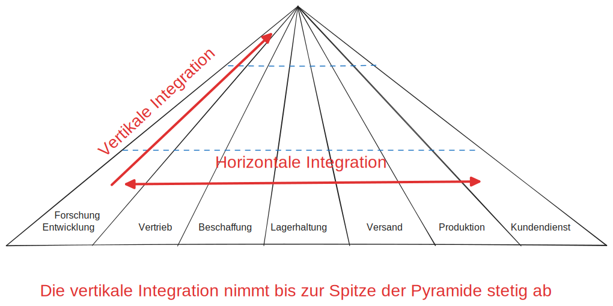
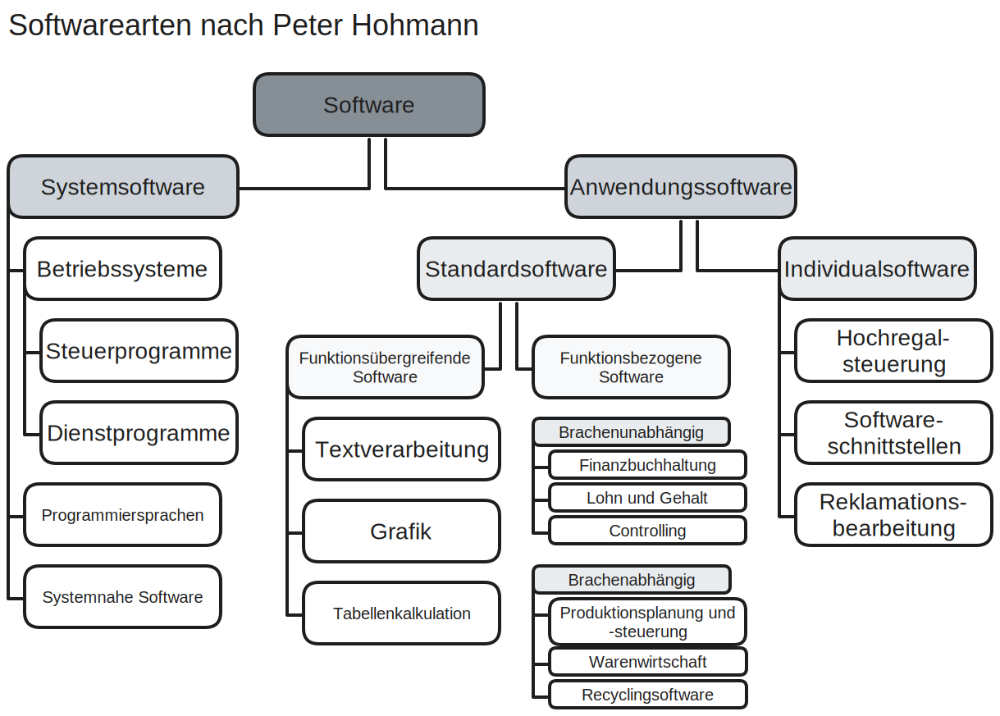

# Betriebliche Anwendungen

## Definition System

## Betriebliche Anwendungen
ein System ist eine Zusammenfassung mehrerer Komponenten zu einer als Ganzes aufzufassenden Einheit. 

Sie lösen in der Regel ein definiertes Bündel von Aufgaben.

- Die Komponenten können von gleicher Art sein, homogene Systeme, z. B. Programme.

- Oder sehr unterschiedlich sein, z. B. die Zusammenfassung von Hardware- und Software.

Planungs und Kontrollsysteme / Administrations- und Dispositionssysteme

- **Administrationssysteme** - z.B. Auftragsabwicklung
    - Beschleunigung von Prozessen
    - Kostensenkung und Entlastung des Personals von Routineaufgaben

- **Dispositionssysteme** - z.B. Bedarfsplanung
    - Optimierung / Verbesserung von Entscheidungen 
    - Beschleunigung von Prozessen
    - Kostensenkung und Entlastung des Personals von Routineaufgaben
    - täglich bis monatlich
    - genutzt vom Mittleren Management

- **Planungssysteme** - z.B. Produktionsprogrammplanung
    - Ermittlung von Plandaten/Zielwerte auf Grund der von Daten aus Dispositons- und Administrationssystemen
    - monatilich bis Jährlich
    - Unternehmensführung

- **Kontrollsysteme** - z.B. Vertriebsinformationssystem
    - Überwachung der Einhaltung der Pläne und Vorschlag von Korrekturmaßnahmen

## Eigenentwicklung vs Standard-Software
- **Vorteile von Standard-Software:**
    - geringe Kosten
    - Strategische Sicherheit
    - Sicherheit im Support
    - Hohe Verfügbarkeit / Qualität
- **Vorteile von Standard-Software:**
    - Differenzen zwischen betrieblichen Anforderungen und gegebenheiten
    - schlechtere Performance (da allgemeiner)
    - Anpassung der betrieblichen Prozesse an die (unveränderliche) Software
    - Abhängigkeit vom Hersteller
    - Motivation und Akzeptantprobleme in Fachabteilungen

## Typen von Betrieblicher Anwendungen
- **Planungs- und Entscheidungssysteme**
- **Analyse- und Informationssysteme**
- **Berichts- und Kontrollsysteme**
- **Wertorientierte Abrechnungssysteme**
- **Mengenorientierte operative Systeme** - z.B. Adimistartoins und Dispositonssysteme

## Arten von Anwendungsarten
Administrations- und Dispositonssysteme:
1. Branchenneutrale Anwendungen
2. Brachenspzifische Anwendungen
3. Zwischenbetriebliche Anwendungen

Führungssysteme:
1. Führungsinformationssysteme
2. Planungssysteme

Querschnittssysteme:
1. Bürosysteme
2. Multimediasysteme
3. Wissensbasierte Systeme

# Integrierte Informationsverarbeitung
Integration = Wiederherstellen eines Ganzen / ergänzen.

zu verknüpfende Anwendungssysteme: Administrationssysteme, Dispositionssysteme, Planungssysteme, Kontrollsysteme, sollen zusammenfunktionieren.

### Integrationsgegenstand
#### Datenintegration
Datenbestände werden logisch zusammengeführt. z.B. Automatische weitergabe, oder gemeinsame Datenbank.
#### Funktionsintegration
Aufgaben werden miteinander Verknüpft, z.B. Kalkulation
#### Prozess- / Vorgangsintegration
Prozesse werden aufeinander abgestimmt. Z.B. Kundenauftrag und Produktion.
#### Methodenintegration
Die benutzten Methoden werden aufeinander abgestimmt. z.B. Algorithmen abstimmen für berechnete Menge der Daten dynamisch abstimmen.
#### Programmintegration
1. Benutzerschnittstelle (Software-Ergonomie (copy-paste etc.))
2. Medienintegration (Texte, Grafiken, Bilder, Ton)
3. Geräteintegration (Telefon, Fax, Computer, Bluetooth)

# Ziele und Probleme der Integrierten Informationsverarbeitung

## Ziele
- Abbau von Grenzen zwischen Abteilungen, Funktionsbereichen und Prozessen
- Minimierung des personellen Inputaufwands (Daten nur einmal erfassen und weitergeben, Automatisches ergänzen der Daten aus Datenbank)
- Erhöhung der Datenqualität (weniger Erfassungsfehler)
- Erhöhung der Prozess-Sicherheit (Menschen Machen Fehler)
- Verringerung von Speicher und Dokumentationsaufwand (weniger Redundanz)

## Probleme
- Anfälligkeit gegenüber fehlerhaften Daten
- Zwang zur vollständigen Erfassung im System
- Keine 100%-Igen Programmtests möglich (maximal Unittests)
- Langer Realisierungszeitraum (Time-To-Market)

# Integrationsmodelle
## Aris-Konzept
Sichten werden eingeführt um bessere Prozessmodellierung zu ermöglichen. Jede Sicht kann ochmal in Ebenen unterteilt werden. Ziel ist das ganzheitlich computergestütztes Geschäftsprozessmanagement.

Dient der Darstellung von sichtweisen von Geschäftsprozessen

Die Fachkonzept Modell-Typen:
- Oganisationssicht - Organigramm
- Funktionssicht - Funktionsbaum
- Datensicht - ERM, SERM
- Prozessansicht/Steuerungssicht - EPK, VKD

### Organisationssicht
Organisatorischer Aufbau des Unternehmens wird verdeutlicht. (z.B. in Marketing, Einkauf, Fertigung, Vertrieb, die allle der Geschäftsleitung unterstehen...)

### Funktionssicht
Funktionsbaum stellt die hierarschische Gliederung einer (fachlichen) Aufgabe dar. (z.B. von Angaebotsabwicklung zerlegt in elementare Bausteine wie Reservierung Lagerbestand, Bestätigung, Versand...)

### Datensicht
Informationen zu verwendeten Daten (Daten, Datenformaten (z.B. exel, SQL-Tabellenstrukturen), Datenbeziehungen)

Entity-Relationship-Modellen, Jackson-Diagrammen oder hierarchische Datenmodelle.

### Prozessansicht (auch Steuerungssicht, Prozessansicht)
Verbindet verschiedene Sichtweisen. 

Sie zeigt je nach gewählter Darstellung z.B.
- welche Ereignisse einen Prozess auslösen.
- welche Funktionen bei einem Prozess mitwirken.
- wie der sachlogische Ablauf des Prozesses ist.

# Komplexe betriebliche Anwendungen
## ERP - Enterprise Resource Planing
z.B. SAP. 

Alle Kernprozesse, die zur Führung eines Unternehmens notwendig sind. Wie z.B. Finanzen, Personalwesen, Fertigung, Logistik, Services, Beschaffung etc.

Die über eine gemeinsame Datenbasis verbunden sind.

## SCM - Supply Chain Management
Wertschöpfungskette abbilden, analysieren, verwalten und automatisieren.

Betriebliche Produktionsfaktoren abbilden wie
- Arbeitskraft (Entwicklung, Design, Produktion, Verwaltung)
- Arbeitsmittel (Grundstücke, Gebäude, Anlagen, Maschienen)
- Werkstoffe (Energie, Rohstoffe, Hilfs und Betriebsstoffe)

## CRM - Customer Relationship Management
- Pflege von Stammdaten (Namen, Adressen, Kontaktdaten)
- Speicherung der Kontakthistorie
- Kundengruppenanalyse und -Bindung
- Dokumentenmanagement

## Computer Integrated Manufactoring
ist ein Sammelbegriff für rechnergestützte/rechnerintegrierte Produktion/Fertigung. z.B. :
- CAD (Kunstruktion, Entwurf)
- CAE (Entwicklung)
- CAP (Arbeitsplanung)
- CNC (Fertigung)
- CAQ (Qualitätssicherung)
- PPS (Produktionsplanung/Steuerung)
- BDE (Betriebsdatenerfassung)

## Kommunikationsanwendungen

### Beispiele
- Electronic Business
    - Die Geschäftsprozesse Vorbereitung, Verhandlung und Durchführung werden übers Internet abgewickelt.
- Electronic Commerce
    - Elektronischer Handel (z.B. Finanzdienstleistung) übers Internet anbieten. Z.B. Amazon
- Electronic Procurement 
    - Beschaffung von Gütern und Dienstleistungen unter Nutzung des Internets.
- Electronic Finance
    - Abwicklung von Geldgeschäften im Internet. z.B. Onlinebanking, Paypal
- Electronic Government
    - Abwicklung von Legislative, Exekutive und Judikative übers Internet. z.B. Onlinefuktionen des Personalausweises
    - G2C - Government to Consumer
    - G2B - Government to Business
    - G2G - Government to Government

### 
- Geschlossenes System.
    - Firmennetze des Lieferanten und des einkaufenden Unternehmens miteinander verbinden
    - erheblicher Aufwand (Schnittstellen aneinander anzupassen)
- Halboffene Systeme
- Offene Systeme
