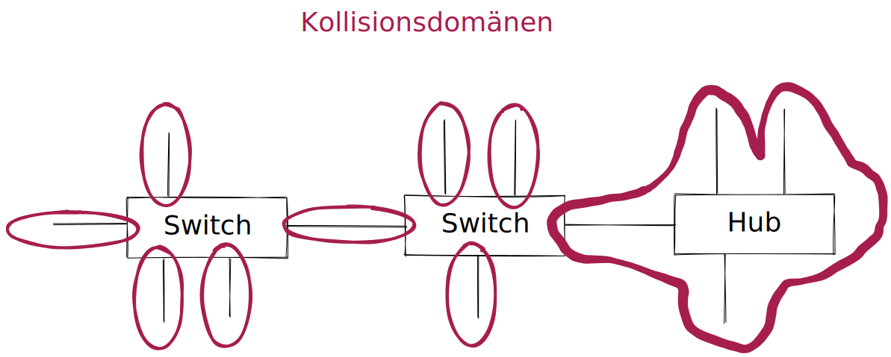
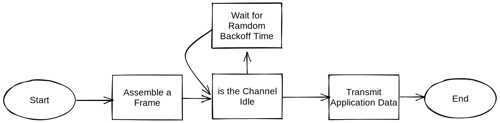
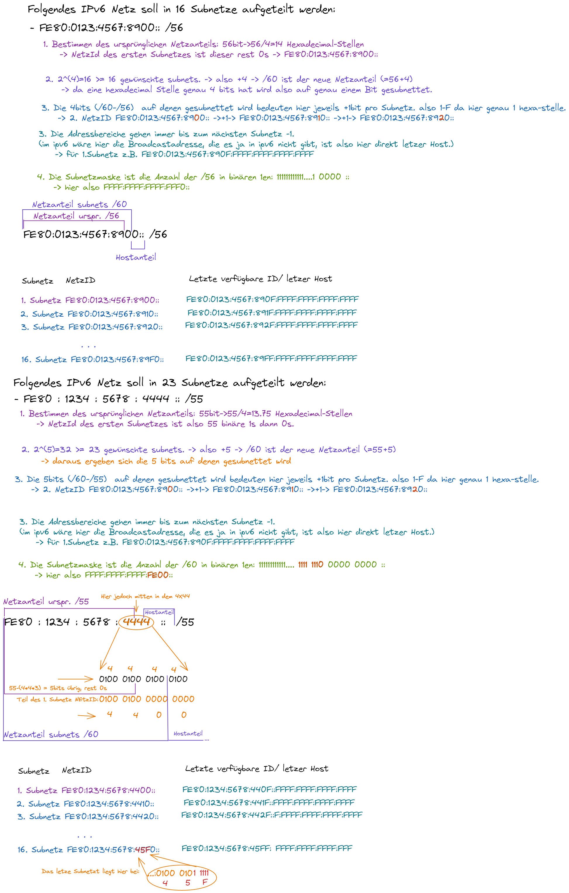

## Netzwerke
# Überblick

## Vorteile von Netzwerken:
- verbesserte Kommunikation: verstärkt den Informationsaustausch
- Im abgeschlossenen firmeneigenen Netzwerk werden Neuigkeiten veröffentlicht, die jeder berechtigte Mitarbeiter abrufen kann.
- Anbindung an Internet kann zentral erfolgen und ermöglicht damit weltweiten Austausch
- Einsatz von Email, Messengern... ermöglicht instant, persistant Kommunikation
- Zentral abgespeicherte Daten können geteilt Verwendet/Zugegriffen werden.
- Zentralisierung
- Kosteneinspaarung
- Steigerung der Effektivität
- Automatisierung
- Standartisierung, z.B.Versionierung von Daten
- Datensicherung
- Gemeinsamme Nutzung von Ressourcen (z.B. geteilter Drucker)
- Absicherung der Verfügbarkeit: im Verfügbarkeitsverbund kann durch Aufbau von Redundanzen/Failover auch im Ausfall einzelner Komponenten arbeitsfähig bleiben
- Lastverbund (Cluster)
- Optimierung der Wartung: z.B. Remote Zugriff
- Mobilität: Arbeiten von Unterwegs/Homeoffice

## Nachteile von Netzwerken
- Kosten: evtl. teure Investionen müssen ökonomischen / unternehmerischen Vorteile aufwiegen. Aufbau, Wartung, Pflege, Instandhaltung erzeugt kosten.

# Geografische Ausdehnung
- zentrale vs dezentrale
- strukturierte und organisierte Hierarchie

# Netzwerkklassifizierungen:
- PAN
- LAN
    - WLAN
- MAN
- WAN
- GAN

## PAN
- USB, FireWire, Blootooth
- wenige Meter, maximal Nebenraum

## LAN (local area network)
- mindestens 2 Geräte im Verbund
- auch Ortznetz genannt. Bis ca. Grundstücksfläche.
- standartmäßig Ethernet

## WLAN (wireless local area network)
- werden durch Normenfamilie IEEE 802.11 definiert
- geräte bequem in Heim- oder Unternehmensnetz einbinden
- geringerer Datendurchsatz als LAN

## MAN (metropolian area network)
- Städtenetzwerk. Breitbandiges Telekommunikationsnetz genannt, das mehrere LANs in geografischer Nähe verbindet.
- z.b. im Uninetzwerk werden mehrere Gebäude und LANs verbunden.
- aber auch Regionenweites Internet
## WAN
- mehrere MANs zusammengeschlossen.
- streng genommen, mehrere Länder/Kontinente zusammengeschlossen.
- meist in Besitzt einer besetimmten Organisation oder Unternehmens.
## GAN
- weltumspannendes Netzwerk wie das Internet
- umfasst mehrere WANs
- GANs nutzen die Glasfaserinfrastruktur, Seekabel oder Satellitenübertragung.

# Zentralisierung vs Dezentralisierung
- gleichberechtigt vs hierarchische struktur
- zwei Grunkonzepte Client-server Peer-to-Peer

## Peer-to-Peer
- von peer (engl. Gleichgestellter)
- prinzipiell alle Computersysteme gleichberechtigt
- im lokalen: Drucker- oder Netzlaufwerksfreigaben
- im globalen: Filesharing-Netzte z.B. **Torrent**, Grid- oder CloudComputing

*Vorteile:* keine Extrakosten für Server  
*Nachteile:* Sicherheitsrichtlinen nur sehr eingeschränkt umsetzbar. Keine Zentrale Verwaltung.  

## Client-Server
- Server-Anwendung welches über Netzwerkverbindung eine Dienstleistungen/Ressourcen bereitstellt und passiv auf Anfragen wartet.
- Client-Programm kommuniziert mit dem Server über eindeutige "Sprache", dem **Protokoll**. Bsp, HTTP und Webserver.
- sobald ein Netzwerk größere Dimensionen annimt, wird PeerToPeer unübersichtlich und schwer zu administrieren.
- Je nach Protokoll ist eine Anmeldung nicht erforderlich (z.B. Web- DNS- und DHCP-Server)

*Vorteile:* Zentralisierte Sicherheitsfreigaben. Erhöhte Sicherheit. Spezialisierung des Servers nach Anforderungen möglich. Redundanz möglich für z.B. Ausfälle oder Loadbalancing.  
*Nachteile:* Anschaffungs-Kosten für Hardware und Betriebssysteme, Verwaltungskosten. mehrfach um Ausfallsicherheit zu garantieren.  
Daher ist Abwägung wichtig : Total Cost of Ownership (TCO) vs. Return On Investment (ROI)  
 -> Kosten-Nutzen-Relation/Rechnung

- File-Server
- Print-Server
- Application-Server
- . . .

#  us-Topologie / Diffusionsnetz
Die Bus-Topologie ist eine passive Topologie. Die angeschlossenen sTationen führen keine Wiederaufbereitung des Signals durch.      
Shared Medium ->sie hängen alle in Reihe am "selben" Kabel.

Früher häufig verwendet, z.B. in Version 10Base5 oder 10Base2. Mittlerweile wird es eher vermieden.
*Vorteile:* Günstig  
*Nachteile:* Single point of Failure, keine wirkliche skallierbarkeit.

# physikalischer Stern 
(der logisch jedoch noch Bus ist)  
Zentraler Verteiler nimmt anfragen an und sendet aber immer an alle gleichzeitig (wie Bus)     
Immer noch Single point of failure (Verteiler)     
ausfall einer statiun oder defekt eines Kabels hat keine Auswirkung auf das restliche Netz.

# logischer Stern 
(der ebenso immer auch physikalischer Stern ist)    
Zentraler Verteiler (Switch) stellt punkt zu punkt verbindung zwischen clients her.   
Hat heutzutage fast vollständig den Bus verdrängt.  
*Vorteile:*
- Extrem Flexibel bzgl. Skallierbarkeit. Weitere Stationen und/oder Verteiler können problemlos hinzugefügt werden.   
- Höhere Durchsatzraten, da 2 Stationen die Volle Bandbreite benützen können.     
- allgemein wenn aktiver Verteiler (vs passiver) wird das Signalverstärkt -> größere Reichweite.    

*Nachteile:* 
- größere Kabelmenge 
- Kosten für Switch
- Beim Ausfall des Verteilers -> Totalausfall

# Ring Topologie
jede Station hat einen klar definierten Vorgänger und Nachfolger    
Nachteile wie bei Bus   
Ring-Topologie spielt heutzutage neben in der Automatisierungstechnik (um hier hohe Fehlertoleranz zu gewähren) fast keine Rolle mehr.

## Token Ring Topologie
Token wandert Reih-um, bis er an eine Station kommt die senden möchte -> Kollisionen minimiert.     

# Baum Topologie
Stern Topologien werden zusammengeschalten um z.B. verschiedene Abteilungen zusammenzufügen.    
z.B. 1 Hauptverteiler hat 3 Abteilung mit jeweils mehreren Clients. Server z.B. am Hauptverteiler angeschlossen.

# (einfaches) Maschennetz Topologie
In einem vernetzten Netzt existieren zwischen Verschiedenen Knoten mehrere Verbindungen.
- keinen single point of failure. Da redundanzen vorhanden.
- Vorteile überwiegen nur, wenn Sicherheit bzgl. Verfügbarkeit das höchste Gut ist.
- Extra Leitungen können load sharing oder passiv (standby) implementiert werden
*Nachteil:*
- extra Kabel, Hardware braucht genug LAN Ausgänge/Eingänge -> kosten
- Routing kann extrem komplex werden. (um feedbacks zu vermeiden etc)

werden siemit switchen realisiert, sind das Spanning-Tree-Protokoll bzw. meshing-fähige Switche erforderlich.
## Vollvermaschtes netz Topologie
Jedes Mitglied ist mit **allen** anderen Mitgliedern vernetzt.

# OSI- Schichten

|OSI |Protokolle|Protokoll-bsp.|Kopplungselemente|Einheiten|
|---|---|---|---|---|
|7|Anwendung / Application|HTTP, DNS, FTP, DHCP|-|Daten|
|6|Darstellung / Presentation|HTTP, DNS, FTP, DHCP|-|Daten|
|5|Sitzung / Session|HTTP, DNS, FTP, DHCP|-|Daten|
|4|Transport / Transport|TCP, UDP|LoadBalancer, (Firewall)|TCP-Segmente, UDP-Datagramme|
|3|Vermittlung / Network|IP, IPsec, ICMP|Gateway, Router, Layer-3-Switch|Pakete|
|2|Sicherung / Data Link|Ethernet (IEEE 802.3), ARP, WLAN (WLAN ja, LAN nein)|Bridge, Layer-2-Switch, WirelessAcessPoint|Frames|
|1|Bitübertragung / Physical|1000BASE-T, Token Ring|Kabel, Repeater(=Verstärker), Hub|Bits|

### Repeater : Layer 1
- verstärkt Sendesignal um verlängerung der Kabellänge über physikalisches Maxium.
- 5-4-3 Regel. Begrenzt Reichweite => mittlerweile in kabelgebundenen Netzwerken fast vollständig verdrängt. (effektiv übernehmen Kopplungselemente in Schichten 2-3 die Signalauffrischung, da diese nicht mit 5-4-3 Regel beschränkt sind)
### Hub : Layer 1
- Ist ein multiport Repeater. Frischt also Signal auf wie der Repeater.   
- Sendet Packete die ankommen an **alle** anderen Stationen. (=> physikalischer Stern Topologie mit Hub in der Mitte).    
- Nachteile (da effektiv ein Bus) Anzahl der Stationen ist begrenzt. Geteilte Bandbreite. Heutztutage heute nicht mehr wirklich relevant.
- Vorteile kostengünstig.

### Bridge : Layer 2
- Verbindet 2 Segmente in einem Computernetz. Reduziert unnötigen Datenverkehr => Um z.B. Kollisionen zu vermeiden verdoppeln wir die Kollisionsdomänen => Auslastung des Netzwerks wird besser verteilt.
- Bridge hat eine "Datenbank" aller relevanten MAC-Adressen. Bridge entscheidet dann ob es relevant ist die Datenpakete weiterzuleiten oder nicht.
- heutzutage nicht mehr wirklich relevant.

### Layer-2-Switch : Layer 2
- stellt Punkt zu Punkt verbindung zwischen 2 Stationen her. (logischer Stern)
- benutzt MAC adressen um zu wissen wohin die Datenpakete müssen. Und updated diese regelmäßig.
- über Uplinkports können mehrere Switches miteinander kombiniert werden. Adresstable hat jedoch eine Obergrenze der maximalen Endgeräte die "bedient werden können".
- Bandbreite ist hier nicht mehr geteilt.
- An einem Empfänger Port ist jedoch die Bandbreite immer noch limitiert. => wenn zu viele Pakete an einen Port gehen, mehr als der Switch zwischenspeichern kann werden Pakete verworfen/gelöscht.
- es gibt "dumme" unmanaged switches und managed switches. Die z.B. Nutzergruppen, Zugangsberechtigungen, Port-Mirroring(zum debuggen/leistungsüberprüfung) etc. verwalten können.

### Gateway : Layer 3-7
Verbindet Netzwerke mit unterschiedlichen Protokollen/Systemen miteinander, die sonst nicht miteinander Kommunizieren könnten.
- Standart-Gateway: Standart weg ins Internet, zuhause z.B. Modem-Router.
- Router, Proxyies etc sind beispiele für Gateways.
- Gateways können auf vielen Ebenen existieren. Nicht nur auf Layer 3.

### Router : Layer 3
Verbintet Netzwerke. "Wegfinder" im Internet.
- jeder Router ist ein Gateway.

### Layer3-Switch : Layer 3

## Kollisionsdomäne
Teilbereich auf OSI-Schicht 1. Fangen auf einem derartigen gemeinsamen Layer-1 Segment zwei Stationen gleichzeig an zu senden (z.B. auf gleichem Kabel), kommt es zu Kollisionen. (z.B. Stationen die an einem Hub zusammengeschlossen sind.)     
- Switches z.B. haben viele Kollisionsdomänen. Eine Bridge z.B. 2 Kollisionsdomenäen.

## halfduplex / vollduplex
half: gleichzeitiges senden und empfangen ist nicht möglich.     
vollduplex: quasi 2 leitungen (in einem Kabel), die gleichzeitiges Senden und Empfangen ermöglichen.
- im halfduplex Betrieb werden **Zugriffsverfahren** benutzt um zu regeln wer wann senden darf:
    - CSMA/CA
    - Token Passing
    - FDMA
    - TDMA
    - CDMA

# Mehrfachzugriffsverfahren
Mehrere Zeilnehmer teilen sich ein Zugriffsmedium

### - CSMA / CA
carrier-sense multiple access with collision avoidance.     
Prinzip: Listen before Talk.        
Z.B. bei einem Bus / Hub Netzwerk. Aber auch wenn sich ein Übertragungsmedium wie ein Frequenzbereich geteilt wird, z.B. WLAN.      

- **Carrier Sense:**  Teilnehmer dürfen nur Daten an das Netz versenden, wenn das Übertragungsmedium frei ist.

- **Multiple Access:** Mehrere Stationen teilen sich ein Übertragungsmedium. Noch zu erwähnen das sie natürlich auf dem selben verbindlichen Protokoll kommunizieren müssen.

- **Collision Avoidance:** Ein komplexer Ablaufplan versucht dafür zu sorgen, dass zwei oder mehr Teilnehmer nicht gleichzeitig eine Übertragung beginnen. Sollte es doch mal passieren wird dies erkannt und die Übertragung abgebrochen -> erneut versucht.

großes Problem: Hidden-Station-Problem. Wenn 2 entfernte Statiunen sich gegenseitig nicht mehr wahrnehmen können. Stationen dazwischen jedoch beide. -> beide Senden ohne das sie es merken gleichzeitig.

-> Lösung: RTS/CTS Koordination. Request to Send/Clear

#### Protokollablauf
1. Medium abhorchen
2. ist MNedium für die Dauer eines DIFS (Taktung die ein Datenpaket maximal gesendet werden kann) frei, wird gesendet
3. ist das Medium belegt wird gestoppt und nach einem DIFS erneut probiert
4. nach vollständigem Empfang des Pakets warted der Empfänger ein SIFS bevor eine Antwort gesändet wird
5. Eine Kollion führt zum gleichzeitigen Timeout, bevor der gesamte Vorgang wiederholt werden kann.

### - CDMA 
Code-division-Multiplex Verfahren. Benutzt z.B. im Mobilfunk.  

Mehrere Signale benutzen den gleichen Kanal. Durch z.B. Spreizung.
- Jeder Sender hat einen anderen Code, mit dem auf verschiedenen "Frequenzen" der Code zusammengefügt wird.
- dadurch wird die Bandbreite besser genutzt/erweitert. (als bei z.B. TDMA oder FDMA)

### - TDMA
Zeit-Multiplex Verfahren. Benutzt z.B. in ISDN Mobilfunk(2G.), Satellitenkommunikation.
Jeder Sender hat sein festgesetztes Zeitfenster zum Senden.
- Zuordnung der Empfangenen Daten erfolgt alleine auf Zeitlichen Position der Daten
- Kennen die Stationen ihren Zeitslot können Kollisionen vermieden werden.

Synchrones TDMA feste Zeitslots -> viel verschwendung von Bandbreite.
Asyncrones TDMA gibt es auch noch. -> Effizienter. Nachteil: Mehr Protokoll/Aufwand.

### - FDMA
Frequenz-Multiplex Verfahren. Mobilfunk, Kabel-Fernsehr.
- Digitales Signal wird in analoge Sinus Welle geändert.
- Jeder Sender bekommt eigene Frequenz.(Mit kleinen Frequenz lücken um Interferenzen auszuschließen) Alle senden "Gleichzeitig".
- Am Empfänger werden die einzelnen Frequenzen wieder herausgefiltert.

### - Token Passing
- Token Ring: Ich erhalte (reihum) den Token. Wenn ich senden möchte sende ich, nachdem ich den Token habe, oder reiche ihn weiter.
- Token Bus: Nimmt logisch gesehen den nächsten Teilnehmer. (MAC adressen z.B. nach Value-sortiert)

# Donnerstag

## Der Aufbau eines Ethernet-v2-Rahmens nach IEEE 802.3
- Liegt in Schichten 1 und 2 und überträgt dort Daten
- am bekanntesten ist die Definiton des noch heute gültigen Ethernet-v2- Rahmens für den Layer 2.

## Frames
- MTU - Maximum transmission Unit kann bei der Konfiguration eines Netzinterfaces angegeben werden.
- Sie definieret die maximale Größe des Datagramms. Daten die diese Länge überschreiten, werden immer in mehrere Frames aufgeteilt/fragmentiert und dann über das Netzwerk versendet.
- Dadurch müssen bei Fehlern nur die entsprechenden Rahmen neu übertragen werden. Außerdem können mehrere Benutzer abwechselnd Rahmen verschickem. -> nahezu gleichzeitiger Netzwerkzugriff mehrere User möglich.
- Prinzipielle Aufbau nach Rahmen nach IEEE 802.3 ist dabei immer gleich.

# Header - Daten -Trailer

Schicht1:
|Präambel|Zieladresse|Ursprungsadresse|Typ|Datenteil|Frame-Kontroll-Sequenz|
|---|---|---|---|---|---|
|8 Bytes|6 Bytes|6 Bytes|2 Bytes|46-1500 Bytes|4 Bytes|

Ohne Präambel ergibt sich: 
- min. größe: 64 Bytes
- max. größe 1518 Bytes (= Nutzlast 1518/1522bytes)

# ethernet
- Ein ethernet-v2-Rahmen hat ohne VLAN-Tag eine Rahmengröße von 64 und 1518Bytes und folgenden Aufbau:
    - als Frame Kontroll Sequenz (FCS) wird ein CRC Algorithmus eingesetzt
    - unter IPv6 gibt es keine fragmentierungen mehr.
    - Ist ein Frame zu groß, erhält der Absender eine Fehlermeldung
    - Ist ein Netzwerk übeer Switche in virtuelle Netzwerke aufgeteilt, erhält jeder Frame eim Datenteil zur Identifizierung des VLANs ein zusätzlich 4Byte großes Feld, das VLAN-Tag.

# IPv4-Adressen
- besteht aus 32 bit -> 2^32 maximale Ip-Adressen

## historische Netzklassen

|Klasse|IP-Bereich von|bis IP-Bereich|Netzmaske|Mögliche Hosts|
|---|---|---|---|---|
|A|1.0.0.1|127.255.255.254|255.0.0.0 |254^3|
|B|128.1.0.1|191.255.255.254|4 255.255.0.0 |254^2|
|C|192.1.0.1|223.255.255.254|255.255.255.0 |254^1=254|
|D|224.0.0.1|239.255.255.254|255.255.255.255|254^0=1|
|E|240.0.0.1|255.255.255.254|werden nicht vergeben !|

## private IP-Bereiche?
wichtig lernen!

|Bereich| von | bis | als netzbereich geschrieben:|
|---|---|---|---|
|A|10.0.0.0|10.255.255.255|10.0.0.0/8|
|B|172.16.0.0|172.31.255.255|172.16.0.0/12|
|C|192.168.0.0|192.168.255.255|192.168.0.0./16|

**127.0.0.1 -> loopback -> localhost!**

https://www.it-administrator.de/download/whitepapers/BlackB_WP_Subnetzmasken.pdf

- eine 1 in der Subnetzmaske -> das bit gehört zum Netzanziel (vs 0)
- -> CIDR zeigt anzahl der gesetzen bits. (classless interdomain routing)
- -> LIDR zeigt netzteil

Bsp. 10.43.8.67/28 entspricht der Adresse 10.43.8.67 mit der Netzmaske 255.255.255.240:   
IPv4-Adresse = 10.43.8.67/28 (32-28= 4 Bit (Netzmaske: 11111111.11111111.11111111.11110000 (mit 4 Stellen im Dualsystem lassen sich 16 unterschiedliche Werte darstellen, nämlich 0–15)) → 16 Adressen − (Broadcast- und Netzadresse) = 14 IPv4-Adressen zu vergeben.)

- standart subnetzmaske ist 24, da berechnen der hosts damit sehr einfach wird. =2^n-2 mit n=32-CIDR-Zahl -> n= 32-24=8

- die CIDR -Zahl ordnet theoretisch bis /8 ->A, bis /16 ->B, bis 24/ ->C zu.

## unicast - multicast - broadcast
- unicast sendet point to point.
- broadcast sendet an mehrere (>1 aber nicht alle). allgemeine broadcast adresse: 255.255.255.255. im privaten ist die (private) broadcast adresse die letzte hostadresse möglich +1.
- multicast sendet an alle.

## APIPA -Adresse
- Autokonfiguration von Adressen fürs Lan, wenn nichts anderes eingestellt.
- address from 169.254.0.0 to 169.254.255.255 (entspricht subnetztmaske 16)

# Ipv6
- buch s.232 recht gut erklärt   
größe: 128 bit.

- statt TTl (Time To Live, hat ipv6 ein hop limit =quasi das selbe)

- Vorteile:
    - mehr sicherheit, durch historische verwendung von IP-Sec

- theoretische größ in ipv4: 1500Bytes 65535 Bytes
- theoretische größe ipv6:      x        -4Mrd Bytes (4 Gigabyte). In der praxis unterstützen jedoch auf unteren Schichten keine so großen Pakete.
- 8 Blöcke mit jeweils 4 Ziffern / jede Ziffer 0-9-A-F = 4 bit / =128bit

## unicast- multicast - anycast
- Unicast
Bezieht sich auf eine Schnittstelle auf einem einzelnen Knoten.

- Multicast
Bezieht sich auf eine Gruppe von Schnittstellen, in der Regel auf verschiedenen Knoten. Pakete, die eine Multicast-Adresse gesendet werden, werden an alle Mitglieder der Multicast-Gruppe geleitet.

- Anycast
Bezieht sich auf eine Gruppe von Schnittstellen, in der Regel auf verschiedenen Knoten. Pakete, die an eine Anycast-Adresse gesendet werden, gehen an den Mitgliedsknoten der Anycast-Gruppe, der dem Absender am nähesten ist.

- fe80:: für local adress.

- Die link-lokale Adresse ist nur im lokalen Netzwerk
gültig (Bild 3).
- Eine globale IPv6-Adresse ermöglicht Verbindungen
ins öffentliche Netz.
- Eine temporäre IPv6-Adresse enthält anstelle der
MAC-Adresse der Schnittstelle eine zufällig erzeugte
64-Bit-Zahl als Schnittstellen-ID. Die temporären
Adressen können für alle Schnittstellen verwendet
werden, die anonym bleiben sollen, z.B. beim Zugriff
auf öffentliche Webserver.

# subnetting beispiele

## wieviele hosts passen in subnetzt:
BSP /25 -> n=32-cid=7  -> 2^n=2^7=128 (-> 128-2=126 REchner passen ins netz mit /25)        

# Subnetting warum?
- Orginisatorische und Logische Einheiten können abgebildet werden. z.B. Abteilungen, alle Auszubildenden etc.
- In ipv4 Broadcaststurm. Regelmäßige Broadcasts beanspruchen Netz Leistung/Bandbreite. Werden bei großen Netzen zu viele.

## Rechenbeispiele

Bsp: 400 Hosts anforderung  
Frage: 10.0.0.0 /8? 
Nein. Warum?: wenn broadcastdomaine zu groß wird:       
-> broadcaststurm/ regelmäßige broadcasts beanspruchen Netzt Leistung.         
-> Orginasitorische und Logische Einheiten können abgebildet werden.        
-> erwägen ob kleinere Subnette Sinn machen.    

Bsp. 10.4.5.50/24  ausführlich berechnen       
in bits:    00001010.00000100.00000101.00110010    
24 1en->    11111111.11111111.11111111.00000000     (links netzanteil)      
&& bitwise: 00001010.00000100.00000101.00000000     ()
in decimal  10.     .4      .5      .0              (NetzID)
-> broadcast 10.    .4      .5      .255            (BC)
-> letzte verfügbare 10.4   .5      .254
Gesammt hosts:n=32-CIDR -> 2^n -> =256      

Bsp. 10.4.5.128/25  ausführlich berechnen       
in bits:    00001010.00000100.00000101.10000000    
24 1en->    11111111.11111111.11111111.10000000     (links netzanteil)         
&& bitwise: 00001010.00000100.00000101.10000000     ()      
            netzID  10.4.5.128            
            erster host 10.4.5.129      
            letzter host 10.4.5.254     
            broadcast   10.4.5.255      

Bsp. 10.1.1.0/22
00001010.00000000.00000001.00000000     
11111111.11111111.11111100.00000000     
00001010.00000000.00000000.00000000 <-NetzID        
10.0.0.0    NetzID in decimal       
bc bestimmen: 32-CID = 32-22 = 10 -> 2^n=2^10 -> **10 decimalstellen von links:** = bc adresse      
00000000.00000000.0000001.11111111 <-BC adresse     
3.255 BC adresse in decimal     

## bsp großes netzt in 2 kleinere teilen:

Bsp. 10.0.0.0/24 soll in 2 Bereiche geteilt werden. (z.B. aus Verwaltungsgründen) (ursprüngliche größe: 2^8-2=254 mögliche hosts)        
-> eine 1 mehr in subnetzmaske = 24+1=/25
10.0.0.0-10.0.0.127     
10.0.0.128-10.0.0.255       
mit hier jeweils (2^7-2=)126 hosts

Bsp. 10.0.0.0/24 soll in 4 Bereiche gesplittet werden:      
geht bis. - 10.0.0.255/24       
2^(32-24)=256 -> 256/4=64-> jeder bereich wird 64 bit groß.     
- 10.0.0.0.-10.0.0.63/26      
- 10.0.0.64-10.0.0.127/26     
- 10.0.0.128-10.0.0.191/26        
- 10.0.0.192-10.0.0.255/26        

# Herangehensweise ipv4 subnetz in 4 teil subnetzte splitten:

- 71.56.8.0/16 -> 4 mal /18 -> 2^(32-CID) = 2^(32-18) = 2^**(14)** = 16384 ip's pro Subnetz

|ausgangsnetz->|71.|56.|8.|0|
|---|---|---|---|---|
|in binär|(71)|0011 1000|0000 1000|0000 0000|
|&& biwise operator mit: **14** * binäres 1 dann 0s|1111 1111|1111 1100|0000 0000|0000 0000|
|ergibt binär|(71)|0011 1000|0000 0000|0000 0000|
|ist NetzID des ersten Netztes:|71.|56.|0.|0|

Nun ist die letzte Verwendbare IP/Broadcast Adresse zu ermitteln um den Raum des netztes bestimmt zu haben:
- da 16348 Ip's verfügbar sind ist die letzten 8 bit alle 1: 1111 1111 -> 255
- da dies noch nicht ausreicht wird die stelle vor dem . aktiviert: 16348/2^8=16348/256=64
- (also beginnt das 2Subnetz das nachfolgt bei 71.56.64.0 (<=71.56.0.0 + 0.0.64.0)
- die Broadcastadresse des vorherigen ist also der wert davor(-=1): 71.56.63.255
- die letze Verwendbare Ip ist wiederrum die davor(-=1): 71.56.63.254
- die Subnetzmaske ist ja /24 -> 1111 1111.1111 1100.0000 0000.0000 0000 -> in decimal also 255.252.0.0  (vgl. usecase obere Tabelle 2 spalte)

für die 2 subnetzmaske haben wir ja bereits die NetzID, die Broadcastadresse ist also wieder 71.56.64.0+ 0.0.64.0 - 0.0.0.0.1). ebenso bei Folgenden:

|Subnetz|Netzadresse (Anfang des Raumes)|Broadcastadresse(Ende des Raumes)|
|---|---|---|
|1|71.56.0.0|71.56.63.255|
|2|71.56.64.0|71.56.127.255|
|3|71.56.128.0|71.56.191.255|
|4|71.56.192.0|71.56.255.255|

Achtung: was hier noch falsch war: erst mit /16 die NetzID bilden und diese als Ausgangspunkt für erstes Subnetz nehmen. NICHT wie im Beispiel direkt mit der && bitweise.      
Ausserdem wrsl. nicht wie eingezeichnet mit 14 sondern direkt mit 16 (oder 18) einsen, von /16 /18 

# ipb6 Subnetting:

- /32 wird quasi nur von Internet-Providern genutzt. Da extrem viele Subnetze.
- ab ca. /64 -> 256

# ARP - Adress Resolution Protocol (ethernet Cache)

Übersetzungstabellen für IP-Adressen/physische Adressen.        

- 2. Ebene OSI. Data link layer
- Um ein Datenpaket von Gerät A nach Gerät **im Heimnetzwerk** zu senden muss A die MAC Adress von B kennen.      
- Wenn  ein PC ein Datenpaket übertragen möchte, kennt er ursprünglich nur die (meist durch DNS ermittelte) IP Zieladresse. Der Mechanismus um das nächste Gerät auf der Ende zu Ende Übertragungsstrecke festzustellen ist im Internet Protokoll Version4 das **ARP**. 

- Das ARP Protokoll fragt diese MAC adresse an, und zwischenspeichert diese für wiederholte Anfragen.
- Im heimnetz wären das z.B. Modem, Drucker, Heimpc, Smartphone.

# ICMP - Internet Controll Message Protocol

- Dient im Rechnernetzwerkden zum Austausch von Status- und Fehlermeldungen
- über das ipv4 Protokoll (ist also eigentlich kein Eigenes Protokoll, nur ein Anhängsel an das Ipv4 Protokoll).
- Übertragung über IP ist unsicher, da Paketverlust unbemerkt passiert .
- Ping basiert auf ICMP

# TCP - Transmission controll protocol
- 4. Ebene OSI. Transportlayer
- Funktionen:
    - **Fehlerkorrektur**
    - **Flusssteuerung** mit fenstertechnik
    - Verbindungsaufbau und -Terminierung
    - Geordnete Datenübertragung und Datensegmentierung
    - Multiplexing
- TCP arbeitet immer nach dem gleichen Prinzipien, egal ob im www oder LAN.

## zu Fehlerkorrektur:
- verbraucht mehr Bandbreite.
- TCO bittet Error Recovery. Hierfür muss TCP die Daten Bytes mithelfe der Felder Sequence und Akknowledgement.
- TCP erzielt Zuverlässigkeit in beide Richtungen, indem es das Feld Sequence Number der einen Richtung in Kombination mit dem Feld Acknowledgement der anderen Richtung nutzt.
- Window/Fenster ist die Anzahl an Packeten. Startet klein und wird größer (wenn Verbindung gut ist).

## zu Multiplexing
- Multiplexing durch TCP und UDP ist das Prinzip mit ports.
- Standadisierte Ports: 0-1023 - gängige Ports mit "festen" Portnummern
- Registrierte Ports: 1024-49151 - können von Benutzern ohne besondere Berchtigungen verwendet werden
- Dynamische Port-Bereiche (49152-65535) - Individuell zu Nutzen. Keine Vergabe durch die IANA.

## Ports und Portnummern
|Port-Nr|Protokoll|
|---|---|
|20/21|Ftp|
|22|SSH|
|23|telnet|
|25|SMTP|
|53|DNS|
|57/69|DHCP|
|80|HTTP|
|123|Network time Protocol|
|161|Simple Network Management Protocol|
|443|HTTP|

# Verbindungsorientiertes Protokoll
Ein Protokoll, das vor Beginn der Datenübertragung einen Austausch von Steuernachrichten oder eine andere, zuvor hergestellte Wechselbeziehung zwischen den beiden endgeräten erfordert.
- z.B. TCP

# Verbindungsloses Protokoll
vorher keinen Nachrichtenaustausch und keine zuvor hergestellte WEchselbeziehung zwischen zwei Endgeräten erfordert.
- z.B. UDP

# UDP
- UDP nutzt gleichen ports wie TCP.
- Der UDP Headere ist deutlich kleiner als der TCP Header und damit ist UDP deutlich schneller.
- UDP hat keine Kontrollfunktion

# telnet
- älteste Dienst im Internet.
- Protokoll für Zugriff auf andere Rechner in einem Rechnernetz
- es gibt einen Client & Server
- Unverschlüsselt -> unsicher -> wird nicht mehr wirklich benutzt. (Nachfolger SSH)
- alle Kommandos müssen über ASCII Befhele übermittelt werden.

# SSH Secure Shell
- wie telnet
- aber mit verschlüsselung

# FTP - File Transfer Protocol
- client - server
- Datenübertragung. Client kann Daten ablegen, löschen oder herunterladen.
- Steuerkanal Port 21 und Datenkanal Port 20
- Header enthalten Restart-Markierungen -> Sicherheit bei Verbindungsabbruch -> Übertragung wieder aufgenommen ab Markierung

# HTTP - hypertext transfer protocol
- soll (hyper-)"text" transportieren
- Port 80
- client server Protokoll
- GET, POST, HEAD, PUT, PATCH, DELETE, TRACE, OPTIONS, REQUEST **requests** -> Server antwortet mit **response** 
- Fehlercodes / Statusmeldungen

## HTTP-Cookies
- möglichkeit den browser anzuweisen, Daten lokal zu speichern.
- bei erneuten HTTP-Requests zum selben Webserver -> Browser schickt cookies mit. -> webserver kann client zuordnen
- HTTP- ist ein **zustandsloses** Protokoll (server kann nicht zwischen mehreren HTTP-requests zusammenhang herstellen)
    - wenn website anwendungsorientiert -> Unterscheidung nötig -> cookies "nötig"

https://www.geeksforgeeks.org/what-is-web-socket-and-how-it-is-different-from-the-http/ under CCBY-SA
# HTTPS -secure hypertext transfer protocol.
- SSL verschüsselung, ermöglicht verschlüsselte Datenübertragung

# websocket
- bidirectional (full duplex) protocol of client-server Communication
- ws:// or wss://
- stateful protocul -> connection will be kept alive untill it is terminated by either party. -> after termination it is closed on both ends.

 https://www.geeksforgeeks.org/what-is-web-socket-and-how-it-is-different-from-the-http/ under CCBY-SA

# SMTP - simple mail transfer protocol
- Kommunikation basiert auf ASCII-Kommandos
- E-Mails entgegennehmen und weiterleiten
- kommunikation zw email-client und smtp-server(Postausgangsserver)
- neben SMTP git es auch POP und IMAP
    - dienen jedoch dazu mails abzuholen oder zu verwalten
- NACHTEILE
    - keine Versandbestätigung
    - keine Verlustbestätigung
    - standardisierte Fehlermeldungen werden NICHT unterstützt
    - beliebige Absenderadresse beim Versand, da keine vorhandene Authentisierung des Benutzers beim Verbindungsaufbau
    - offene SMTP-server ->massenhafte Spams

Maßnahmen und Verfahren entwickelt, um Missbrauch entgegenzuwirken. Sind jedoch OPTIONAL.

## POP
- holt Emails ab
- POP arbeitet nach der Offline-Verarbeitung
- Online -> Emails werden vom Posteingangsserver heruntergeladen -> nach erfolgreichem vollständigem Zugriff -> Emails werden auf Server gelöscht.
- Verbindung über TCP PORT 110.
- Kommunikation über ASCII

## IMAP
- Kommunikationsprotokoll wie POP
- emails bleiben (standardmäßig) (bei POP standardmäßig gelöscht) auf dem Server
- synchronistation mehrerer Clients (selbes Mailfach mit Pc & Smartphone => löschen/verschieben/etc)
- Verbindung über TCP PORT 143
- Kommunikation über ASCII

# IGMP
- IP-Multicasting im Internet
- Erweiterung des bekannten Ipv4 Headers
- Alle Netzknoten müssen IGMP unterstützen. 
- Das Internet mit der Protokoll-Familie TCP/IP setzt einen Sender und EMpfänger pro Verbindung voraus. -> für gleichzeitiges Senden an viele ungeeignet.           
-     -> Verbindungen mit einem Sender und mehreren Empfängern ist bei IP nur mit IGMP möglich. Bei z.B. Fernsehr und Rundfunkübertragungen.

# ROUTING

## statisch

## dynamisch

Allgemeine Regeln für DYNAMISCHES Routing:

1. Verhindern von routing-Schleifen
2. Hinzufügen neuer. Sofortiges Ersetzen von verlorenen Routen. (Konvergenzzeit gering halten)
3. Ersatzrouten in Tabellen aufnehmen. Redundanzen.
4. Feststellen das Routen ungültig sind.
5. Günstigste Route priorisieren. (Günstig nach latenz vs Bandbreite)
6. DYNAMISCHES Ermitteln aller Routen zu Subnetzen des Netzwerkes und Eintragen.

# Autonomes System & IGP
Ein **autonomes System** ist einen Menge von Routern mit gemeinsem Inneren Gateway-Protokoll (IGP) (und gemeinsamen Metriken) unter einer technischen Verwaltung.       
Also z.B. ein netzwerk in dem IGRP gesprochen wird usw...

# Interior-Gateway-Protokolle:

## Distanz Vektor Protokolle
Wählt kürzesten Hop-Count.
- z.B: RIP, IGRP, EIGRP

### RIPv1 & RIPv2 - Routing Information Protocol
- maximale HOP Count 15. -> größe des Netzwerkes begrenzt
- Zur Vermeidung von Routingschleifen kommen Split-Horizon-Verfahren, Holddown Timer, Route Poisoning und Triggered Updates zum Einsatz
- kein load-balancing
- als Metrik wird HOp-Count benutzt

### IGRP

- Bei IGRP werden die besten Wege zu einem Ziel über die berechnete Metrik bestimmt.
- Die Metrik einer Verbindung setzt sich aus Verzögerung, Bandbreite, Leistungszuverlässigkeit und Leistungsauslastung zusammen.
- max. HOP count 255
- Routing Tables werden alle 90sekunden aktualisiert.
- Zur Vermeidung von Routingschleifen kommen Split-Horizon-Verfahren, Holddown Timer, Route Poisoning und Triggered Updates zum Einsatz

### EIGRP
- max. HOP count 255
- incremental updates sent. instead of full routing table each time.
- supports classless IPv4 which IGRP did not
- Zur Vermeidung von Routingschleifen kommen Split-Horizon-Verfahren, Holddown Timer, Route Poisoning und Triggered Updates zum Einsatz

## Link-State Protokolle
geht nach den Kosten.
- shortest path- algorithmus ermittelt den (zeitlich) schnellsten Weg

### OSPF
- Grundlage des Shortest Path -Algorithmus sind nicht die Anzahl der Hops sondern die Pfadkosten. ->nominale Datenrate wird also die Metrik.
- wrsl. das am häufigsten verwendete IGP in großen Unternehmensnetzen.
- garantiert schleifenfreies Routing
- gut skallierbar
- vereinfacht Kommunikation und Wartung

# Exterior-Gateway-Protokoll
- hier ist nur GBP relevant
- Datenverkehr zwischen verschieden autonomen Systemen / IGPs untereinander.

# Leitergebundene Übertragung
- Ein Kabel besteht aus mindestens einer leitenden Ader/Faser.
- Mehrere Adern werden durch entsprechende Isolationsschichten voneinander getrennt.
- Adern werden von einer Schutzhülle dem Außenmantel umgeben.

## Störempfindlichkeit

## Dämpfung
beschreibt das Abschwächen der Datensignale mit zunehmender Entfernung

### Entstörung durch Verdrillung
durch fehlende bzw schlechte **Verdrillung/Verseilung** zusammengehörender Adern steigt die Dämpfung durch Abstrahlung (Antenneneffekt). z.B. das Twisted Pair Kabel.
- natürlich nur bei Strom als Medium. Nicht bei Licht.

## screened Kabel
extra abschirmung- F/UTP F/STP...

## Lize und Massivleiter
- Massivleiterkabel haben eine geringere Dämpfung dürfen aber nicht geknickt/gebogen werden. -> für dauerhafte Installationen(in Wänden, Boden etc.)

# Twisted Pair Kabel
- die maximal mögliche Distanz zwischen einem Computer 100m.
- Wellenwiederstand beträgt überwiegend 100 Ohm.
- Ketegorien 1-8
    - heutzutage sollen im LAN-Bereich 6 & 6A eingesetz werden (bzw 7 & 7A für mehr Durchsatz)

# Litzenkabel - Litze
- stranded wire
- aus dünnen Einzeldrähten bestehender und daher leicht zu biegender elektrischer Leiter.
- oft aus kupfer

# RJ-45 / GG-45 Stecker
- LAN-kabel am pc etc.
- ab Kategorie 7 wird Gg-45 verwendet

# Leistungsklassen Kabel:
1-8 grob die größenräume können

# Glasfaßerkabel - LWL - Lichtwellenleiter
Licht ist durch Reflexion zwischen kern und Mantel bedingt.
- Dämpfung des lichts in der Glasfaser fällt sehr unterschiedlich aus und ist abhängig von der Wellenlänge.
- Monomode, ist der Kern glein genug (z.B. 3-9ym), dann kann sich nur eine Welle in der Faser ausbreiten
    - mit Monomode sind Längen von mehreren Kilometern möglich -> können schon ab 500m Sinn machen
    - in einem Kabel können sich viele Fasern befinden (bis zu 144 und mehr)
    - teuer -> Anwendungsgebiet eher im Backbone von z.B.  Telefon
- Multimode
    - könnte auch in den Kilometerbreich gehen. 

# Primärverkabelung Sekundärverkabelung Tertiärverkabelung

## Sicherheits-Leitungen
Vermaschte oder Vollvermaschte Sicherheitsleitungen können zusätzlich als failback gelegt werden, z.B. zwischen einzelnen EVs. Im Falle eines Ausfalls.

# Fachbegriffe (S.181-192)
- Bandbreite
    - (maximale) Übertragungsrate in Datenverbindungen. Bit/Sekunde
    - durchschnittliche Internetanschluss in Deutschland hat Bandbreite von 15 Mbit/s
    - Glasfaseranschlüsse schaffen locker 1 Gbit/s
- Datenrate
    - (aktuelle) Übertragungsrate in Datenverbindungen.
- Bitfehlerrate
    - Verhältnis der Anzahl der binären Signalelemente, die bei der Übertragung verfälscht wurden, zur Gesamtzahl.
- Reflexion
    - Reflexion git es in elektrischen Wellen(Leitungen) und LWLs.
    - häufig an Leitungsenden und Übergängen
    - Reflektionen führen dazu, das ein und dasselbe Signal beim Empfänger zweimal (zeitlich verzögert) eintrifft.
- Rauschen
    - unerwartete Störung eines Nutzsignales
    - elektronisches Rauschen
    - Thermisches Rauschen
    - Intermodulationsrauschen
- Nebensprechen / crosstalk
    - koppeln -> Feld eines Leiters überträgt ein signal in Feld eines anderen Leiters. Z.B. fremde Stimmen im Funk "mithören"
