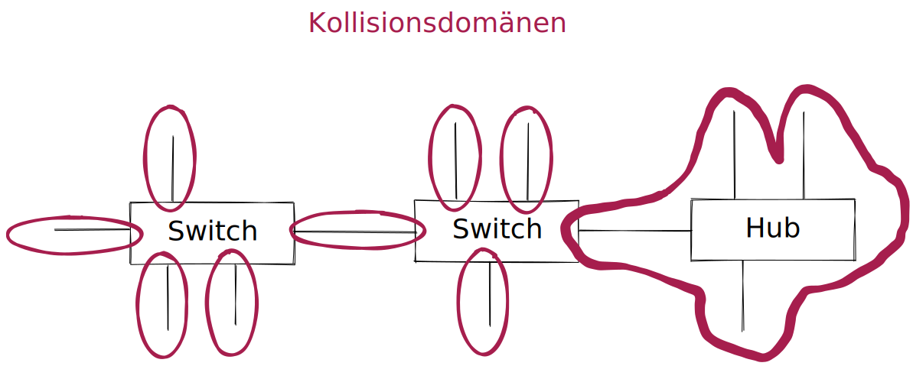
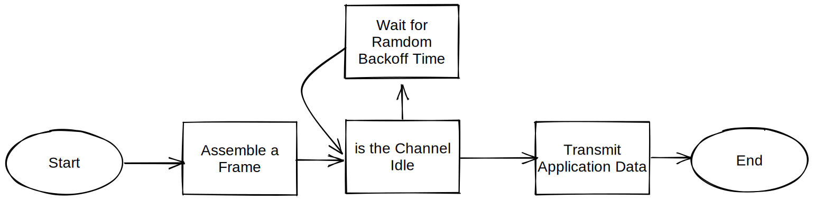

# Netzwerke - Grundlagen

# Überblick

## Vorteile von Netzwerken:
- verbesserte Kommunikation: verstärkt den Informationsaustausch
- Im abgeschlossenen firmeneigenen Netzwerk werden Neuigkeiten veröffentlicht, die jeder berechtigte Mitarbeiter abrufen kann.
- Anbindung an Internet kann zentral erfolgen und ermöglicht damit weltweiten Austausch
- Einsatz von Email, Messengern... ermöglicht instant, persistant Kommunikation
- Zentral abgespeicherte Daten können geteilt Verwendet/Zugegriffen werden.
- Zentralisierung
- Kosteneinspaarung
- Steigerung der Effektivität
- Automatisierung
- Standartisierung, z.B.Versionierung von Daten
- Datensicherung
- Gemeinsamme Nutzung von Ressourcen (z.B. geteilter Drucker)
- Absicherung der Verfügbarkeit: im Verfügbarkeitsverbund kann durch Aufbau von Redundanzen/Failover auch im Ausfall einzelner Komponenten arbeitsfähig bleiben
- Lastverbund (Cluster)
- Optimierung der Wartung: z.B. Remote Zugriff
- Mobilität: Arbeiten von Unterwegs/Homeoffice

## Nachteile von Netzwerken
- Kosten: evtl. teure Investionen müssen ökonomischen / unternehmerischen Vorteile aufwiegen. Aufbau, Wartung, Pflege, Instandhaltung erzeugt kosten.

# Geografische Ausdehnung
- zentrale vs dezentrale
- strukturierte und organisierte Hierarchie

# Netzwerkklassifizierungen:
- PAN
- LAN
    - WLAN
- MAN
- WAN
- GAN

## PAN
- USB, FireWire, Blootooth
- wenige Meter, maximal Nebenraum

## LAN (local area network)
- mindestens 2 Geräte im Verbund
- auch Ortznetz genannt. Bis ca. Grundstücksfläche.
- standartmäßig Ethernet

## WLAN (wireless local area network)
- werden durch Normenfamilie IEEE 802.11 definiert
- geräte bequem in Heim- oder Unternehmensnetz einbinden
- geringerer Datendurchsatz als LAN

## MAN (metropolian area network)
- Städtenetzwerk. Breitbandiges Telekommunikationsnetz genannt, das mehrere LANs in geografischer Nähe verbindet.
- z.b. im Uninetzwerk werden mehrere Gebäude und LANs verbunden.
- aber auch Regionenweites Internet
## WAN
- mehrere MANs zusammengeschlossen.
- streng genommen, mehrere Länder/Kontinente zusammengeschlossen.
- meist in Besitzt einer besetimmten Organisation oder Unternehmens.
## GAN
- weltumspannendes Netzwerk wie das Internet
- umfasst mehrere WANs
- GANs nutzen die Glasfaserinfrastruktur, Seekabel oder Satellitenübertragung.

# Zentralisierung vs Dezentralisierung
- gleichberechtigt vs hierarchische struktur
- zwei Grunkonzepte Client-server Peer-to-Peer

## Peer-to-Peer
- von peer (engl. Gleichgestellter)
- prinzipiell alle Computersysteme gleichberechtigt
- im lokalen: Drucker- oder Netzlaufwerksfreigaben
- im globalen: Filesharing-Netzte z.B. **Torrent**, Grid- oder CloudComputing

*Vorteile:* keine Extrakosten für Server  
*Nachteile:* Sicherheitsrichtlinen nur sehr eingeschränkt umsetzbar. Keine Zentrale Verwaltung.  

## Client-Server
- Server-Anwendung welches über Netzwerkverbindung eine Dienstleistungen/Ressourcen bereitstellt und passiv auf Anfragen wartet.
- Client-Programm kommuniziert mit dem Server über eindeutige "Sprache", dem **Protokoll**. Bsp, HTTP und Webserver.
- sobald ein Netzwerk größere Dimensionen annimt, wird PeerToPeer unübersichtlich und schwer zu administrieren.
- Je nach Protokoll ist eine Anmeldung nicht erforderlich (z.B. Web- DNS- und DHCP-Server)

*Vorteile:* Zentralisierte Sicherheitsfreigaben. Erhöhte Sicherheit. Spezialisierung des Servers nach Anforderungen möglich. Redundanz möglich für z.B. Ausfälle oder Loadbalancing.  
*Nachteile:* Anschaffungs-Kosten für Hardware und Betriebssysteme, Verwaltungskosten. mehrfach um Ausfallsicherheit zu garantieren.  
Daher ist Abwägung wichtig : Total Cost of Ownership (TCO) vs. Return On Investment (ROI)  
 -> Kosten-Nutzen-Relation/Rechnung

- File-Server
- Print-Server
- Application-Server
- . . .

#  us-Topologie / Diffusionsnetz
Die Bus-Topologie ist eine passive Topologie. Die angeschlossenen sTationen führen keine Wiederaufbereitung des Signals durch.      
Shared Medium ->sie hängen alle in Reihe am "selben" Kabel.

Früher häufig verwendet, z.B. in Version 10Base5 oder 10Base2. Mittlerweile wird es eher vermieden.
*Vorteile:* Günstig  
*Nachteile:* Single point of Failure, keine wirkliche skallierbarkeit.

# physikalischer Stern 
(der logisch jedoch noch Bus ist)  
Zentraler Verteiler nimmt anfragen an und sendet aber immer an alle gleichzeitig (wie Bus)     
Immer noch Single point of failure (Verteiler)     
ausfall einer statiun oder defekt eines Kabels hat keine Auswirkung auf das restliche Netz.

# logischer Stern 
(der ebenso immer auch physikalischer Stern ist)    
Zentraler Verteiler (Switch) stellt punkt zu punkt verbindung zwischen clients her.   
Hat heutzutage fast vollständig den Bus verdrängt.  
*Vorteile:*
- Extrem Flexibel bzgl. Skallierbarkeit. Weitere Stationen und/oder Verteiler können problemlos hinzugefügt werden.   
- Höhere Durchsatzraten, da 2 Stationen die Volle Bandbreite benützen können.     
- allgemein wenn aktiver Verteiler (vs passiver) wird das Signalverstärkt -> größere Reichweite.    

*Nachteile:* 
- größere Kabelmenge 
- Kosten für Switch
- Beim Ausfall des Verteilers -> Totalausfall

# Ring Topologie
jede Station hat einen klar definierten Vorgänger und Nachfolger    
Nachteile wie bei Bus   
Ring-Topologie spielt heutzutage neben in der Automatisierungstechnik (um hier hohe Fehlertoleranz zu gewähren) fast keine Rolle mehr.

## Token Ring Topologie
Token wandert Reih-um, bis er an eine Station kommt die senden möchte -> Kollisionen minimiert.     

# Baum Topologie
Stern Topologien werden zusammengeschalten um z.B. verschiedene Abteilungen zusammenzufügen.    
z.B. 1 Hauptverteiler hat 3 Abteilung mit jeweils mehreren Clients. Server z.B. am Hauptverteiler angeschlossen.

# (einfaches) Maschennetz Topologie
In einem vernetzten Netzt existieren zwischen Verschiedenen Knoten mehrere Verbindungen.
- keinen single point of failure. Da redundanzen vorhanden.
- Vorteile überwiegen nur, wenn Sicherheit bzgl. Verfügbarkeit das höchste Gut ist.
- Extra Leitungen können load sharing oder passiv (standby) implementiert werden
*Nachteil:*
- extra Kabel, Hardware braucht genug LAN Ausgänge/Eingänge -> kosten
- Routing kann extrem komplex werden. (um feedbacks zu vermeiden etc)

werden siemit switchen realisiert, sind das Spanning-Tree-Protokoll bzw. meshing-fähige Switche erforderlich.
## Vollvermaschtes netz Topologie
Jedes Mitglied ist mit **allen** anderen Mitgliedern vernetzt.

# OSI- Schichten

|OSI |Protokolle|Protokoll-bsp.|Kopplungselemente|Einheiten|
|---|---|---|---|---|
|7|Anwendung / Application|HTTP, DNS, FTP, DHCP|-|Daten|
|6|Darstellung / Presentation|HTTP, DNS, FTP, DHCP|-|Daten|
|5|Sitzung / Session|HTTP, DNS, FTP, DHCP|-|Daten|
|4|Transport / Transport|TCP, UDP|LoadBalancer, (Firewall)|TCP-Segmente, UDP-Datagramme|
|3|Vermittlung / Network|IP, IPsec, ICMP|Gateway, Router, Layer-3-Switch|Pakete|
|2|Sicherung / Data Link|Ethernet (IEEE 802.3), ARP, WLAN (WLAN ja, LAN nein)|Bridge, Layer-2-Switch, WirelessAcessPoint|Frames|
|1|Bitübertragung / Physical|1000BASE-T, Token Ring|Kabel, Repeater(=Verstärker), Hub|Bits|

### Repeater : Layer 1
- verstärkt Sendesignal um verlängerung der Kabellänge über physikalisches Maxium.
- 5-4-3 Regel. Begrenzt Reichweite => mittlerweile in kabelgebundenen Netzwerken fast vollständig verdrängt. (effektiv übernehmen Kopplungselemente in Schichten 2-3 die Signalauffrischung, da diese nicht mit 5-4-3 Regel beschränkt sind)
### Hub : Layer 1
- Ist ein multiport Repeater. Frischt also Signal auf wie der Repeater.   
- Sendet Packete die ankommen an **alle** anderen Stationen. (=> physikalischer Stern Topologie mit Hub in der Mitte).    
- Nachteile (da effektiv ein Bus) Anzahl der Stationen ist begrenzt. Geteilte Bandbreite. Heutztutage heute nicht mehr wirklich relevant.
- Vorteile kostengünstig.

### Bridge : Layer 2
- Verbindet 2 Segmente in einem Computernetz. Reduziert unnötigen Datenverkehr => Um z.B. Kollisionen zu vermeiden verdoppeln wir die Kollisionsdomänen => Auslastung des Netzwerks wird besser verteilt.
- Bridge hat eine "Datenbank" aller relevanten MAC-Adressen. Bridge entscheidet dann ob es relevant ist die Datenpakete weiterzuleiten oder nicht.
- heutzutage nicht mehr wirklich relevant.

### Layer-2-Switch : Layer 2
- stellt Punkt zu Punkt verbindung zwischen 2 Stationen her. (logischer Stern)
- benutzt MAC adressen um zu wissen wohin die Datenpakete müssen. Und updated diese regelmäßig.
- über Uplinkports können mehrere Switches miteinander kombiniert werden. Adresstable hat jedoch eine Obergrenze der maximalen Endgeräte die "bedient werden können".
- Bandbreite ist hier nicht mehr geteilt.
- An einem Empfänger Port ist jedoch die Bandbreite immer noch limitiert. => wenn zu viele Pakete an einen Port gehen, mehr als der Switch zwischenspeichern kann werden Pakete verworfen/gelöscht.
- es gibt "dumme" unmanaged switches und managed switches. Die z.B. Nutzergruppen, Zugangsberechtigungen, Port-Mirroring(zum debuggen/leistungsüberprüfung) etc. verwalten können.

### Gateway : Layer 3-7
Verbindet Netzwerke mit unterschiedlichen Protokollen/Systemen miteinander, die sonst nicht miteinander Kommunizieren könnten.
- Standart-Gateway: Standart weg ins Internet, zuhause z.B. Modem-Router.
- Router, Proxyies etc sind beispiele für Gateways.
- Gateways können auf vielen Ebenen existieren. Nicht nur auf Layer 3.

### Router : Layer 3
Verbintet Netzwerke. "Wegfinder" im Internet.
- jeder Router ist ein Gateway.

### Layer3-Switch : Layer 3

## Kollisionsdomäne
Teilbereich auf OSI-Schicht 1. Fangen auf einem derartigen gemeinsamen Layer-1 Segment zwei Stationen gleichzeig an zu senden (z.B. auf gleichem Kabel), kommt es zu Kollisionen. (z.B. Stationen die an einem Hub zusammengeschlossen sind.)     
- Switches z.B. haben viele Kollisionsdomänen. Eine Bridge z.B. 2 Kollisionsdomenäen.

## halfduplex / vollduplex
half: gleichzeitiges senden und empfangen ist nicht möglich.     
vollduplex: quasi 2 leitungen (in einem Kabel), die gleichzeitiges Senden und Empfangen ermöglichen.
- im halfduplex Betrieb werden **Zugriffsverfahren** benutzt um zu regeln wer wann senden darf:
    - CSMA/CA
    - Token Passing
    - FDMA
    - TDMA
    - CDMA

# Mehrfachzugriffsverfahren
Mehrere Zeilnehmer teilen sich ein Zugriffsmedium

### - CSMA / CA
carrier-sense multiple access with collision avoidance.     
Prinzip: Listen before Talk.        
Z.B. bei einem Bus / Hub Netzwerk. Aber auch wenn sich ein Übertragungsmedium wie ein Frequenzbereich geteilt wird, z.B. WLAN.      

- **Carrier Sense:**  Teilnehmer dürfen nur Daten an das Netz versenden, wenn das Übertragungsmedium frei ist.

- **Multiple Access:** Mehrere Stationen teilen sich ein Übertragungsmedium. Noch zu erwähnen das sie natürlich auf dem selben verbindlichen Protokoll kommunizieren müssen.

- **Collision Avoidance:** Ein komplexer Ablaufplan versucht dafür zu sorgen, dass zwei oder mehr Teilnehmer nicht gleichzeitig eine Übertragung beginnen. Sollte es doch mal passieren wird dies erkannt und die Übertragung abgebrochen -> erneut versucht.

großes Problem: Hidden-Station-Problem. Wenn 2 entfernte Statiunen sich gegenseitig nicht mehr wahrnehmen können. Stationen dazwischen jedoch beide. -> beide Senden ohne das sie es merken gleichzeitig.

-> Lösung: RTS/CTS Koordination. Request to Send/Clear

#### Protokollablauf
1. Medium abhorchen
2. ist MNedium für die Dauer eines DIFS (Taktung die ein Datenpaket maximal gesendet werden kann) frei, wird gesendet
3. ist das Medium belegt wird gestoppt und nach einem DIFS erneut probiert
4. nach vollständigem Empfang des Pakets warted der Empfänger ein SIFS bevor eine Antwort gesändet wird
5. Eine Kollion führt zum gleichzeitigen Timeout, bevor der gesamte Vorgang wiederholt werden kann.

### - CDMA 
Code-division-Multiplex Verfahren. Benutzt z.B. im Mobilfunk.  

Mehrere Signale benutzen den gleichen Kanal. Durch z.B. Spreizung.
- Jeder Sender hat einen anderen Code, mit dem auf verschiedenen "Frequenzen" der Code zusammengefügt wird.
- dadurch wird die Bandbreite besser genutzt/erweitert. (als bei z.B. TDMA oder FDMA)

### - TDMA
Zeit-Multiplex Verfahren. Benutzt z.B. in ISDN Mobilfunk(2G.), Satellitenkommunikation.
Jeder Sender hat sein festgesetztes Zeitfenster zum Senden.
- Zuordnung der Empfangenen Daten erfolgt alleine auf Zeitlichen Position der Daten
- Kennen die Stationen ihren Zeitslot können Kollisionen vermieden werden.

Synchrones TDMA feste Zeitslots -> viel verschwendung von Bandbreite.
Asyncrones TDMA gibt es auch noch. -> Effizienter. Nachteil: Mehr Protokoll/Aufwand.

### - FDMA
Frequenz-Multiplex Verfahren. Mobilfunk, Kabel-Fernsehr.
- Digitales Signal wird in analoge Sinus Welle geändert.
- Jeder Sender bekommt eigene Frequenz.(Mit kleinen Frequenz lücken um Interferenzen auszuschließen) Alle senden "Gleichzeitig".
- Am Empfänger werden die einzelnen Frequenzen wieder herausgefiltert.

### - Token Passing
- Token Ring: Ich erhalte (reihum) den Token. Wenn ich senden möchte sende ich, nachdem ich den Token habe, oder reiche ihn weiter.
- Token Bus: Nimmt logisch gesehen den nächsten Teilnehmer. (MAC adressen z.B. nach Value-sortiert)

## Der Aufbau eines Ethernet-v2-Rahmens nach IEEE 802.3
- Liegt in Schichten 1 und 2 und überträgt dort Daten
- am bekanntesten ist die Definiton des noch heute gültigen Ethernet-v2- Rahmens für den Layer 2.

## Frames
- MTU - Maximum transmission Unit kann bei der Konfiguration eines Netzinterfaces angegeben werden.
- Sie definieret die maximale Größe des Datagramms. Daten die diese Länge überschreiten, werden immer in mehrere Frames aufgeteilt/fragmentiert und dann über das Netzwerk versendet.
- Dadurch müssen bei Fehlern nur die entsprechenden Rahmen neu übertragen werden. Außerdem können mehrere Benutzer abwechselnd Rahmen verschickem. -> nahezu gleichzeitiger Netzwerkzugriff mehrere User möglich.
- Prinzipielle Aufbau nach Rahmen nach IEEE 802.3 ist dabei immer gleich.

# Header - Daten -Trailer

Schicht1:
|Präambel|Zieladresse|Ursprungsadresse|Typ|Datenteil|Frame-Kontroll-Sequenz|
|---|---|---|---|---|---|
|8 Bytes|6 Bytes|6 Bytes|2 Bytes|46-1500 Bytes|4 Bytes|

Ohne Präambel ergibt sich: 
- min. größe: 64 Bytes
- max. größe 1518 Bytes (= Nutzlast 1518/1522bytes)

# ethernet
- Ein ethernet-v2-Rahmen hat ohne VLAN-Tag eine Rahmengröße von 64 und 1518Bytes und folgenden Aufbau:
    - als Frame Kontroll Sequenz (FCS) wird ein CRC Algorithmus eingesetzt
    - unter IPv6 gibt es keine fragmentierungen mehr.
    - Ist ein Frame zu groß, erhält der Absender eine Fehlermeldung
    - Ist ein Netzwerk übeer Switche in virtuelle Netzwerke aufgeteilt, erhält jeder Frame eim Datenteil zur Identifizierung des VLANs ein zusätzlich 4Byte großes Feld, das VLAN-Tag.