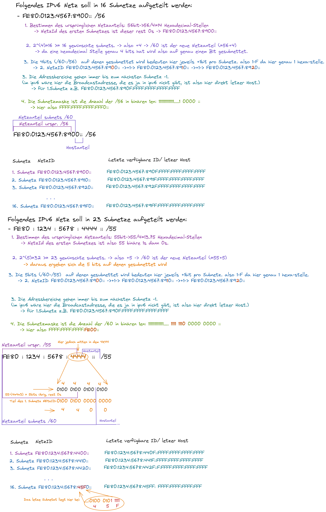

# IPs und Subnetting

# IPv4-Adressen
- besteht aus 32 bit -> 2^32 maximale Ip-Adressen

## historische Netzklassen

|Klasse|IP-Bereich von|bis IP-Bereich|Netzmaske|Mögliche Hosts|
|---|---|---|---|---|
|A|1.0.0.1|127.255.255.254|255.0.0.0 |254^3|
|B|128.1.0.1|191.255.255.254|4 255.255.0.0 |254^2|
|C|192.1.0.1|223.255.255.254|255.255.255.0 |254^1=254|
|D|224.0.0.1|239.255.255.254|255.255.255.255|254^0=1|
|E|240.0.0.1|255.255.255.254|werden nicht vergeben !|

## private IP-Bereiche?
wichtig lernen!

|Bereich| von | bis | als netzbereich geschrieben:|
|---|---|---|---|
|A|10.0.0.0|10.255.255.255|10.0.0.0/8|
|B|172.16.0.0|172.31.255.255|172.16.0.0/12|
|C|192.168.0.0|192.168.255.255|192.168.0.0./16|

**127.0.0.1 -> loopback -> localhost!**

https://www.it-administrator.de/download/whitepapers/BlackB_WP_Subnetzmasken.pdf

- eine 1 in der Subnetzmaske -> das bit gehört zum Netzanziel (vs 0)
- -> CIDR zeigt anzahl der gesetzen bits. (classless interdomain routing)
- -> LIDR zeigt netzteil

Bsp. 10.43.8.67/28 entspricht der Adresse 10.43.8.67 mit der Netzmaske 255.255.255.240:   
IPv4-Adresse = 10.43.8.67/28 (32-28= 4 Bit (Netzmaske: 11111111.11111111.11111111.11110000 (mit 4 Stellen im Dualsystem lassen sich 16 unterschiedliche Werte darstellen, nämlich 0–15)) → 16 Adressen − (Broadcast- und Netzadresse) = 14 IPv4-Adressen zu vergeben.)

- standart subnetzmaske ist 24, da berechnen der hosts damit sehr einfach wird. =2^n-2 mit n=32-CIDR-Zahl -> n= 32-24=8

- die CIDR -Zahl ordnet theoretisch bis /8 ->A, bis /16 ->B, bis 24/ ->C zu.

## unicast - multicast - broadcast
- unicast sendet point to point.
- broadcast sendet an mehrere (>1 aber nicht alle). allgemeine broadcast adresse: 255.255.255.255. im privaten ist die (private) broadcast adresse die letzte hostadresse möglich +1.
- multicast sendet an alle.

## APIPA -Adresse
- Autokonfiguration von Adressen fürs Lan, wenn nichts anderes eingestellt.
- address from 169.254.0.0 to 169.254.255.255 (entspricht subnetztmaske 16)

# Ipv6
- buch s.232 recht gut erklärt   
größe: 128 bit.

- statt TTl (Time To Live, hat ipv6 ein hop limit =quasi das selbe)

- Vorteile:
    - mehr sicherheit, durch historische verwendung von IP-Sec

- theoretische größ in ipv4: 1500Bytes 65535 Bytes
- theoretische größe ipv6:      x        -4Mrd Bytes (4 Gigabyte). In der praxis unterstützen jedoch auf unteren Schichten keine so großen Pakete.
- 8 Blöcke mit jeweils 4 Ziffern / jede Ziffer 0-9-A-F = 4 bit / =128bit

## unicast- multicast - anycast
- Unicast
Bezieht sich auf eine Schnittstelle auf einem einzelnen Knoten.

- Multicast
Bezieht sich auf eine Gruppe von Schnittstellen, in der Regel auf verschiedenen Knoten. Pakete, die eine Multicast-Adresse gesendet werden, werden an alle Mitglieder der Multicast-Gruppe geleitet.

- Anycast
Bezieht sich auf eine Gruppe von Schnittstellen, in der Regel auf verschiedenen Knoten. Pakete, die an eine Anycast-Adresse gesendet werden, gehen an den Mitgliedsknoten der Anycast-Gruppe, der dem Absender am nähesten ist.

- fe80:: für local adress.

- Die link-lokale Adresse ist nur im lokalen Netzwerk
gültig (Bild 3).
- Eine globale IPv6-Adresse ermöglicht Verbindungen
ins öffentliche Netz.
- Eine temporäre IPv6-Adresse enthält anstelle der
MAC-Adresse der Schnittstelle eine zufällig erzeugte
64-Bit-Zahl als Schnittstellen-ID. Die temporären
Adressen können für alle Schnittstellen verwendet
werden, die anonym bleiben sollen, z.B. beim Zugriff
auf öffentliche Webserver.

# subnetting beispiele

## wieviele hosts passen in subnetzt:
BSP /25 -> n=32-cid=7  -> 2^n=2^7=128 (-> 128-2=126 REchner passen ins netz mit /25)        

# Subnetting warum?
- Orginisatorische und Logische Einheiten können abgebildet werden. z.B. Abteilungen, alle Auszubildenden etc.
- In ipv4 Broadcaststurm. Regelmäßige Broadcasts beanspruchen Netz Leistung/Bandbreite. Werden bei großen Netzen zu viele.

## Rechenbeispiele

Bsp: 400 Hosts anforderung  
Frage: 10.0.0.0 /8? 
Nein. Warum?: wenn broadcastdomaine zu groß wird:       
-> broadcaststurm/ regelmäßige broadcasts beanspruchen Netzt Leistung.         
-> Orginasitorische und Logische Einheiten können abgebildet werden.        
-> erwägen ob kleinere Subnette Sinn machen.    

Bsp. 10.4.5.50/24  ausführlich berechnen       
in bits:    00001010.00000100.00000101.00110010    
24 1en->    11111111.11111111.11111111.00000000     (links netzanteil)      
&& bitwise: 00001010.00000100.00000101.00000000     ()
in decimal  10.     .4      .5      .0              (NetzID)
-> broadcast 10.    .4      .5      .255            (BC)
-> letzte verfügbare 10.4   .5      .254
Gesammt hosts:n=32-CIDR -> 2^n -> =256      

Bsp. 10.4.5.128/25  ausführlich berechnen       
in bits:    00001010.00000100.00000101.10000000    
24 1en->    11111111.11111111.11111111.10000000     (links netzanteil)         
&& bitwise: 00001010.00000100.00000101.10000000     ()      
            netzID  10.4.5.128            
            erster host 10.4.5.129      
            letzter host 10.4.5.254     
            broadcast   10.4.5.255      

Bsp. 10.1.1.0/22
00001010.00000000.00000001.00000000     
11111111.11111111.11111100.00000000     
00001010.00000000.00000000.00000000 <-NetzID        
10.0.0.0    NetzID in decimal       
bc bestimmen: 32-CID = 32-22 = 10 -> 2^n=2^10 -> **10 decimalstellen von links:** = bc adresse      
00000000.00000000.0000001.11111111 <-BC adresse     
3.255 BC adresse in decimal     

## bsp großes netzt in 2 kleinere teilen:

Bsp. 10.0.0.0/24 soll in 2 Bereiche geteilt werden. (z.B. aus Verwaltungsgründen) (ursprüngliche größe: 2^8-2=254 mögliche hosts)        
-> eine 1 mehr in subnetzmaske = 24+1=/25
10.0.0.0-10.0.0.127     
10.0.0.128-10.0.0.255       
mit hier jeweils (2^7-2=)126 hosts

Bsp. 10.0.0.0/24 soll in 4 Bereiche gesplittet werden:      
geht bis. - 10.0.0.255/24       
2^(32-24)=256 -> 256/4=64-> jeder bereich wird 64 bit groß.     
- 10.0.0.0.-10.0.0.63/26      
- 10.0.0.64-10.0.0.127/26     
- 10.0.0.128-10.0.0.191/26        
- 10.0.0.192-10.0.0.255/26        

# Herangehensweise ipv4 subnetz in 4 teil subnetzte splitten:

- 71.56.8.0/16 -> 4 mal /18 -> 2^(32-CID) = 2^(32-18) = 2^**(14)** = 16384 ip's pro Subnetz

|ausgangsnetz->|71.|56.|8.|0|
|---|---|---|---|---|
|in binär|(71)|0011 1000|0000 1000|0000 0000|
|&& biwise operator mit: **14** * binäres 1 dann 0s|1111 1111|1111 1100|0000 0000|0000 0000|
|ergibt binär|(71)|0011 1000|0000 0000|0000 0000|
|ist NetzID des ersten Netztes:|71.|56.|0.|0|

Nun ist die letzte Verwendbare IP/Broadcast Adresse zu ermitteln um den Raum des netztes bestimmt zu haben:
- da 16348 Ip's verfügbar sind ist die letzten 8 bit alle 1: 1111 1111 -> 255
- da dies noch nicht ausreicht wird die stelle vor dem . aktiviert: 16348/2^8=16348/256=64
- (also beginnt das 2Subnetz das nachfolgt bei 71.56.64.0 (<=71.56.0.0 + 0.0.64.0)
- die Broadcastadresse des vorherigen ist also der wert davor(-=1): 71.56.63.255
- die letze Verwendbare Ip ist wiederrum die davor(-=1): 71.56.63.254
- die Subnetzmaske ist ja /24 -> 1111 1111.1111 1100.0000 0000.0000 0000 -> in decimal also 255.252.0.0  (vgl. usecase obere Tabelle 2 spalte)

für die 2 subnetzmaske haben wir ja bereits die NetzID, die Broadcastadresse ist also wieder 71.56.64.0+ 0.0.64.0 - 0.0.0.0.1). ebenso bei Folgenden:

|Subnetz|Netzadresse (Anfang des Raumes)|Broadcastadresse(Ende des Raumes)|
|---|---|---|
|1|71.56.0.0|71.56.63.255|
|2|71.56.64.0|71.56.127.255|
|3|71.56.128.0|71.56.191.255|
|4|71.56.192.0|71.56.255.255|

Achtung: was hier noch falsch war: erst mit /16 die NetzID bilden und diese als Ausgangspunkt für erstes Subnetz nehmen. NICHT wie im Beispiel direkt mit der && bitweise.      
Ausserdem wrsl. nicht wie eingezeichnet mit 14 sondern direkt mit 16 (oder 18) einsen, von /16 /18 

# ipv6 Subnetting:

- /32 wird quasi nur von Internet-Providern genutzt. Da extrem viele Subnetze.
- ab ca. /64 -> 256

# ipv6 cheat sheet
