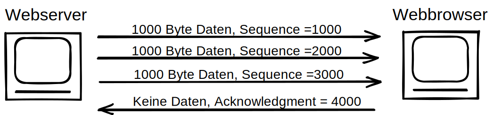
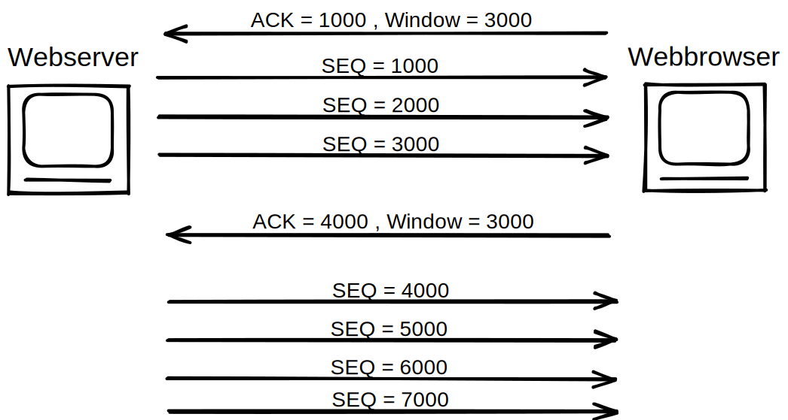

# Protokolle

# ARP - Adress Resolution Protocol (ethernet Cache)

Übersetzungstabellen für IP-Adressen/physische Adressen.        

- 2. Ebene OSI. Data link layer
- Um ein Datenpaket von Gerät A nach Gerät **im Heimnetzwerk** zu senden muss A die MAC Adress von B kennen.      
- Wenn  ein PC ein Datenpaket übertragen möchte, kennt er ursprünglich nur die (meist durch DNS ermittelte) IP Zieladresse. Der Mechanismus um das nächste Gerät auf der Ende zu Ende Übertragungsstrecke festzustellen ist im Internet Protokoll Version4 das **ARP**. 

- Das ARP Protokoll fragt diese MAC adresse an, und zwischenspeichert diese für wiederholte Anfragen.
- Im heimnetz wären das z.B. Modem, Drucker, Heimpc, Smartphone.

# ICMP - Internet Controll Message Protocol

- Dient im Rechnernetzwerkden zum Austausch von Status- und Fehlermeldungen
- über das ipv4 Protokoll (ist also eigentlich kein Eigenes Protokoll, nur ein Anhängsel an das Ipv4 Protokoll).
- Übertragung über IP ist unsicher, da Paketverlust unbemerkt passiert .
- Ping basiert auf ICMP

# TCP - Transmission controll protocol
- 4. Ebene OSI. Transportlayer
- Funktionen:
    - **Fehlerkorrektur**
    - **Flusssteuerung** mit fenstertechnik
    - Verbindungsaufbau und -Terminierung
    - Geordnete Datenübertragung und Datensegmentierung
    - Multiplexing
- TCP arbeitet immer nach dem gleichen Prinzipien, egal ob im www oder LAN.

## zu Fehlerkorrektur:
- verbraucht mehr Bandbreite.
- TCO bittet Error Recovery. Hierfür muss TCP die Daten Bytes mithelfe der Felder Sequence und Akknowledgement.
- TCP erzielt Zuverlässigkeit in beide Richtungen, indem es das Feld Sequence Number der einen Richtung in Kombination mit dem Feld Acknowledgement der anderen Richtung nutzt.
- Window/Fenster ist die Anzahl an Packeten. Startet klein und wird größer (wenn Verbindung gut ist).

## zu Multiplexing
- Multiplexing durch TCP und UDP ist das Prinzip mit ports.
- Standadisierte Ports: 0-1023 - gängige Ports mit "festen" Portnummern
- Registrierte Ports: 1024-49151 - können von Benutzern ohne besondere Berchtigungen verwendet werden
- Dynamische Port-Bereiche (49152-65535) - Individuell zu Nutzen. Keine Vergabe durch die IANA.

## Ports und Portnummern
|Port-Nr|Protokoll|
|---|---|
|20/21|Ftp|
|22|SSH|
|23|telnet|
|25|SMTP|
|53|DNS|
|57/69|DHCP|
|80|HTTP|
|123|Network time Protocol|
|161|Simple Network Management Protocol|
|443|HTTP|

# Verbindungsorientiertes Protokoll
Ein Protokoll, das vor Beginn der Datenübertragung einen Austausch von Steuernachrichten oder eine andere, zuvor hergestellte Wechselbeziehung zwischen den beiden endgeräten erfordert.
- z.B. TCP

# Verbindungsloses Protokoll
vorher keinen Nachrichtenaustausch und keine zuvor hergestellte WEchselbeziehung zwischen zwei Endgeräten erfordert.
- z.B. UDP

# UDP
- UDP nutzt gleichen ports wie TCP.
- Der UDP Headere ist deutlich kleiner als der TCP Header und damit ist UDP deutlich schneller.
- UDP hat keine Kontrollfunktion

# telnet
- älteste Dienst im Internet.
- Protokoll für Zugriff auf andere Rechner in einem Rechnernetz
- es gibt einen Client & Server
- Unverschlüsselt -> unsicher -> wird nicht mehr wirklich benutzt. (Nachfolger SSH)
- alle Kommandos müssen über ASCII Befhele übermittelt werden.

# SSH Secure Shell
- wie telnet
- aber mit verschlüsselung

# FTP - File Transfer Protocol
- client - server
- Datenübertragung. Client kann Daten ablegen, löschen oder herunterladen.
- Steuerkanal Port 21 und Datenkanal Port 20
- Header enthalten Restart-Markierungen -> Sicherheit bei Verbindungsabbruch -> Übertragung wieder aufgenommen ab Markierung

# HTTP - hypertext transfer protocol
- soll (hyper-)"text" transportieren
- Port 80
- client server Protokoll
- GET, POST, HEAD, PUT, PATCH, DELETE, TRACE, OPTIONS, REQUEST **requests** -> Server antwortet mit **response** 
- Fehlercodes / Statusmeldungen

## HTTP-Cookies
- möglichkeit den browser anzuweisen, Daten lokal zu speichern.
- bei erneuten HTTP-Requests zum selben Webserver -> Browser schickt cookies mit. -> webserver kann client zuordnen
- HTTP- ist ein **zustandsloses** Protokoll (server kann nicht zwischen mehreren HTTP-requests zusammenhang herstellen)
    - wenn website anwendungsorientiert -> Unterscheidung nötig -> cookies "nötig"

https://www.geeksforgeeks.org/what-is-web-socket-and-how-it-is-different-from-the-http/ under CCBY-SA
# HTTPS -secure hypertext transfer protocol.
- SSL verschüsselung, ermöglicht verschlüsselte Datenübertragung

# websocket
- bidirectional (full duplex) protocol of client-server Communication
- ws:// or wss://
- stateful protocul -> connection will be kept alive untill it is terminated by either party. -> after termination it is closed on both ends.

 https://www.geeksforgeeks.org/what-is-web-socket-and-how-it-is-different-from-the-http/ under CCBY-SA

# SMTP - simple mail transfer protocol
- Kommunikation basiert auf ASCII-Kommandos
- E-Mails entgegennehmen und weiterleiten
- kommunikation zw email-client und smtp-server(Postausgangsserver)
- neben SMTP git es auch POP und IMAP
    - dienen jedoch dazu mails abzuholen oder zu verwalten
- NACHTEILE
    - keine Versandbestätigung
    - keine Verlustbestätigung
    - standardisierte Fehlermeldungen werden NICHT unterstützt
    - beliebige Absenderadresse beim Versand, da keine vorhandene Authentisierung des Benutzers beim Verbindungsaufbau
    - offene SMTP-server ->massenhafte Spams

Maßnahmen und Verfahren entwickelt, um Missbrauch entgegenzuwirken. Sind jedoch OPTIONAL.

## POP
- holt Emails ab
- POP arbeitet nach der Offline-Verarbeitung
- Online -> Emails werden vom Posteingangsserver heruntergeladen -> nach erfolgreichem vollständigem Zugriff -> Emails werden auf Server gelöscht.
- Verbindung über TCP PORT 110.
- Kommunikation über ASCII

## IMAP
- Kommunikationsprotokoll wie POP
- emails bleiben (standardmäßig) (bei POP standardmäßig gelöscht) auf dem Server
- synchronistation mehrerer Clients (selbes Mailfach mit Pc & Smartphone => löschen/verschieben/etc)
- Verbindung über TCP PORT 143
- Kommunikation über ASCII

# IGMP
- IP-Multicasting im Internet
- Erweiterung des bekannten Ipv4 Headers
- Alle Netzknoten müssen IGMP unterstützen. 
- Das Internet mit der Protokoll-Familie TCP/IP setzt einen Sender und EMpfänger pro Verbindung voraus. -> für gleichzeitiges Senden an viele ungeeignet.           
-     -> Verbindungen mit einem Sender und mehreren Empfängern ist bei IP nur mit IGMP möglich. Bei z.B. Fernsehr und Rundfunkübertragungen.
