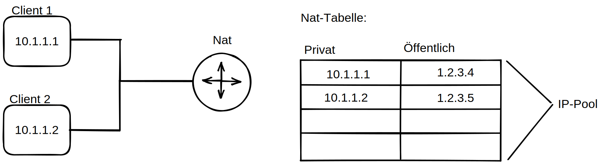
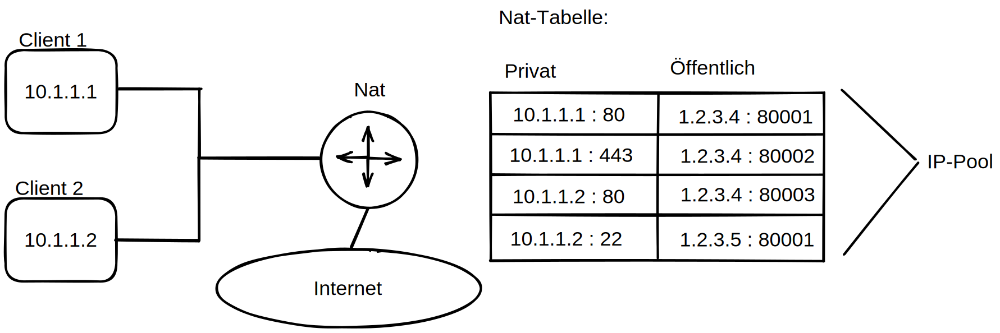

# NAT - Network Adress Translation
Gleichzeitige Verwendung einer öffentlichen Adresse durch mehrere Hosts

## Statisches Nat
jede private Ip bekommt eine öffentliche Ip -> genausoviele öffentliche IPs wie Private werden benötigt -> kein wirklicher Vorteil

## Dynamisches Nat
- Der Pool beschränkt wieviele Benutzer gleichzeitig aktiv sein können (hier z.B. 2 Nutzer)
- Timeout etc. 

## Nat overloading mit Pat - Port Adress Translation
- Alle Teilnehmer eines Lans wollen (gleichzeitig) ins Internet
- Einzelne Verbindungen werden statt wie by dynamischen Nat nicht einer ganzen IP Adresse, sondern einer IP-Adresse & Port Kombination zugewießen. (Mapping to ports)
