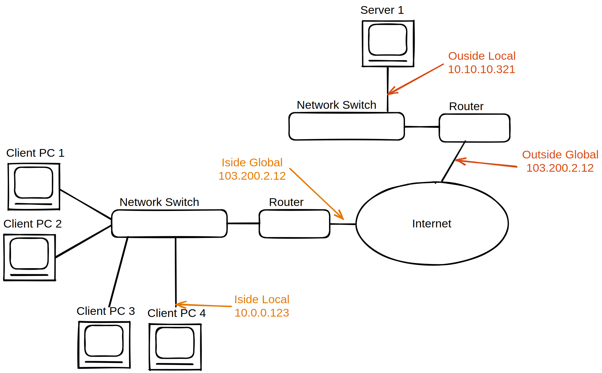

# NAT 
# inside- outside || global - local
- inside vs outside: private ip vs global
    - inside ip adresses configured inside the network of the user.
    - ip adresses of the public internet etc outside of the previous defined.
- local vs global:
    - local: private Ipv4 Adress
    - has global **public** ipv4/6 adress reachable by others
- inside local adress
- inside global adress
- outside global adress
- outside local adress

# NAT - Network Adress Translation
Gleichzeitige Verwendung einer öffentlichen Adresse durch mehrere Hosts

## Statisches Nat
jede private Ip bekommt eine öffentliche Ip -> genausoviele öffentliche IPs wie Private werden benötigt -> kein wirklicher Vorteil

## Dynamisches Nat
- Der Pool beschränkt wieviele Benutzer gleichzeitig aktiv sein können (hier z.B. 2 Nutzer)
- Timeout etc. 

## Nat overloading mit Pat - Port Adress Translation
- Alle Teilnehmer eines Lans wollen (gleichzeitig) ins Internet
- Einzelne Verbindungen werden statt wie by dynamischen Nat nicht einer ganzen IP Adresse, sondern einer IP-Adresse & Port Kombination zugewießen. (Mapping to ports)

# Dual Stack
ipv4 und ipv6 Adressen werden in Kombination benutzt.
 -> Nat64

## NAT64
4 to 6 ip tunnel. Letzten 32 bit einer 128bit ipv6 adresse werden genutzt um die ipv4 zu encodieren.
- stateless
- statefull

Stateless translation is appropriate when a NAT64 translator is used in front of IPv4-only servers to allow them to be reached by remote IPv6-only clients. Stateful translation is suitable for deployment at the client side or at the service provider, allowing IPv6-only client hosts to reach remote IPv4-only nodes.