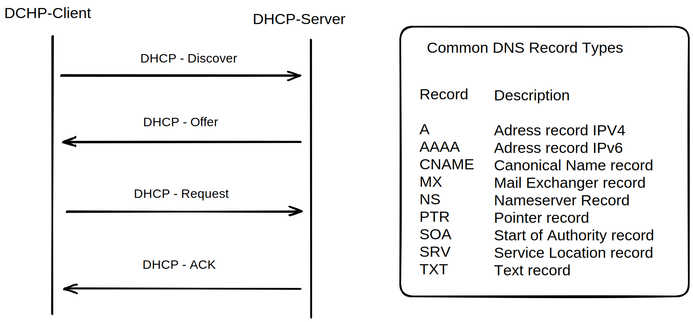

# DHCP und DNS
- Dynamic Host Configuration Protocol

## Warum
Jeder Host braucht eine IP-Konfiguration (IP Adresse, DNS-Server). Dies von Hand für jedes Gerät zu machen wäre schlecht. -> DHCP macht dies automatisch.

- mit DHCP kann jede IP-Host die IP-Adresskonfiguration von einem DHCP-Server anfordern und sich automatisch selber konfigurieren.
- Server bekommen in der Regel eine statische mit Hand eingetragene IP-Adresse. Clients in der Regel automatische per DHCP.
## DHCP-Typen
- statisch: von hand mac-> ip
- automatisch: adresspool -> zuordnung dann "für immer" (dann wie statisch) 
- dynamisch: adresspool -> ip wird zugeordnet mit Leasetime. Client muss vor Ablauf der Zeit erweiterung beantragen.

## Ablauf DORA - D.O.R.A -Prinzip
- DHCP-**Discover**: Der DHCP-Client verschickt ein UDP-Paket mit der Ziel-Adresse 255.255.255.255 und der Quell-Adresse 0.0.0.0. Dieser Broadcast dient als Adressanforderung an alle verfügbaren DHCP-Server. Im Optimalfall gibt es nur einen DHCP-Server. So vermeidet man Konflikte bei der Adressvergabe.

- DHCP-**Offer**: Der DHCP-Server antwortet auf den Broadcast mit einer freien IP-Adresse und weiteren Parametern, um die IP-Konfiguration zu vervollständigen. Jeder angesprochene DHCP-Server schickt ein UDP-Paket mit folgenden Daten zurück:
    - MAC-Adresse des Clients
    - mögliche IP-Adresse
    - Laufzeit der IP-Adresse/-Konfiguration (Lease-Time)
    - Subnetzmaske
    - IP-Adresse des DHCP-Servers / Server-ID

- DHCP-**Request**: Aus der Auswahl von evt. mehreren DHCP-Servern sucht sich der DHCP-Client eine IP-Adresse heraus. Daraufhin verschickt er eine positive Meldung an den betreffenden DHCP-Server. Alle anderen Server erhalten die Meldung ebenso und gehen von der Annahme der IP-Adresse zugunsten eines anderen Servers aus.

- DHCP-**Acknowledgement** (ACK): Anschließend muss die Vergabe der IP-Adresse vom DHCP-Server bestätigt werden. Doch nicht nur die Daten zum TCP/IP-Netzwerk kann DHCP an den Client vergeben. Sofern der DHCP-Client weitere Angaben auswerten kann, übermittelt der DHCP-Server weitere Optionen:
    - DHCP -**Not** Acknowledged: Sollte der DHCP-Server keine Adressen mehr zur Verfügung haben oder während des Vorgangs ein anderer Client diese Adresse zugesagt bekommen haben, sendet der DHCP-Server ein DHCPNAK (DHCP-Not Acknowledged).

Sobald der DHCP-Client die Bestätigung erhalten hat, speichert er die Daten lokal ab. Abschließend wird der TCP/IP-Stack vollständig gestartet.

- DHCP Refresh: 
In der DHCP-ACK-Nachricht ist die Lease-Time angegeben. Nach hälfte der Lease-Time -> erneuter DHCP-REQUEST -> DHCP-ACK bestätigung zur Verlängerung.           
Sollte die ACK ausbleiben, wird in immer kürzeren Zeitintervallen erneut angefragt. Bis am Ende der Lease Time dann ein neues DISCOVER stattfindet.

- DHCP Release
die vom dhcp zugeteilte IP adresse freigeben (und neue anfordern: renew)
```
ipconfig /release
ipconfig /renew
```

## DHCPv6
Bei IPv6 benötigt man eigentlich kein DHCP-Dienst, da SLAAC (Stateless Adress Autoconfiguration).
- In der Praxis können jedoch nicht alle Betriebssysteme SLAAC -> DHCPv6 Verfahren.


# DNS - Domain Name System
Der Domain-Namensraum hat eine baumförmige Struktur. Ein Domainname wird immer von rechts nach links delegiert aufgelöst. www.google.de -> 123.456.1.1

## Nameserver
- authorativer/primary Nameserver: ist für eine Zone verantwortlich. (z.B. .tv)
- nicht-authorativer/secondary Nameserver: bezieht Informationen über eine Zone von anderen Nameservern. Casht diese im RAM in z.B. Zeitintervallen für schnellen Zugriff. (z.B. google DNS)



## Hierarchische Struktur


[Creative Commons Attribution-Share Alike 2.5 CC BY-SA 2.5](https://commons.wikimedia.org/w/index.php?curid=556580 "Wikipedia") https://creativecommons.org/licenses/by-sa/2.5  


# DHCP/DNS - Projektaufgabe Netzwerke

# Aufgabenstellung Teil1
## Recherche-Teil
- Informieren Sie sich zu dem Ablauf eines DHCP-Releases
    - Nutzen Sie auch den dafür vorhandenen RFC
    - Beschreiben Sie stichpunktartig mit den entsprechenden Fachbegriffen den Ablauf und die Funktionen vom DHCP
- Informieren und notieren Sie sich Informationen zu DNS-Zonen und deren Funktionen
    - Beschreiben Sie jede Zone stichpunktartig

## Realisierung
- Setzen Sie drei verschiedene Broadcast-Domänen (drei Standorte) um
- Nutzen Sie jeweils einen Switch und einen Router
- Erstellen Sie in jedem LAN 3 PCs, die automatisch eine IP-Konfiguration erhalten sollen
- Erstellen Sie egal an welchem Standort einen Webserver und auf einem Client einen Webbrowser
- Erstellen Sie einen DNS-Server und sorgen Sie dafür, dass jeder Rechner so benannt ist, dass Sie einfach eine Namensauflösung und die Funktionalität testen können.
- Sorgen Sie dafür. dass die Standorte sich mithilfe von statischem Routing aus erreichen können. – Kein automatisches und alle drei Standorte sollen redundant miteinander verbunden sein

# Aufgabenstellung Teil2
## Recherche-Teil
- Informieren Sie sich, was unter Netzwerkmanagement verstanden wird
    - Was sind Eigenschaften und Funktionen?
    - Was sind bekannte und oder wichtige Systemkennwerte?
    - Wie hole ich Statusinformationen ab?
- Informieren Sie sich über SNMP, dessen Funktionen und Nutzen
- Welche Regeln gibt es beim Troubleshooting von Netzwerken und welche zwei Methoden des Troubleshooting gibt es?
- Schreiben Sie sich stichpunktartig Informationen zu Ihren Recherchen auf
## Realisierung
- Speichern Sie Ihre vorherige Anwendung, die Sie mit Filius erstellt haben
- Bauen Sie 3-6 kleine Fehler in Ihre Anwendung rein und tauschen Sie sich mit Ihren Mitteilnehmern aus, diese sollen die Anwendung, ohne die entsprechenden Fehler zu kennen versuchen zu finden und zu beheben.