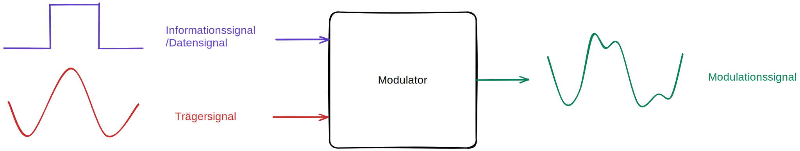

# Weitverkehrsnetze (Öffentliche Netze)
- quasi alles ab Telefonanschluss(ins öffentliche Netz) - entspricht **WAN**

## Internet
- alles was öffentlich zugänglich ist. (öffentliche IPs)
## Intranet
- Nutzt private IP-Adresse
- "innerhalb" von Unternehmen/ Behörden implementieren. Standortübergreifend. -> herkömmlich durch Standortleitungen -> mitlerweile nur noch virtuelle Leitungen von Providern.
- im gegensatz zu LAN/WAN/GAN nicht die örtliche Abgrenzung, sondern die Abgrenzung des Benutzerkreises.
    - Protokolle IPsec sichern Kommunikation über unsichere öffentliche IP-Netze
- (**Vom Internet aus nicht sehbar**). Kein ungeregelter Übergang in öffentliche Zweige möglich. Firewalls kontrollieren logische Schnittstellen zum Internet. 

## Extranet
- erweiterung des Intranets um eine Komponente, die nur von einer festgelegten Gruppe externer Benutzer verwendet werden kann.
- Bereitstellung von Informationen über z.B. Unternehmensgrenzen hinweg. (Zulieferer Portal etc.)

# Arten von Netzen
- PstN
- ISDN
- kabel (tv)
- Unterseekabel
- Mobilfunk- /Satellitennetz

||lokales Netz|Weitverkehrsnetz|
|---|---|---|
|Konzept|Übertragung von Daten/Audio/Video... in einem begrenzten Bereich | Übertragung von Daten/Audio/Video... in einem weit begrenzten Bereich (EU, weltweit etc)|
|Übertragungsarten|100Mbit/s bis 10Gbit/s|2Mbit/s (z.BTelefon) bis 100Gbit/s (Glasfaßer)|
|Eigentum|im Besitz des Benutzers|Im Besitz öffentlicher oder privater Betriebe|

# Dienste
- Internetdienste - Server-Applikationen
- Quality of Service:
    - Dauer des Verbindungsaufbaus
    - Ausfallwahrscheinlichkeit
    - Durchsatzraten
    - Priorisierung von Protokollen

# Verbindungsarten

- Festverbindung: Standleitung/Mietleitung

# Vermittlungsprinzip
|Paketvermittlung|Leitungsvermittlung|
|---|---|
|Keine dedizierte Verbindung|physikalische(Standleitung) oder virtuelle Verbindung|
|Daten werden an verschiedenen Stationen zwischengespeichert|entsprechende/zugesicherte Kapazität und Qualität|
|Eine Garantie für Datendurchsatz kann nicht gegeben werden (z.B. eine Zwischenstation hat keine Kapazität mehr -> Packetloss)|Beispiel: ein Telefongespräch|

|Kennzeichen|Paketvermittlung|Leitungsvermittlung|
|---|---|---|
|Verbindungsaufbau|nicht benötigt|muss zuerst stattfinden|
|Dedizierte Leitung|nicht benötigt|wird benötigt|
|haben Pakete immer die gleiche Route|Nein|Ja|
|Verfügbare Bandbreite|dynamisch|fix/garantiert|
|Zwischenspeicherung|Ja|Nein|
|Abrechnung/Kosten|Datenmenge/Datenvolumen|Zeiteinheit|

# Netzneutralität
gleichberechtigte neutrale Übertragung von Daten im Internet. Ohne bevorzugung/diskriminierung von z.B. Gaming/Video Packeten.

# Duplex

## Simplex
Es kann nur in einer Richtung gesendet werden.
## Halbduplex
Es kann in beide Richtung gesendet/empfangen werden. Jedoch nur in eine Richtung zu einem Zeitpunkt.
## Vollduplex
Es kann in beide Richtungen übertragen werden. Die Kommunikation erfolgt über zwei getrennte eigenständige Kanäle. (gleichzeitiges Hören(Downstream) und Sprechen(Upstream))
## Multiplexing
- Unterschied Multiplexing und Multiple Access:
Im Zusammenhang mit Multiplexverfahren wird von Multiplexing und auch von Multiple Access gesprochen. Die Verfahren bei Multiplexing und Multiple Access dienen zur gemeinsamen Nutzung des Übertragungsmediums und sind im wesentlichen gleich.
- **Multiplexing**
    - Bei Multiplexing handelt es sich um Verfahren, bei denen ein Multiplexer am Anfang eines Übertragungswegs mehrere Signale bündelt. Am Ende des Übertragungswegs teilt ein Demultiplexer sie wieder in einzelne Signale auf.
- Multiple Access:
    - Bei Multiple Access geht es darum, dass sich Teilnehmer das Übertragungsmedium teilen und der Zugriff darauf selbständig geregelt wird. Hierbei gibt es zwei Möglichkeiten. Entweder entscheidet eine zentrale Komponente über die Zuteilung der Zugriffsrechte oder die Teilnehmer arbeiten mit einer Kollisionserkennung, die dann wirksam wird, wenn zwei Teilnehmer gleichzeitig senden.

# Modulation

## Modem (analog)
- Wandelt digitale Signale von der Computerschnittstelle in analoge Signale per Modulation um. (Fürs Telefonnetz)
- Modulation um das übertragende Signal in eine Form zu bekommen die sich für Übertragung über weite Strecken eignet 
    - digitale signale Eignen sich nicht, da sie schon nach kurzer Strecke verfälscht sind
- Beim Modem im Telefonnetz Speziell im Frequenzbereichen zwischen 300 un 3400 Herz
### Modem-Steuerung
- AT-Befhele steuern Modem. Beim Wählprogramm wird dies automatisch erledigt. -> Übertragungsparameter werden abgestimmt:
    - Übertragungsgeschwindigkeit, Fehlerkorrektur, Datenkompression, Protokolle
    - dann beginnt die eigentliche Datenübertragung

# PPP - Point to Point Protokoll
- Auf Layer 2
- Verkapselt Packete von höheren Schichten
- Protokoll für Einwahl ins Internet über leitungsvermittelnde Netze.
## PPPtP - Point to Point Tunneling Protocol
- z.B. für VPNs
- Unsicher aber wird noch benutzt
## SSTP - Secure socket Tunneling Protocol
- MS nachfolger zu PPPtP. Nutzt verschlüsseltes HTTP auf Port 443.