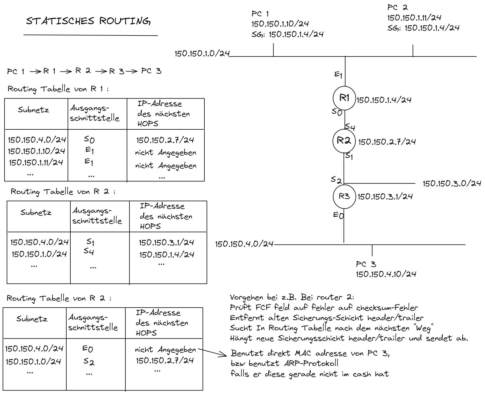

# ROUTING

## statisch

## dynamisch

Allgemeine Regeln für DYNAMISCHES Routing:

1. Verhindern von routing-Schleifen
2. Hinzufügen neuer. Sofortiges Ersetzen von verlorenen Routen. (Konvergenzzeit gering halten)
3. Ersatzrouten in Tabellen aufnehmen. Redundanzen.
4. Feststellen das Routen ungültig sind.
5. Günstigste Route priorisieren. (Günstig nach latenz vs Bandbreite)
6. DYNAMISCHES Ermitteln aller Routen zu Subnetzen des Netzwerkes und Eintragen.

# Autonomes System & IGP
Ein **autonomes System** ist einen Menge von Routern mit gemeinsem Inneren Gateway-Protokoll (IGP) (und gemeinsamen Metriken) unter einer technischen Verwaltung.       
Also z.B. ein netzwerk in dem IGRP gesprochen wird usw...

# Interior-Gateway-Protokolle:

## Distanz Vektor Protokolle
Wählt kürzesten Hop-Count.
- z.B: RIP, IGRP, EIGRP

### RIPv1 & RIPv2 - Routing Information Protocol
- maximale HOP Count 15. -> größe des Netzwerkes begrenzt
- Zur Vermeidung von Routingschleifen kommen Split-Horizon-Verfahren, Holddown Timer, Route Poisoning und Triggered Updates zum Einsatz
- kein load-balancing
- als Metrik wird HOp-Count benutzt

### IGRP

- Bei IGRP werden die besten Wege zu einem Ziel über die berechnete Metrik bestimmt.
- Die Metrik einer Verbindung setzt sich aus Verzögerung, Bandbreite, Leistungszuverlässigkeit und Leistungsauslastung zusammen.
- max. HOP count 255
- Routing Tables werden alle 90sekunden aktualisiert.
- Zur Vermeidung von Routingschleifen kommen Split-Horizon-Verfahren, Holddown Timer, Route Poisoning und Triggered Updates zum Einsatz

### EIGRP
- max. HOP count 255
- incremental updates sent. instead of full routing table each time.
- supports classless IPv4 which IGRP did not
- Zur Vermeidung von Routingschleifen kommen Split-Horizon-Verfahren, Holddown Timer, Route Poisoning und Triggered Updates zum Einsatz

## Link-State Protokolle
geht nach den Kosten.
- shortest path- algorithmus ermittelt den (zeitlich) schnellsten Weg

### OSPF
- Grundlage des Shortest Path -Algorithmus sind nicht die Anzahl der Hops sondern die Pfadkosten. ->nominale Datenrate wird also die Metrik.
- wrsl. das am häufigsten verwendete IGP in großen Unternehmensnetzen.
- garantiert schleifenfreies Routing
- gut skallierbar
- vereinfacht Kommunikation und Wartung

# Exterior-Gateway-Protokoll
- hier ist nur GBP relevant
- Datenverkehr zwischen verschieden autonomen Systemen / IGPs untereinander.
