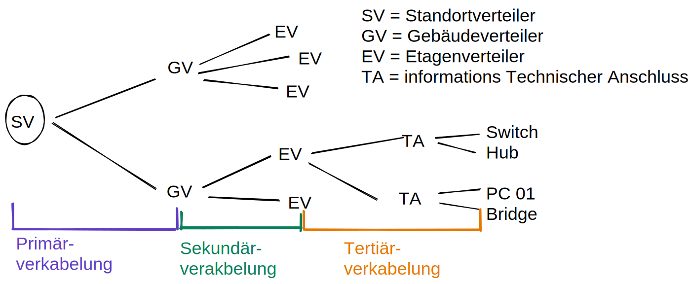

## Kabel Wlan etc.

# Leitergebundene Übertragung
- Ein Kabel besteht aus mindestens einer leitenden Ader/Faser.
- Mehrere Adern werden durch entsprechende Isolationsschichten voneinander getrennt.
- Adern werden von einer Schutzhülle dem Außenmantel umgeben.

## Störempfindlichkeit

## Dämpfung
beschreibt das Abschwächen der Datensignale mit zunehmender Entfernung

### Entstörung durch Verdrillung
durch fehlende bzw schlechte **Verdrillung/Verseilung** zusammengehörender Adern steigt die Dämpfung durch Abstrahlung (Antenneneffekt). z.B. das Twisted Pair Kabel.
- natürlich nur bei Strom als Medium. Nicht bei Licht.

## screened Kabel
extra abschirmung- F/UTP F/STP...

## Lize und Massivleiter
- Massivleiterkabel haben eine geringere Dämpfung dürfen aber nicht geknickt/gebogen werden. -> für dauerhafte Installationen(in Wänden, Boden etc.)

# Twisted Pair Kabel
- die maximal mögliche Distanz zwischen einem Computer 100m.
- Wellenwiederstand beträgt überwiegend 100 Ohm.
- Ketegorien 1-8
    - heutzutage sollen im LAN-Bereich 6 & 6A eingesetz werden (bzw 7 & 7A für mehr Durchsatz)

# Litzenkabel - Litze
- stranded wire
- aus dünnen Einzeldrähten bestehender und daher leicht zu biegender elektrischer Leiter.
- oft aus kupfer

# RJ-45 / GG-45 Stecker
- LAN-kabel am pc etc.
- ab Kategorie 7 wird Gg-45 verwendet

# Leistungsklassen Kabel:
1-8 grob die größenräume können

# Glasfaßerkabel - LWL - Lichtwellenleiter
Licht ist durch Reflexion zwischen kern und Mantel bedingt.
- Dämpfung des lichts in der Glasfaser fällt sehr unterschiedlich aus und ist abhängig von der Wellenlänge.
- Monomode, ist der Kern glein genug (z.B. 3-9ym), dann kann sich nur eine Welle in der Faser ausbreiten
    - mit Monomode sind Längen von mehreren Kilometern möglich -> können schon ab 500m Sinn machen
    - in einem Kabel können sich viele Fasern befinden (bis zu 144 und mehr)
    - teuer -> Anwendungsgebiet eher im Backbone von z.B.  Telefon
- Multimode
    - könnte auch in den Kilometerbreich gehen. 

# Primärverkabelung Sekundärverkabelung Tertiärverkabelung

## Sicherheits-Leitungen
Vermaschte oder Vollvermaschte Sicherheitsleitungen können zusätzlich als failback gelegt werden, z.B. zwischen einzelnen EVs. Im Falle eines Ausfalls.

# Fachbegriffe (S.181-192)
- Bandbreite
    - (maximale) Übertragungsrate in Datenverbindungen. Bit/Sekunde
    - durchschnittliche Internetanschluss in Deutschland hat Bandbreite von 15 Mbit/s
    - Glasfaseranschlüsse schaffen locker 1 Gbit/s
- Datenrate
    - (aktuelle) Übertragungsrate in Datenverbindungen.
- Bitfehlerrate
    - Verhältnis der Anzahl der binären Signalelemente, die bei der Übertragung verfälscht wurden, zur Gesamtzahl.
- Reflexion
    - Reflexion git es in elektrischen Wellen(Leitungen) und LWLs.
    - häufig an Leitungsenden und Übergängen
    - Reflektionen führen dazu, das ein und dasselbe Signal beim Empfänger zweimal (zeitlich verzögert) eintrifft.
- Rauschen
    - unerwartete Störung eines Nutzsignales
    - elektronisches Rauschen
    - Thermisches Rauschen
    - Intermodulationsrauschen
- Nebensprechen / crosstalk
    - koppeln -> Feld eines Leiters überträgt ein signal in Feld eines anderen Leiters. Z.B. fremde Stimmen im Funk "mithören"
