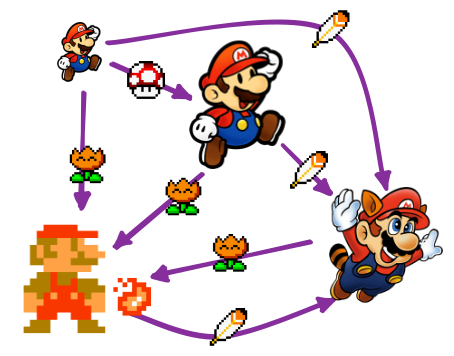

# OOP in Rust - Object-Oriented paradigms in Rust
## Inheritance
Rust has no real inheritance (by design). Instead you could:
- use Traits with default implementation.
- use generics to enable Polymorphism.

### Polymorphism - Definiton:
Code that can work with mdata of multiple types. (ex Generics in Rust)

## Encapsulation
`pub` keyword to define public vs automatically hidden/private details of the implementation. Default in Rust is usually to be hidden.

The following example for example encapsulates the actual implementation of the List away. That way it would be easy to change from a Vec to a HashSet etc at a later point, without changing anything that uses the AveragedCollection:
```rust
pub struct AveragedCollection {
    // private fields
    list: Vec<i32>,
    average: f64,
}

impl AveragedCollection {
    // only public methods exposed to the outside are:
    // - add(), remove(), and average().
    pub fn add(&mut self, value: i32) {
        self.list.push(value);
        self.update_average();
    }

    pub fn remove(&mut self) -> Option<i32> {
        let result = self.list.pop();
        match result {
            Some(value) => {
                self.update_average();
                Some(value)
            }
            None => None,
        }
    }

    pub fn average(&self) -> f64 {
        self.average
    }

    fn update_average(&mut self) {
        let total: i32 = self.list.iter().sum();
        self.average = total as f64 / self.list.len() as f64;
    }
}
```


## Trait Objects that allow values of different Types
Example to implement a Draw Trait, to enable our theoretical GUI to render out or data.
```rust
// the Draw trait, that 'makes sure' that we are able to draw everything that implements it.
pub trait Draw{
    fn draw(&self);
}

// components holds all our Components. 
// - In a Box because Vec is fixed size -> we just hold the pointer
// - dyn Draw is the 'stand in' for anyt type that implements the Draw trait.
pub struct Screen {
    pub components: Vec<Box<dyn Draw>>,
}
// We implement the Run method that draws all components:
impl Screen{
    pub fn run(&self) {
        for component in self.components.iter() {
            component.draw();
        }
    }
}

// now we can implement the Trait on a few examples:
#[derive(Debug)]
pub struct Button {
    width: u32,
    height: u32,
    label: String,
}
impl Draw for Button {
    fn draw(&self) {
        println!("Button: {:?}",self.label)
    }
}

pub struct SelectBox{
    width: u32,
    height: u32,
    options: Vec<String>,
}
impl Draw for SelectBox {
    fn draw(&self) {
        println!("Select Box:");
        for o in self.options.iter() {
            println!("     [x] - {}", &o);
        }
    }
}

// this is how it could be used:
fn main() {
    let b1 = Button{
        width: 10,
        height: 10,
        label: String::from("Click me"),
    };
    let b2 = Button{
        width: 10,
        height: 10,
        label: String::from("Submit"),
    };
    let sbox = SelectBox{
        width: 10,
        height: 30,
        options: vec![
            String::from("Yes"),
            String::from("Maybe"),
            String::from("No"),
        ],
    };
    let screen = Screen{
        components: vec![Box::new(b1), Box::new(sbox), Box::new(b2), ],
    };
    screen.run();
}
// -> Button: "Click me"
// -> Select Box:
// ->      [x] - Yes
// ->      [x] - Maybe
// ->      [x] - No
// -> Button: "Submit"
```
### Differentiating the above from a generic-trait implementation
- We could also do something similar with generics:
- this has some limitations and benifits though: 
    - Every component in the Screen MUST be of the same type in this case (so only button etc.)
    - BUT this 2nd implementation will use **static dispatch**. So it will not have any run time cost attatched to it. The dynamic `<Box<dyn Draw>>` implementation above on the other hand will have the additional runtime cost of checking types at runtime. Called **dynamic dispatch** in rust.
```rust
pub struct Screen<T: Draw> {
    pub components: Vec<T>,
}

impl<T> Screen<T>
where
    T: Draw,
{
    pub fn run(&self) {
        for component in self.components.iter() {
            component.draw();
        }
    }
}
```

## Example of a state pattern - state machine in Rust
Functionality should include:
    - blog starts as an empty draft
    - after a draft is done, a review is requested.
    - when the post is approved it gets published
    - only published posts are allowed to return content in `.content()`. 
Any other changes attempted should have no effect.

3 Solutions could solve this problem:
- using dyn-Box: https://doc.rust-lang.org/book/ch17-03-oo-design-patterns.html#implementing-an-object-oriented-design-pattern
    - runtime checking, have to implement methods multiple times etc. (check macros for shortcutting this)
    - 
- using enums for the different Post-Types
    - Must exhause all cases every time (ex use match-Statement etc.)
- Encoding States and Behavior as Types: 
    - this is the most strict implementation post.content() will not compile before it is accessible.
```rust
fn main() {
    let mut post = Post::new();                                 // -> post is: DrafPost
    post.add_text("Some Content for a well written Blog...");   // -> post.content becomes "Some Content..."
    let post = post.request_review();                           // -> post is: PendingReviewPost
    let post = post.approve();                                  // -> post is: Post
    assert_eq!("Some Content for a well written Blog...", post.content());
}
pub struct Post {
    content: String,
}
pub struct DraftPost {
    content: String,
}
pub struct PendingReviewPost {
    content: String,
}

impl Post {
    pub fn new() -> DraftPost {
        DraftPost { content: String::new(), }
    }
    pub fn content(&self) -> &str {
        &self.content
    }
}
impl DraftPost {
    pub fn add_text(&mut self, text: &str) {
        self.content.push_str(text);
    }
    pub fn request_review(self) -> PendingReviewPost{
        PendingReviewPost{ content: self.content, }
    }
}
impl PendingReviewPost {
    pub fn approve(self) -> Post {
        Post {content: self.content, }
    }
}
```

## Mario state machine with Enums in Rust
Finite State machine that implements Mario-Game's Mushrooms logic:


- Small Mario
- Super Mario
- Fire Mario
- Cape Mario

```rust
#[derive(Debug, PartialEq)]
enum State {
    SmallMario,
    SuperMario,
    FireMario,
    CapeMario,
}
enum Upgrade {
    Mushroom,
    Flower,
    Feather,
} 
struct Player {
    state: State,
    //...
}
use State::*;
use Upgrade::*;

impl Player {
    fn new() -> Self {
        Self { state: SmallMario}   // default state we start with
    }
    fn collect(&mut self, power: Upgrade) {
        match (&self.state, power) {
            (SmallMario, Mushroom)  => self.state = SuperMario,
            (_,         Flower)     => self.state = FireMario,
            (_,         Feather)    => self.state = CapeMario,
            (_,         Mushroom)   => {},      // no change here
        }
    }
}

fn main() {
    let mut mario = Player::new();
    assert_eq!(mario.state, SmallMario);
    mario.collect(Mushroom);
    assert_eq!(mario.state, SuperMario);
    mario.collect(Flower);
    assert_eq!(mario.state, FireMario);
    mario.collect(Feather);
    assert_eq!(mario.state, CapeMario);
    mario.collect(Mushroom);
    assert_eq!(mario.state, CapeMario);
}
```